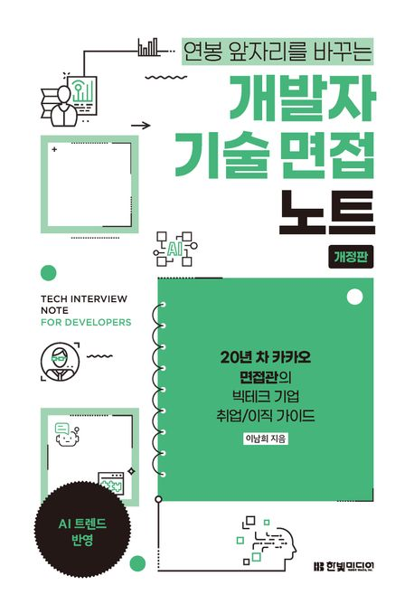

:::info
한빛미디어 \<나는 리뷰어다\> 활동을 위해서 책을 제공받아 작성된 서평입니다.
:::

## Book Info

:::tip
책 이미지를 클릭하면 교보문고 사이트로 이동합니다!
:::

- 제목: 개발자 기술 면접 노트
- 저자: 이남희
- 출판사: 한빛미디어
- 출간: 2025-04-07

{/* truncate */}

## Intro

오랜만에 다시 서평을 신청했다. 이제 곧 인턴이 끝나가기도 해서 다음 스탭을 준비해야 하나 고민하고 있었는데, 마침 기술 면접에 대한 책이 나와서 신청하게 됐다. 이 책은 카카오에서 20년 차 면접관이 쓴 책으로, 빅테크 기업 취업/이직 가이드라고 할 수 있다. 이 책을 읽으면서 기술 면접에 대한 전반적인 내용과 준비 방법을 알 수 있었다. 

## Book Review

### 인턴 개발자가 읽어본 기술 면접 가이드북

요즘 개발자 시장 분위기가 녹록지 않다는 이야기를 많이 듣는다.
나도 지금 인턴으로 일하고 있는데, 앞으로 정규직 전환을 노리든, 다른 회사로 지원을 하든 결국은 코딩 테스트랑 기술 면접 준비는 피할 수 없겠구나 싶었다.

실무는 조금씩 익히고 있지만, 막상 이력서를 어떻게 써야 하는지, 기술 면접은 뭘 공부해야 하는지는 막막했다. 그러던 중 이 책을 알게 됐고, 생각보다 굉장히 현실적인 가이드북이라는 느낌을 받았다.

### 막연했던 취업 준비, 방향을 잡을 수 있었다

책은 서류 준비 → 코딩 테스트/기술 면접 → 면접 후 과정까지 흐름이 잘 정리되어 있다.
단순히 알고리즘 문제 풀이 책이 아니라, 채용 공고 분석법, 이력서 작성 팁, 기술 면접에서 자주 나오는 질문들까지 친절하게 설명해준다.

특히 좋았던 부분은 아래와 같다.

- 채용 공고 분석법 덕분에 단순히 공고를 보는 걸 넘어서, 내가 어떤 스킬을 보완해야 하는지 파악할 수 있었다.
- 탈락하는 이력서 사례를 보면서 내가 이력서를 쓸 때 주의해야 할 점을 배울 수 있었다.
- 기술 면접 준비 파트에서는 DB, OS, 네트워크, 아키텍처 등 어떤 내용을 공부해야 할지 방향을 잡을 수 있었다.
- 스터디와 성장 마인드셋의 중요성도 강조하는데, 앞으로 어떻게 커리어를 쌓아야 할지 고민하는 데 많은 도움이 됐다.

### 인턴이더라도 미리 준비하는 게 중요하다는 걸 느꼈다

인턴을 하다 보면 실무 따라가기도 바쁘고, 정규직 전환 준비도 급하게 느껴진다.
하지만 이 책을 읽으면서 지금부터라도 차근차근 준비해두면 나중에 훨씬 덜 막막하겠다는 생각이 들었다.

기술 면접 준비는 생각보다 넓고 깊은 영역을 다뤄야 한다. 실무와 병행해서 준비하는 건 쉽지 않겠지만, 최소한 공부 방향을 잡아두는 것만으로도 마음이 든든해졌다.

무엇보다 이 책은 단순히 기술적인 부분뿐만 아니라, 어떤 자세로 일하고 성장해야 하는지에 대한 내용까지 담고 있어서 더 좋았다. 장기적인 커리어 관점에서 많은 인사이트를 얻을 수 있었다.

## 대상 독자

주니어라면 무조건 읽는 걸 추천한다. 사실 시니어 정도의 연차가 아닌 사람들께는 모두 추천하는 책이다. 이력서부터 시작하여 포트폴리오, 기술 면접, 기술 면접이 아닌 면접까지 채용 과정에 대해 전반적으로 다양한 팁을 알려준다. 