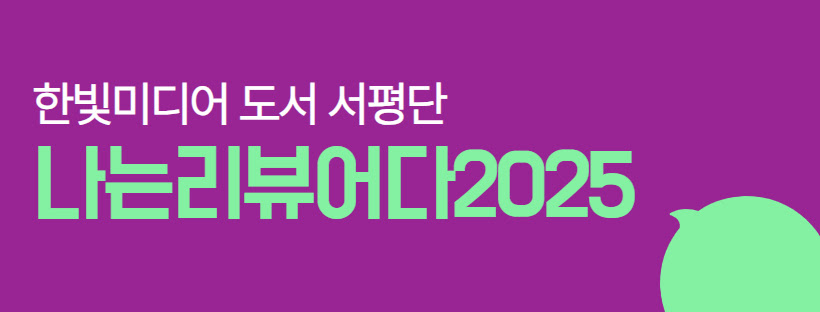
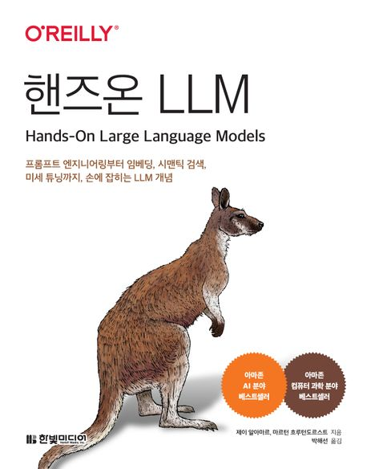

:::info
한빛미디어 \<나는 리뷰어다\> 활동을 위해서 책을 제공받아 작성된 서평입니다.
:::

## Book Info

:::tip
책 이미지를 클릭하면 교보문고 사이트로 이동합니다!
:::
image.png

- 제목: 개발자 기술 면접 노트
- 저자: 제이 알아마르, 마르턴 흐루턴도르스트
- 역자: 박해선
- 출판사: 한빛미디어
- 출간: 2025-06-10

{/* truncate */}

## Intro

LLM(대규모 언어 모델)은 이제 개발자뿐 아니라 연구자, 학생, 기획자 등 다양한 분야에서 필수 교양으로 자리잡고 있다. 나도 지금까지 LLM의 작동 원리와 다양한 활용법을 공부해왔지만, 쏟아지는 기술과 툴을 따라가느라 기본기를 정리할 기회가 부족했었다. 이번 기회에 핸즈온 LLM을 읽으며 LLM의 핵심 개념을 차분히 정리하고, 실제로 손을 움직이며 실습까지 병행해볼 수 있었다.

LLM을 공부한 경험은 있었지만 한 번 전체를 체계적으로 복습하고 싶다는 마음에 이 책을 집어들었고, 결과적으로 정말 만족스러웠다. LLM 공부는 끝이 없는 여정이라 생각한다. 새로운 모델, 새로운 툴, 새로운 접근 방식이 계속 등장하니까 말이다. 그럴수록 더 중요한 건 ‘기본기’라는 걸, 이 책을 통해 다시금 느낄 수 있었다.

## Book Review

### LLM을 ‘다시’ 공부하고 싶은 사람에게 최고의 선택

이 책은 단순히 LLM을 처음 배우는 사람을 위한 입문서가 아니다. 이미 Transformer, Fine-Tuning, Embedding 등의 개념을 알고 있는 사람이라도, 그 연결고리를 제대로 정리하고 싶은 이들에게 훌륭한 가이드가 될 것이다.

예전에는 블로그 글이나 논문을 여기저기 흩어져서 보며 이해하려 했던 개념들이, 이 책의 3장(Transformer 구조 설명)을 통해 비로소 하나로 연결되는 느낌이었다. 특히 직관적인 시각자료와 함께 실습이 자연스럽게 이어지는 구성 덕분에 “아 그래서 이렇게 동작하는 거였구나” 하는 걸 책을 읽으면서 많이 느꼈다.

### 보이는 설명, 직접 해보는 실습

이 책의 가장 큰 장점은 ‘시각화’와 ‘실습’이다.

각 장마다 수십 개의 컬러 도식, 예시 그림, 코드 결과 이미지가 포함되어 있어, 이해가 어려운 개념도 자연스럽게 머릿속에 그려지게 된다.

huggingface, colab 등을 활용한 실습이 잘 마련되어 있어, 별도 환경 구축 없이 바로 실습이 가능하며, 특히 프롬프트 엔지니어링, 클러스터링, RAG 파이프라인 구성 같은 실전 예제가 풍부해 응용력까지 키울 수 있었다.

개인적으로는 5장에서의 BERTopic, 7장에서의 LangChain의 ReAct, 그리고 12장 '생성 모델 미세 튜닝하기'가 가장 인상 깊었다.

### 단점이라기보다는, 대상 독자에 대한 분명한 전제

이 책은 완전 초심자를 위한 책은 아니다. 저자도 서문에서 선수 지식에 대해 언급하듯, 파이썬과 머신러닝에 대한 최소한의 배경지식이 있어야 수월하게 읽을 수 있다.

또한 실제 서비스 운영에 필요한 인프라, 비용 최적화, 배포 등은 다루지 않기 때문에 실무 응용까지 기대하는 독자라면 별도 학습이 필요하다.

이 책의 초점은 분명했다. “LLM을 깊이 이해하고, 직접 다뤄볼 수 있도록 돕는다.” 이 목표에 정말 충실한 책이라고 생각한다.

## 대상 독자

- LLM의 작동 원리와 주요 개념을 시각화 + 실습 중심으로 다시 정리하고 싶은 사람

- 블로그나 논문으로 조각조각 습득했던 내용을 한 권으로 체계적으로 정리하고 싶은 독자

- 챗봇, 임베딩 기반 검색, 프롬프트 최적화 등 다양한 LLM 활용법을 체계적으로 익히고 싶은 분

- LangChain, RAG, LoRA 등 최근 LLM 트렌드를 실습을 통해 따라가고 싶은 학습자
