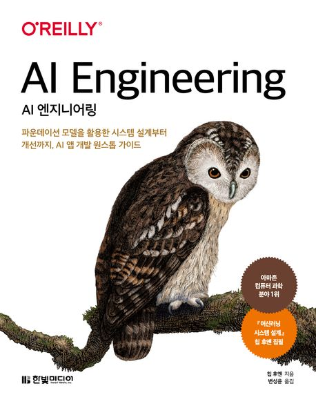

:::info
한빛미디어 \<나는 리뷰어다\> 활동을 위해서 책을 제공받아 작성된 서평입니다.
:::

## Book Info

:::tip
책 이미지를 클릭하면 교보문고 사이트로 이동합니다!
:::

- 제목: AI Engineering
- 저자: 칩 후옌
- 역자: 변성윤
- 출판사: 한빛미디어
- 출간: 2025-09-10

{/* truncate */}

## Intro

정말 오랜만에 책을 조금씩 읽어봤다. 최근에는 오픈소스 기여와 취업 준비 때문에 하루하루가 정신없이 지나가 버려서 책 한 권을 온전히 읽는 시간이 없었다. 솔직히 이번 달도 바쁘다는 핑계로 나는 리뷰어다 활동을 생략할까 고민했지만, 마침 성윤님께서 번역하신 책이 한빛미디어에서 새로 출간된다는 소식을 보고 지원해서 읽게 됐다. 

## Book Review

### 제품 중심의 AI 엔지니어링

저자는 책의 서두에서 기존 머신러닝이 얼마나 “모델 중심적” 사고에 갇혀 있는지를 지적한다. 이 책을 읽으면서 나도 그동안 얼마나 모델의 성능에만 집착했는지를 돌아보게 됐다. 저자는 AI 엔지니어링을 제품 중심(Product-centric) 접근으로 정의하면서, “무엇을 만들 수 있는가”가 아니라 “왜 만들어야 하는가”를 먼저 묻는다.

AI 시스템을 단순히 모델 학습으로 보지 않고, 애플리케이션 개발–모델 개발–인프라 구축이라는 세 층으로 나눠 설명하는 구성이 인상 깊었다. AI 애플리케이션을 처음 설계할 때부터 사용자의 문제와 요구를 가장 앞에 두어야 한다는 메시지가 크게 와닿았다.

특히 인상적이었던 건, 요즘 누구나 API 하나로 AI 프로토타입을 쉽게 만들 수 있는 시대지만, 그것을 ‘서비스로 운영 가능한 수준’으로 끌어올리는 일은 전혀 다르다는 점이다. 단순히 모델을 호출하는 코드 몇 줄이 아니라, 평가(Evaluation), 모니터링, 피드백 루프까지 포함해 “AI 시스템을 어떻게 안정적으로 성장시킬 것인가”에 초점을 맞춘 점이 좋았다.
책을 읽으면서 “AI 엔지니어링”이란 결국 모델의 정확도를 올리는 기술이 아니라, 사람이 실제로 신뢰하고 사용할 수 있는 시스템을 만드는 기술이라는 사실을 느꼈다.

### 평가와 운영

개인적으로 가장 좋았던 챕터는 3장이었다. 칩 후옌이 강조하는 평가(Evaluation) 부분은 이 책의 핵심이라고 생각한다. 나는 지금까지 모델의 성능을 측정할 때 정확도나 F1 스코어만 떠올렸는데, 이 책은 그것이 얼마나 좁은 관점인지를 보여준다.

3장에서는 파운데이션 모델의 개방형 특성을 다루면서, 하나의 입력에 여러 답변이 가능한 상황에서 **‘정답이 하나가 아닐 때 우리는 무엇을 기준으로 평가할 것인가’**라는 질문을 던진다. 단순한 수치보다 지연시간, 비용, 안전성, 편향, 사용자 경험 같은 요소를 함께 봐야 한다는 부분이 가장 기억에 남는다.

특히 저자가 제시하는 AI 평가자(AI as a Judge) 개념이 흥미로웠다. 모델이 모델을 평가하도록 하는 방법인데, 이 접근이 완벽하지는 않아도 현실적인 해법이라는 점에서 인상 깊었다. 이런 실험적인 아이디어를 통해 칩 후옌이 단순히 기술서가 아닌, “AI 시스템을 어떻게 사회에 녹여낼 것인가”를 고민하고 있다는 게 느껴졌다.

후반부에서는 API 기반 프로토타입이 어떻게 컨텍스트 보강 → 가드레일 추가 → 모델 라우터 구성 → 캐싱 및 피드백 루프 구축으로 발전해 가는지를 단계적으로 보여준다. 마치 작은 사이드 프로젝트를 점점 실제 서비스로 성장시키는 과정을 보는 듯해서 흥미로웠다. 이 부분을 읽으면서 나도 개인 프로젝트를 할 때 “평가와 피드백을 체계적으로 넣어봐야겠다”는 생각이 들었다.

## 대상 독자

- AI·ML 관련 전공자이지만 “AI 제품화(Production)” 관점이 궁금한 사람
- LLM·생성형 AI의 내부 작동 원리와 엔지니어링 관점을 체계적으로 정리하고 싶은 학습자
- FastAPI, LangChain, AWS 등 실무 기술과 연결된 AI 시스템 설계를 배우고 싶은 개발자
- AI 스타트업, 대학 연구실, 혹은 프로젝트 팀에서 실무 감각을 익히고 싶은 학생
- “머신러닝 시스템 설계”를 읽고 더 실무 중심의 후속 단계를 배우고 싶은 독자
