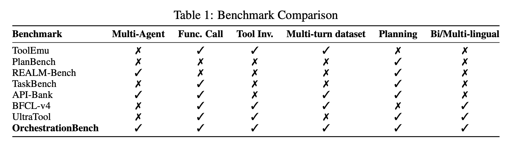
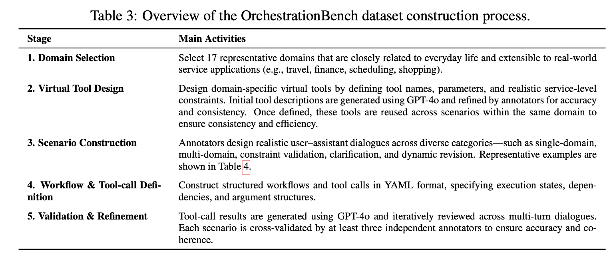

> ICLR 2026. [[Paper](https://openreview.net/forum?id=Oljnxmf4pc&noteId=NyL52JeO4j)] [[Github](https://github.com/kakao/OrchestrationBench)]  


## 들어가며

최근 moltbot(현 openclaw), oh-my-opencode와 같은 서비스가 핫해지면서 읽으면 재밌을 것 같다는 생각에 읽고 리뷰를 해본다.

## 간단 요약

1. 실제 multi-domain 환경에서 LLM 오케스트레이션을 평가하기 위한 이중 언어(한국어, 영어) 벤치마크를 소개한다.
2. workflow planning과 tool execution으로 분리하고 Graph Edit Distance(GED)와 같은 structured metric을 사용한다.
3. 이 벤치마크는 constraint validation과 dynamic revision을 포함하는 17개 domain과 거의 100개의 tool로 구성된 수동으로 만든 데이터셋을 포함한다.
4. 실험 결과 일관된 tool execution은 확인되었지만 planning 단계에서는 상당한 변동성이 나타나 structured 평가의 필요성을 강조한다.
5. 새로운 domain, tool, deployment context로 확장 가능한 벤치마크로 설계됐다.

{/* truncate */}

## Introduction

기존 벤치마크는 대부분 단순화되어 있거나 domain이 격리된 환경에서 작동하기에 서비스 준비가 된 LLM에 필요한 오케스트레이션 능력을 확인할 수 없다. 이런 gap을 해소하기 위해 현실적인 서비스 환경에서 LLM을 평가하기 위해 이중 언어 벤치마크인 OrchestrationBench를 소개한다. 이 벤치마크는 workflow planning과 constraint-aware tool execution을 강조하는 포괄적인 평가 프로토콜을 정의한다. workflow planning 경우에는 평가는 workflow cosntruction에 공식화된다. 각 workflow는 Directed Acyclic Graph(DAG)로 표현된다. constraint-aware tool execution은 평가는 tool calling의 syntactic correctness를 넘어선다.


## Related Work

논문에서는 관련 연구를 네 가지 영역으로 분류한다. 

**Tool Execution Benchmarks**  
BFCL, API-Bank, T-Eval, ToolBench 등은 에이전트가 task를 분해하고 적절한 tool이나 API를 invoke하는 능력을 평가한다. 

**Single-agent Task Performance Benchmarks**  
TaskBench, τ-bench, GAIA, WebArena, OSWorld 등은 single agent가 특정 환경에서 task을 완료하는 능력을 평가한다. 이런 벤치마크들은 여러 domain에 걸쳐 LLM의 agentic task execution 능력을 측정한다는 점에서 가치가 있다. 그러나 OrchestrationBench는 이런 연구들과 다르게 주로 개별 에이전트 성능보다는 LLM-to-LLM 협업에 초점을 맞추며, 특히 메인 모델이 전문 LLM을 오케스트레이션하고 호출하는 시스템을 설계한다. 

**Tool Safety Benchmarks**  
ToolEmu, R-Judge, SafeToolBench는 위험한 요청을 거부하는 능력을 평가한다. 더 자세히 설명하면 ToolEmu는 single agent, R-Judge, SafeToolBench는 multi-turn agent의 경우이다. 여기서 ToolEmu는 복잡한 다단계 계획 수행 능력보다는 emulate된 환경 내 개별 tool call의 safety alignment에 초점을 맞춘다고 한다. 그러나 OrchestrationBench는 main LLM이 사용 가능한 sub-LLM의 functional descriptions과 constraints를 올바르게 이해함으로써 실행 불가능한 요청을 거부할 수 있는지 테스트하고, safety과는 다른 차원의 functional feasibility에 대한 평가를 다룬다.

**Agentic Planning Benchmarks**  
다양한 추상화 수준에서 계획 및 조정 능력을 평가하는 벤치마크이다. PlanBench, MultiAgentBench, REALM-Bench 등 다양한 벤치마크가 있다. 이런 벤치마크들이 에이전트의 plan이나 tool calling 능력을 테스트하지만 OrchestrationBench는 main LLM이 natural language capability description에 기반하여 전문화된 서브 LLM을 동적으로 조정하는 오케스트레이터 역할을 하는 계층적인 LLM-to-LLM 오케스트레이션 과제를 제시한다. workflow planning을 constraint-aware execution과 분리하는 diagnostic evaluation를 제공하여 상용 챗봇 배포에 필요한 오케스트레이션 기능에 대한 유니크한 평가를 제공한다.



OrchestrationBench는 이 모든 평가를 만족하는 유일한 벤치마크라고 한다.  

## The OrchestrationBench Framework

### 1. The Complexity of Evaluating LLMs in Real-World Environments

실제 서비스 환경에서 LLM 평가는 단순한 QA를 넘어서는 복잡한 도전이다. 다음 사용자 요청을 생각해보자.

> "서울행 항공편 예약하고, COEX 근처 호텔 찾아서, 일정을 팀에게 공유해줘."

이 요청을 처리하려면 아래와 같은 

1. **multi-steep planning**: 일정 공유는 예약 완료 후에만 가능
2. **dynamic adaptation**: 사용자가 "아침 비행기로 바꿔줘"라고 수정 요청 시 대응
3. **constraint validation**: "4시 10분에 치과 예약"에 대해 시스템 제약(정시/30분 단위만 가능)을 인지하고 대안 제시

이런 시나리오는 기존의 정적인 벤치마크가 잡지 못하는 planning, adaptation, constraint-aware execution의 복잡하게 얽힌 과제를 강조한다.

### 2. OrchestrationBench Architecture

OrchestrationBench는 영어와 한국어 즉, 이중 언어 데이터셋을 갖춘 포괄적인 평가 프레임워크를 도입한다.

#### 2.1 Advanced Planning and Coordination

아래를 보면 알 수 있듯이 오케스트레이션을 각 task의 execution 상태, 종속성 관계, step-level planning을 정의하는 structured workflow schema로 형식화한다. 이런 구조는 sequential 및 parallel execution을 관리하고 workflow 간 종속성을 처리하며, execution 중 사용자 상호작용에 적응할 수 있는지 평가할 수 있게 한다.

**Workflow Schema**


**예시**: "내일 서울 출장이다. 항공편 예약하고, COEX 근처 호텔도 찾고, 일정을 팀에게 공유해줘."

```yaml
workflow_1:
  status: pending
  type: independent
  steps:
    - status: pending
      name: travel_agent
      refined_query: "내일 서울행 출장 항공편 예약"

workflow_2:
  status: pending
  type: independent
  steps:
    - status: pending
      name: travel_agent
      refined_query: "COEX 근처 호텔 예약"

workflow_3:
  status: pending
  type: dependent
  depend_on: ["workflow_1", "workflow_2"]
  steps:
    - status: pending
      name: calendar_agent
      refined_query: "완료된 일정을 팀에게 공유"
```

`depend_on`은 현재 workflow가 시작되기 전에 완료되어야 하는 workflow를 지정한다. `workflow_3`은 `workflow_1`과 `workflow_2`에 의존하므로, 두 task이 완료된 후에야 실행된다.

실제 환경에서 사용자 쿼리는 정적인 task plan을 따르기보다는 동적으로 진화하는 경우가 많다. OrchestrationBench는 모델이 추가적인 tool이 필요할 때 새로운 workflow를 생성하고 explicit confirmation이나 sub-task로의 분기가 필요할 때 workflow를 분할함으로써 유연하게 조정할 수 있는지를 평가한다. 예를 들어 사용자가 예약된 요청을 수정하거나 대화 중에 새로운 조건을 추가하는 경우 모델은 이전 단계와의 일관성을 유지하면서 workflow를 업데이트하거나 확장해야 한다. 명확한 기준은 workflow를 분할하거나 통합해야 하는 시점을 결정한다. 독립적인 요청(e.g., 항공편 일정과 호텔추천 모두 요청하는 경우) 또는 중간 확인이 필요한 task(e.g., 예약 전에 추천 승인)는 별도의 워커플로로 처리된다. 반대로 일관되고 하나의 목표에 기여하는 task는 하나의 workflow 내에 유지된다. 예를 들어 유명인의 별자리를 결정하기 전에 생일을 확인하는 경우이다.

즉, 이 프레임워크는 모델이 계획할 뿐만 아니라 실제 상호작용적인 시나리오에 맞춰 workflow를 조정하고 중단하고 다시 작동하는 능력을 자세하게 평가할 수 있도록 한다. 

#### 2.2. Comprehensive Tool Use

tool execution 평가는 단순히 tool call 정확도를 검증하는 수준을 넘어, 서비스 수준 상호작용 과정 전체를 포괄한다.
이는 모델이 tool을 올바르게 invoke하는지 뿐만 아니라, 언제 tool use가 필요한지, 언제는 추가 tool 없이 직접 정보를 제공할 수 있는지, 그리고 사용자 입력이 불충분하거나 모호한 경우를 인지하여 능동적으로 추가 설명을 요청할 수 있는지를 평가한다. 이러한 행동은 `AWAIT_FOR_USER_INPUT` 신호로 표현된다.

syntatic correctness를 넘어서서 실제 서비스는 도메인별 비즈니스 규칙을 엄격하게 준수해야 한다. tool을 실제로 invoke하기 전에, 모델은 pre-execution 검증을 수행하며, 필요한 제약 조건이 충족되지 않았을 경우 `TOOL_CONSTRAINT_VIOLATION`을 발생시킨다.

- 논리적 일관성 유지
    - 사용자의 요청 내용이 현실적으로 말이 되거나 논리적으로 모순되지 않는지 확인하는 과정
    - e.g., 항공권 예약 시 귀국일이 출발일보다 빠른 것
- 자원 제한 강제
    - 서비스나 도구가 제공하는 특정 자원의 제약을 사용자의 요청이 준수하는지 확인하는 과정
    - e.g., 특정 물품의 재고 수량을 초과하는 주문 요청, 허용된 예산을 넘어서는 구매 요청

LLM은 사용자의 요청이나 추출된 정보에 대해 성공적으로 유효성 검사를 마친 후에야 비로소 올바른 형식의 매개변수를 사용하여 해당 외부 도구를 실행해야 한다.

모델 성능은 call/reject 분류 매트릭을 통해 측정되고 여기서 `AWAIT_FOR_USER_INPUT`, `TOOL_CONSTRAINT_VIOLATION`은 reject 사례를 나타내고 성공적인 execution은 funcion-calling 성능 지표를 사용하여 평가된다.

#### 2.3. Multi-Domain Tool Environments

이 벤치마크는 특정 서비스 종속성과는 독립적으로 유지하면서 실제 애플리케이션으로 확장 가능한 17개의 대표적인 서비스 도메인을 정의한다. 각 도메인은 모델의 고유한 오케스트레이션 및 명령어 수행 능력을 평가할 수 있도록 현실적이면서도 일반화된 시나리오를 중심으로 구축된다.


영어 97개, 한국어 99개의 tool이 있다. 한국어에는 주소 로마자 변환, 사주 정보 등과 같은 특수 tool이 추가되어 있다. 단순화된 tool 추상화를 사용한 이전 벤치마크들과는 달리 OrchestrationBench는 도메인별 제약 조건과 현실적인 동작을 통합하여 다양한 task에 대한 세밀한 커버리지를 제공하고 실제 서비스 환경을 충실하게 시뮬레이션한다.

이런 domain들은 집합적으로 세 가지 일반적인 사용자 workflow 유형을 나타낸다. 이런 분류는 이 벤치마크가 주로 일상적인 소비자 서비스를 반영하는 동시에 유틸리티 및 생산성 맥락으로 확장 가능함을 강조한다.

1. 문의 및 정보 task(e.g., 날씨 확인, 장소 찾기, 뉴스 읽기)
2. 행동 및 거래 task(e.g., 항공권 예약, 물품 구매)
3. 계획 및 조정 task(e.g., 회의 일정 잡기, 메시지 보내기, 배송 준비)

### 3. Dataset Construction

해당 데이터셋은 실제 서비스 오케스트레이션의 복잡성과 현실성을 잡을 수 있도록 설계됐다. 진정성과 퀄리티를 보장하기 위해 모든 대화 세션, workflow 및 tool call은 인공적으로 생성한 것이 아닌 훈련된 annotator가 상세한 구축 지침에 따라 직접 생성했다. 즉, 대화 흐름, tool 사용 및 제약 조건 처리가 특정 모델의 인공 데이터가 아닌 현실적인 사용자-서비스 상호작용을 충실하게 반영하도록 보장한다.

아래 표는 domain 선택, 가상 tool 설계, 수동 검토 및 검증을 포함하는 전반적인 구축 파이프라인이다. 모든 시나리오는 일관성과 정확성을 보장하기 위해 최소 세 명의 annotator에 의해 교차 검증 됐다. 통제되고 해석 가능한 평가를 가능하게 하기 위해 모호하거나 다중 솔루션 사례를 제외하고 명확하고 잘 정의된 종속성을 가진 task세어만 데이터를 구축했다. 즉, 이 벤치마크는 높은 신뢰성을 달성하는 동시에 단일 모델이나 독점 API에 독립적으로 유지된다.



**시나리오 유형 예시**


### 4. Dataset Scale and Distribution


이 데이터셋은 영어와 한국어 서브셋을 모두 포함하며 규모 면에서 유사하다. 두 데이터셋 모두 17개의 대표적인 서비스 도메인에 걸쳐 있고, 의도적으로 비대칭적인 tool 분포를 보여준다. Places 또는 Entertainment와 같은 넓은 domain은 많은 tool을 포함하지만, Weather나 News 같은 좁은 domain은 현실적인 사용 빈도를 반영하기 위해 간결하게 구성되어 있다.

workflow 수준에서 대부분의 세션은 2~3개의 workflow와 2~3개의 domain을 포함하지만 일부는 최대 7 step까지 확장되거나 4개 이상의 domain에 걸친다. 이는 single session이 일반적으로 여러 차례의 planning을 필요로 하며 일부는 최대 7 planning step을 포함하는 걸 보여준다. 또한, 두 개 이상의 domain이 자주 포함되는 것은 사용자가 heterogeneous 서비스 간에 전환하는 현실적인 다중 도메인 시나리오를 반영한다. tool invocation 측면에서 이 데이터셋은 single isolated call보다는 sequential and parallel call 구조가 지배적이어서 실제 task을 완료하는 데 오케스트레이션이 복잡한 걸 확인할 수 있다.

이런 분포들은 종합적으로 OrchestrationBench가 광범위한 실제 오케스트레이션 패턴을 다루며, 모델 planning, tool invocation 그리고 adaptive reasoning capabilities에 대한 세밀한 평가를 가능하게 함을 보여준다. 이는 벤치마크가 고립된 질의응답 또는 단순한 tool calling을 넘어 현실적이고 constaint-aware 서비스 환경에서의 오케스트레이션 성능 평가를 가능하게 함을 강조한다.

## Evaluation

현재의 end-to-end 벤치마크인 AgentBench, GAIA, SWE-bench, τ-bench는 유연성을 제공하지만 복잡한 multi-step task에서 실패 지점을 모호하게 만드는 경우가 많다. 이런 한계를 해결하기 위해 각 구성 요소를 독립적으로 분리하고 테스트하는 스탭별 평가를 사용한다. 평가는 Planning과 Tool execution 두 가지 주요 단계를 구분한다. 서브 LLM의 미묘한 동작을 잡기 위해 tool execution을 두 가지 순차적인 평가 기준으로 더 분해한다. call/reject 분류 정확도와 function calling 성능이다.

**모델**  
모든 reasoning 모델은 low reasoning 설정으로 구성됐다.
- OpenAI GPT Models (gpt-4.1, gpt-4o, gpt-5)
- Anthropic Claude Models (claude-sonnet-4)
- Google Gemini Models (gemini-2.5-pro-preview, gemini-2.5-flash-preview)
- Alibaba Qwen Models (Qwen3 series)
- Korean Open-Source Models (SKT A.X-4.0, Kakao kanana-1.5, LG AI Research EXAONE-4.0)

**Evaluation Protocol**
- 각 타겟 LLM은 평가 시점까지의 전체 대화 기록을 입력으로 제공받는다.
- 병렬적으로 실행되는 LLM들은 정보 누출을 방지하기 위해 서로 분리된 기록에서 작동한다.
- 순차적으로 실행되는 LLM들은 이전 모델의 출력을 포함한 누적된 대화 기록에 접근한다.
- 메인 LLM의 workflow 생성은 사용자 입력에 의해서만 트리거된다.
- 서브 LLM은 메인 LLM으로부터 전달된 정제된 질의와 사용자가 제공한 추가 설명을 처리한다.

### 1. Evaluation Metrics

2가지로 나뉜다. 이렇게 분리한 이유는 계획을 잘 세워도 실행에서 틀릴 수 있고, 반대로 단순 호출 정확도는 좋아도 전체 workflow는 망가질 수 있기 때문이다.

**Planning Assessment**
workflow 생성 품질을 평가하기 위해 Graph Edit Distance(GED)를 사용한다. GED는 하나의 그래프를 다른 그래프로 변환하기 위해 필요한 최소 편집 연산(minimum edit operations)의 수를 계산함으로써 구조적 차이(structural differences)를 정량화하며, Advancing Agentic Systems의 방법을 따른다. 본 연구에서는 값이 클수록 성능이 우수함을 의미하도록 1−GED를 사용한다. 우리의 workflow representation은 workflow structure, step assignment(sub-LLM selection), 그리고 execution status를 포함한다. 우리는 계층적 workflow 점수 평가를 수행하며, 이 중 structural score는 workflow topology의 정확성을 측정하고, component score는 step-level assignments을 평가한다. 오류 가중치 설정에서는 status errors(0.2)보다 selection errors(0.8)에 더 높은 가중치를 부여한다. 이는 잘못된 tool을 선택하는 것이 tool execution 상태를 잘못 판단하는 것보다 일반적으로 task 성공에 더 치명적이라는 직관을 반영한 것이다. 다만, 이러한 가중치는 경험적으로 도출된 것은 아니다.

**Tool Execution Assessment**
tool execution 능력을 종합적으로 평가하기 위해, 우리는 두 가지 핵심 요소를 분석한다. 첫째는 모델이 적절한 calling 결정을 내릴 수 있는 능력이며, 둘째는 실제 function execution의 퀄리티이다. call/reject classification accuracy는 전체 사례 중에서 적절한 reject 결정과 성공적인 function call 시도를 모두 포함한 올바른 결정의 비율을 측정한다. function calling performance는 function call 단계로 정상적으로 진행된 사례들에 한해 실제 function call의 정확성을 평가하며, 세 가지 세부 지표를 사용한다. tool 선택 F1, key F1, 그리고 argument F1이다.

function calling 파라미터 검증은 3단계 접근법을 사용한다.
1. Exact match 비교
2. tool descriptions에 기반한 type/pattern 검증
3. 나머지 사례에 대한 semantic 검증

모델 bias를 줄이기 위해, 우리는 세 개의 LLM judges — GPT-4.1, Claude Sonnet 4, Gemini 2.5 Flash — 로 구성된 앙상블(ensemble)을 사용하며, temperature는 0.3으로 설정하고 arithmetic mean을 통해 점수를 집계한다.

LLM judge는 true/false positives and negatives을 분류하며, 이러한 판정 결과는 F1 계산에 통합된다. 평가의 신뢰성을 추가로 확보하기 위해, annotator와 LLM judge 간의 judge 간 일치도(inter-rater agreement)를 측정하였고, 그 결과 Cohen’s Kappa 점수 0.63을 얻었으며, 이는 상당한 수준의 일치를 의미한다. function calling training과의 호환성, 즉 JSON 출력 형식을 유지하기 위해 call rejection과 information requests를 XML 출력 형식으로 구현한다.

### 2. Evaluation Results


최고 성능은 bold, 차순위 성능은 밑줄로 표시됐다. Claude 모델은 `anthropic.claude-sonnet-4-20250514-v1:0`을 사용하여 AWS Bedrock을 통해 평가됐다. workflow 점수는 1-GED로 계산되고 값이 높을수록 성능이 좋다.

**핵심 발견**

**Open-Source Model Viability**

Qwen3-235B-A22B 같은 오픈소스 dense 모델이 상용 모델에 근접한 성능을 보였다. Dense 아키텍처가 Mixture-of-Experts(MoE)보다 Planning 태스크에서 일관되게 우수했다.

**Model-Specific Specializations**

Gemini는 Planning에서 최고(영어 0.850)를 보여줬지만 function calling은 약하다. Claude-sonnet-4는 Function Calling에서 최고(영어 0.885)를 기록했다. GPT-4.1은 균형 잡힌 성능을 보여준다. 특히 workflow 생성은 위의 그래프를 보면 알 수 있듯이 영어 및 한국어 데이터셋 모두에서 최상위 모델과 하위 모델 간에 상대적으로 큰 성능 편차를 보이고, 평가된 task들 중에서 planning 능력이 차별화되는 역량이다.

**Planning-Execution Gap**

Planning과 Call/Reject 간 상관계수가 영어 0.58, 한국어 0.45로 상대적으로 낮다. planning과 decision 간의 연관성이 상대적으로 약하다. 즉, 모델이 좋은 workflow를 생성하더라도 execution decision-making이 부정확할 수 있다.

**Language-Dependent Performance**

Claude는 영어 Call/Reject decision에서 0.868이지만 한국어에서는 0.759로 하락한다. 반면 Gemini는 한국어에서 더 강한 성능을 보여준다. 이는 언어별 학습 효과와 이중 언어 평가의 중요성을 나타낸다.

이러한 결과는 강력한 개별 역량에도 불구하고, planning-execution 간의 차이가 실제 환경에서의 에이전트형 성능을 제한할 수 있음을 보여주며 task-specific and language-aware 모델 선택의 필요성을 강조한다.


## Conclusion and Future Works

OrchestrationBench는 현실적인 multi-domain 서비스 환경에서 LLM 오케스트레이션 능력을 평가하는 최초의 이중언어(영어/한국어) 벤치마크이다. 오케스트레이션을 workflow planning과 tool execution 요소로 분리함으로써 agentic reasoning의 다양한 측면에 걸친 모델 성능에 대한 인사이트를 제공한다.

핵심 결론은 두 가지이다.
- workflow planning은 function calling보다 모델 간 성능 격차가 훨씬 크며 오케스트레이션 task에서 신중한 모델 선택이 필요하다.
- 모델들이 함수 호출은 잘 수행하지만, 실제 환경에서의 tool constraints를 고려해 function call이 적절한지 판단하는 call/reject 분류에서는 어려움을 보인다.

한계도 다음과 같다.
- 17개 도메인이 모든 오케스트레이션 시나리오를 포착하거나 다른 언어로 일반화하기에는 무리가 있다.
- 가상 도구 사용으로 실제 API 통합의 복잡성이 반영되지 않는다.
- turn-by-turn 평가는 각 step에서의 execution이 성공적으로 이루어진다고 가정하기에 전체 성능 매트릭을 과대평가할 가능성이 있다.

향후 방향은 아래와 같다.
- MCP 같은 프레임워크를 통한 실제 multi-domain tool 통합
- planning-execution 갭을 해결하는 학습 방법 개발
- 더 정교한 multi-agent 협업 패턴 지원
