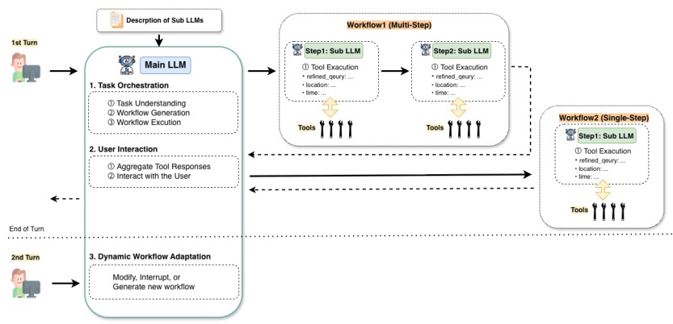
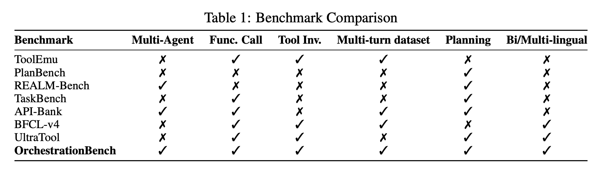
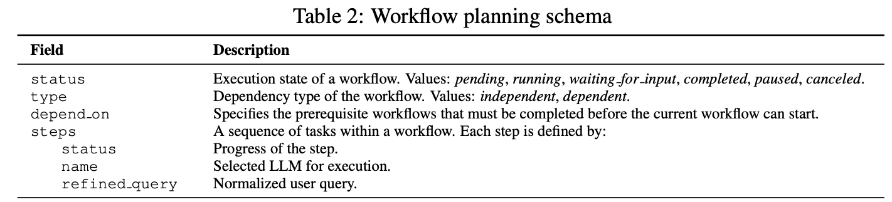
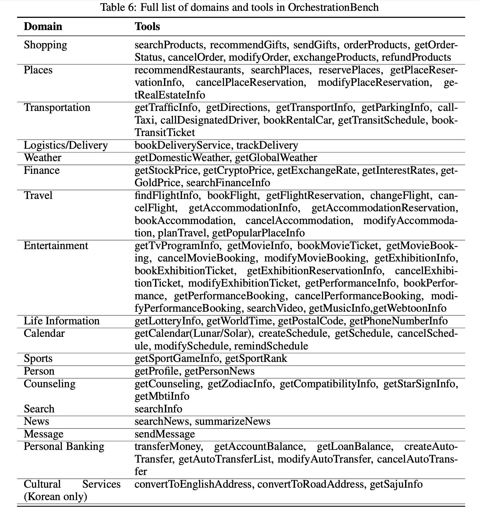
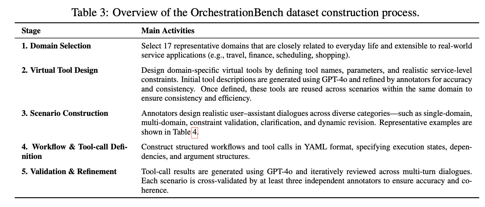
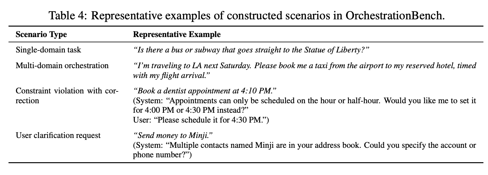
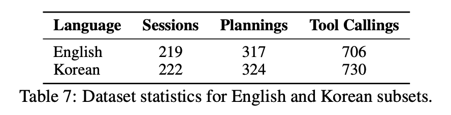
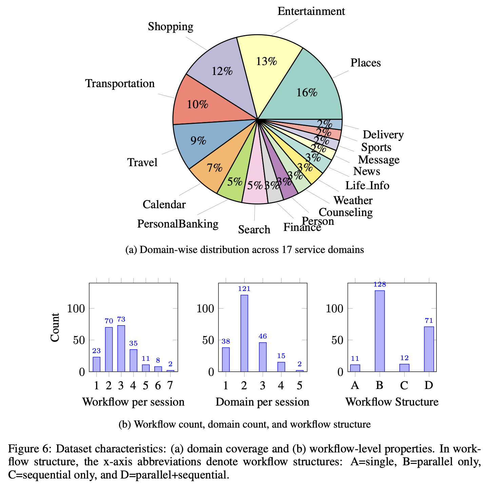
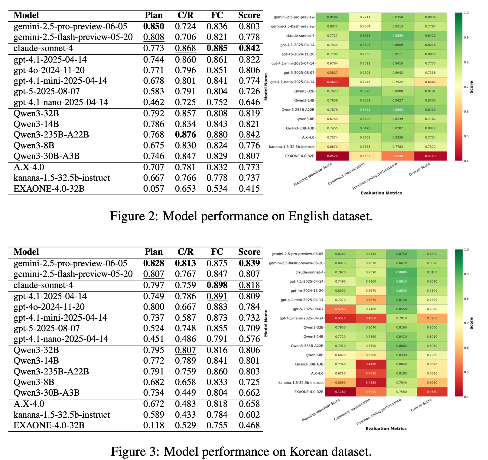
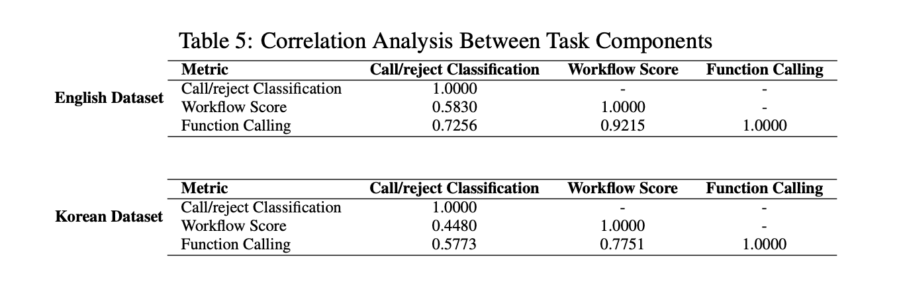

> ICLR 2026. [Paper](https://openreview.net/forum?id=Oljnxmf4pc&noteId=NyL52JeO4j), [GitHub](https://github.com/kakao/OrchestrationBench)

## Summary

- OrchestrationBench는 LLM agent가 실제 서비스 요청을 처리할 때 필요한 orchestration 능력을 benchmark로 분리해 평가한다.
- 핵심은 **workflow planning**과 **constraint-aware tool execution**을 한 점수로 합치지 않고 planning, call/reject, function calling으로 나누어 보는 것이다.
- 데이터는 영어와 한국어, 17개 domain, 약 100개 **virtual tools**, multi-domain service scenario를 포함한다.
- 실험에서는 workflow planning이 function calling보다 모델 간 차이를 크게 드러내고, 모델들이 제약 조건을 보고 tool call 여부를 판단하는 call/reject에서 어려움을 보인다고 보고한다.

## Introduction

LLM agent를 실제 서비스에 배포하려면 단일 질문에 답하는 능력만으로는 부족하다. 사용자는 한 번에 여러 요구를 섞어 말하고, 중간에 조건을 바꾸며, 어떤 작업은 다른 작업의 결과가 나온 뒤에야 실행할 수 있다. 이런 상황에서는 모델이 단순히 적절한 tool call을 만드는 것보다, 요청 전체를 어떤 흐름으로 나누고 어떤 순서로 실행할지 정하는 능력이 중요해진다.

논문은 이러한 능력을 **orchestration**으로 본다. OrchestrationBench는 service-ready LLM orchestration을 평가하기 위해 **workflow planning**과 **constraint-aware tool execution**을 분리한다. Workflow planning은 사용자 요청을 여러 workflow로 분해하고 의존성을 잡는 능력이다. Constraint-aware tool execution은 실제 tool을 호출할지, 정보를 더 요청할지, 서비스 제약 조건 때문에 실행을 거절할지 판단하는 능력이다.

이 benchmark는 영어와 한국어를 모두 포함한다. 17개 도메인과 실제 서비스에 가까운 약 100개의 **virtual tools**를 사용하고, sequential planning, parallel planning, multi-domain interaction, 비즈니스 제약 조건 검증을 포함한다. 논문은 OrchestrationBench를 고정된 leaderboard가 아니라 도메인과 tool을 확장할 수 있는 living benchmark로 제안한다.

{/* truncate */}

### Service Orchestration Problem

논문이 가정하는 상황은 일반적인 Q&A가 아니다. 사용자가 "서울행 항공편 예약하고, COEX 근처 호텔 찾고, 일정을 팀에게 공유해줘"라고 말하면 모델은 최소한 세 가지를 해야 한다. 항공편과 숙소를 각각 처리하고, 그 결과가 나온 뒤에야 일정을 공유해야 한다. 중간에 사용자가 "아침 비행기로 바꿔줘"라고 말하면 기존 계획도 다시 맞춰야 한다.

여기서 더 까다로운 부분은 제약 조건이다. 사용자가 "4:10 PM에 치과 예약해줘"라고 했는데 해당 서비스가 정각이나 30분 단위 예약만 받는다면, 모델은 바로 tool을 호출하면 안 된다. "4:00 PM이나 4:30 PM으로 예약할 수 있다"고 안내해야 한다. 논문은 이런 문제를 safety와 구분되는 **실행 가능성(functional feasibility)** 문제로 본다. 위험해서 거절하는 것이 아니라, 서비스 규칙상 실제로 수행 가능한 요청인지 판단하는 문제다.

OrchestrationBench의 핵심은 agent 실패를 한 덩어리로 보지 않는 데 있다. 모델이 요청을 잘못 나누었는지, workflow 의존성을 잘못 잡았는지, 필요한 정보를 묻지 않았는지, 또는 제약 조건을 무시하고 tool을 호출했는지를 따로 평가한다.



## Related Work

기존 tool benchmark는 대체로 API나 tool call을 제대로 만들었는지에 관심이 많다. BFCL, API-Bank, ToolBench 같은 benchmark가 여기에 가깝다. 반면 PlanBench 같은 planning benchmark는 계획 자체를 보지만, 실제 tool execution까지 깊게 들어가지는 않는다. ToolEmu나 SafeToolBench는 위험한 요청을 거부하는 safety evaluation에 가깝다.

OrchestrationBench는 이 사이에 있다. 논문 표현을 기준으로 보면 **LLM-to-API**보다 **LLM-to-LLM orchestration**에 가깝다. Main LLM이 사용자 요청을 workflow로 나누고, 각 작업을 sub-LLM에 넘긴 뒤, sub-LLM이 tool calling을 수행한다. 이후 main LLM은 sub-LLM의 결과를 모아 사용자에게 응답한다.

OrchestrationBench는 **workflow planning**과 **constraint-aware tool execution**을 한 점수로 합치지 않고 따로 평가한다. 이 구조에서는 모델이 계획을 잘못 세운 것인지, 아니면 제약 조건을 보고 실행 여부를 판단하지 못한 것인지 분리해서 볼 수 있다.



## OrchestrationBench

### Advanced Planning and Coordination

논문에서 workflow는 단순한 할 일 목록이 아니다. 각 workflow는 상태, 의존성, 실행할 sub-LLM, 정제된 쿼리를 가진다. 예를 들어 항공편 예약과 호텔 예약은 서로 독립적으로 진행할 수 있지만, 일정 공유는 둘 다 끝난 뒤에야 가능하다. 그래서 앞의 두 workflow는 independent이고, 일정 공유 workflow는 dependent가 된다.

```yaml
workflow_1:
  status: pending
  type: independent
  steps:
    - status: pending
      name: travel_agent
      refined_query: "내일 서울행 출장 항공편 예약"

workflow_2:
  status: pending
  type: independent
  steps:
    - status: pending
      name: travel_agent
      refined_query: "COEX 근처 호텔 예약"

workflow_3:
  status: pending
  type: dependent
  depend_on: ["workflow_1", "workflow_2"]
  steps:
    - status: pending
      name: calendar_agent
      refined_query: "완료된 일정을 팀에게 공유"
```

논문은 workflow를 나누거나 하나로 유지하는 기준도 둔다. 독립적인 요청이거나 중간 확인이 필요한 경우에는 workflow를 나누고, 한 목표를 함께 완성하는 작업은 같은 workflow 안에 둔다. 이 기준을 통해 모델이 단순히 단계 목록을 만드는 것이 아니라, 어떤 작업을 함께 묶고 어떤 작업을 분리해야 하는지 평가한다.



### Comprehensive Tool Use

이 논문에서 **tool execution**은 어떤 함수를 호출하고 어떤 인자를 넣는지만 평가하지 않는다. Tool execution 평가는 tool use가 필요한지, 직접 답할 수 있는지, 정보가 부족해서 사용자 입력을 기다려야 하는지, 제약 조건 위반으로 tool call을 거절해야 하는지를 포함한다.

사용자 정보가 부족하면 **AWAIT_FOR_USER_INPUT**으로 처리하고, 서비스 제약을 위반하면 **TOOL_CONSTRAINT_VIOLATION**으로 처리한다. 반대로 충분한 정보가 있고 제약도 만족하면 function call로 넘어간다. 이 때문에 논문은 tool execution을 **call/reject**와 **function calling**으로 나누어 평가한다.

### Multi-Domain Tool Environments

논문은 17개 서비스 도메인을 정의하고, 영어 97개와 한국어 99개의 **virtual tools**를 둔다. 각 도메인에는 도메인별 제약 조건과 실제 서비스에 가까운 동작이 포함된다. 한국어 subset에는 주소 로마자 변환이나 사주처럼 문화권에 맞는 tool도 포함된다.



### Dataset Construction

논문에서 강조하는 점은 conversation session, workflow, tool call이 annotator의 수작업 annotation과 validation을 거쳐 만들어졌다는 것이다. 데이터는 도메인 선정, virtual tool 설계, scenario 작성, workflow annotation, multi-annotator validation을 거쳐 만들어진다. 모든 scenario는 최소 3명의 annotator가 cross-validation한다. Appendix에서는 LLM이 virtual tool result 생성, 번역 초안, 언어 교정, 코드 개발 보조에 사용되었지만, 그 결과물은 preliminary draft로만 쓰였고 사람이 검토하고 수정했다고 설명한다.



### Dataset Scale and Distribution

OrchestrationBench는 영어와 한국어를 모두 포함한다. 영어는 219개 session, 317개 planning case, 706개 tool calling instance를 포함하고, 한국어는 222개 session, 324개 planning case, 730개 tool calling instance를 포함한다. 두 subset은 모두 17개 도메인을 포함한다.

Workflow 단위에서는 대부분의 session이 2~3개 workflow와 2~3개 도메인을 포함한다. 일부 session은 최대 7개 step 또는 4개 이상의 도메인까지 확장된다. Workflow 구조는 single, parallel only, sequential only, parallel+sequential 형태로 분류된다.







## Evaluation

### Evaluation Protocol

평가는 크게 planning과 tool execution으로 나뉜다. Planning에서는 모델이 생성한 workflow를 정답 workflow와 비교한다. Tool execution에서는 sub-LLM이 refined query를 받아 실제 tool call을 해야 하는지, 거절하거나 되물어야 하는지, 호출한다면 어떤 function과 argument를 써야 하는지 본다.

Evaluation protocol은 turn-by-turn 방식으로 설계된다. 평가 대상 LLM은 평가 시점까지의 conversation history를 받는다. 병렬로 실행되는 sub-LLM은 서로의 중간 history를 보지 못하고, 순차적으로 실행되는 LLM은 이전 output이 포함된 cumulative history를 본다. Main LLM의 workflow generation은 user input이 들어왔을 때만 실행된다.

### Metrics

Planning은 workflow를 graph로 보고 **Graph Edit Distance (GED)** 기반의 **1-GED**를 사용한다. 점수가 높을수록 정답 workflow와 비슷하다는 뜻이다. Tool execution은 다시 **call/reject**와 **function calling**으로 나뉜다. Call/reject는 true rejection과 true function call을 포함한 decision accuracy로 계산된다. Function calling은 function name, key, value 추출 성능을 F1 기반으로 평가한다.

### Evaluation Results

결과에서 관찰되는 것은 planning과 function calling이 같은 능력이 아니라는 점이다. Gemini 계열은 planning score가 높지만, function calling에서는 Claude Sonnet 4나 GPT-4.1 계열이 더 높은 점수를 보인다. GPT-4.1은 비교적 균형 잡힌 결과를 보인다. Qwen3 계열 open-source model은 일부 proprietary model에 가까운 성능을 보인다.

Open-source dense model은 planning task에서 mixture-of-experts variant보다 더 안정적인 결과를 보인다. 논문은 function calling 성능은 모델 간 차이가 상대적으로 작지만, planning 성능은 모델 간 편차가 크다고 해석한다.

Metric correlation에서도 planning과 call/reject는 강하게 결합되어 있지 않다. 논문은 planning과 call/reject 사이의 상관을 영어 0.58, 한국어 0.45로 보고한다. 반면 call/reject와 function calling 사이의 상관은 더 높게 나타난다. 이는 workflow planning과 tool execution을 분리해서 평가해야 한다는 논문의 주장과 연결된다.





## Conclusion and Future Works

OrchestrationBench는 영어와 한국어를 포함하는 bilingual benchmark로, multi-domain service environment에서 LLM orchestration을 평가하기 위해 만들어졌다. 핵심은 orchestration을 **workflow planning**과 **tool execution**으로 나누어 보고, tool execution도 다시 **call/reject classification**과 **function calling**으로 분리한다는 점이다.

Conclusion에서 가장 강조되는 결과는 workflow planning이 function calling보다 모델 간 격차를 더 크게 드러낸다는 점이다. 논문은 open-source dense model도 agentic task에서 경쟁력 있는 성능을 보이지만, orchestration task에서는 모델 선택이 특히 중요하다고 정리한다. 또한 모델들이 function call 자체는 비교적 잘 수행하더라도, 실제 제약 조건을 보고 지금 함수를 호출해도 되는지 판단하는 call/reject classification에서는 어려움을 보인다고 말한다.

논문은 현재 benchmark의 적용 범위도 함께 밝힌다. OrchestrationBench는 17개 domain과 영어/한국어 데이터를 포함하지만, 모든 orchestration scenario나 다른 언어까지 포괄하지는 않는다. 또한 predefined workflow와 **virtual tools**를 사용하므로, 더 유연한 end-to-end workflow generation이나 MCP 같은 framework를 통한 real-world tool integration은 이후 과제로 남긴다.

평가 방식도 future work와 연결된다. 현재 평가는 turn-by-turn evaluation이어서 각 단계의 실행이 성공했다고 가정하고 다음 단계를 평가한다. 논문은 이 설정이 전체 성능을 높게 보이게 만들 수 있으며, 실제 end-to-end evaluation에서는 초기 오류가 뒤 단계로 전파되어 더 낮은 성공률이 나올 수 있다고 설명한다. 따라서 future work는 real tool integration, error propagation을 포함한 end-to-end evaluation, domain과 language 확장, planning-execution gap을 줄이기 위한 training method, 더 복잡한 multi-agent coordination pattern으로 제시된다.

결론적으로 OrchestrationBench는 isolated tool calling을 넘어 service-ready LLM orchestration을 체계적으로 평가하기 위한 benchmark를 목표로 한다. 논문이 강조하는 방향은 더 많은 function calling 문제를 푸는 것이 아니라, 계획 수립, 실행 가능성 판단, 도구 호출, multi-agent coordination을 하나의 서비스 시나리오 안에서 평가하는 것이다.
