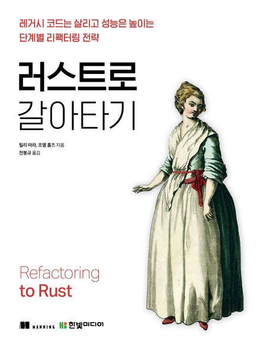

:::info
한빛미디어 \<나는 리뷰어다\> 활동을 위해서 책을 제공받아 작성된 서평입니다.
:::

## Book Info

:::tip
책 이미지를 클릭하면 교보문고 사이트로 이동합니다!
:::

- 제목: 러스트로 갈아타기
- 저자: 릴리 마라, 조엘 홈즈
- 역자: 전봉규
- 출판사: 한빛미디어
- 출간: 2026-01-22

{/* truncate */}

## Intro

2026년에도 한빛미디어 나는 리뷰어다 활동을 이어가게 되었다. 단순히 책을 한 권 더 읽는다는 의미를 넘어, 새로운 지식과 관점을 가장 먼저 접할 수 있는 기회를 다시 한 번 얻었다는 점이 특히 감사하다. IT 기술 책 한 권이 보통 2~4만 원을 훌쩍 넘는다는 것을 생각하면, 이 활동을 통해 좋은 책을 무료로 읽고 깊이 있게 정리할 수 있다는 건 분명 큰 기회라고 생각한다. 하지만 나에게 더 중요한 가치는 '가격'이 아니라, 스스로 공부할 명확한 계기와 마감이 생긴다는 점이다. 리뷰를 써야 한다는 책임감 덕분에 책을 훑는 데서 끝나지 않고, 이해하고 정리하고 내 것으로 만드는 과정을 거치게 된다. 2026년에도, 읽고 정리하고 나누는 과정을 통해 한 단계 더 성장해보자.

## Book Review

이 책을 읽고 나서 가장 먼저 든 생각은 이 책이 "Rust 문법서"라기보다 "레거시 시스템을 망가뜨리지 않고 바꾸는 방법론"에 가깝다는 점이었다.

### 점진적 리팩터링 철학이 분명하다

초반부는 리팩터링과 재작성의 차이를 계속 대비한다. 핵심 메시지는 단순하다. 큰 재작성 한 번보다 작은 변경을 빠르게 배포하고, 테스트와 모니터링으로 검증하면서 교체하라는 것이다. 이 관점이 마음에 들었던 이유는, 책이 "Rust가 빠르다"를 반복하는 데서 끝나지 않고 "운영 중 서비스에서 어떻게 위험을 줄일지"를 함께 다루기 때문이다.

2장은 소유권/대여/수명이라는 Rust 핵심 개념을 시각화해서 설명한다. 실제로 본문에 `E0382`, `E0502`, `E0106` 같은 대표 에러가 계속 등장하는데, 그냥 문법 암기보다 "왜 컴파일러가 막는지"를 납득하게 만들어 준다. 특히 수명 그래프를 시각적으로 곁들여 설명하는 구간은 Rust를 처음 진지하게 공부할 때 꽤 도움이 된다고 생각한다.

### 중반부는 C FFI, NGINX 예제가 강력하다

3~4장은 실무 전환 관점에서 가장 인상적이었다. `unsafe`를 피상적으로 소개하는 게 아니라, C 포인터를 받아 `CStr::from_ptr`로 처리하고 `extern "C"` 경계를 어떻게 잡아야 하는지 단계적으로 보여준다. 계산기 예제로 시작해서 NGINX 모듈로 확장하는 흐름도 좋았다.

4장에서는 `ngx_http_calculator_handler`, `read_body_handler`, `request_body_as_str<'a>` 같은 함수 단위까지 파고든다. `bindgen`을 이용해 NGINX C API 바인딩을 생성하고, `cargo build` 결과물을 NGINX 모듈과 연결해 `curl -X POST ... /calculate`로 검증하는 과정이 구체적이다. "이론적으로 가능" 수준이 아니라 실제 통합 문제를 어떻게 풀어가는지 보여줘서, FFI를 처음 실무에 도입할 때 참고하기 좋을 것 같다고 느꼈다.

### 후반부는 Python, 테스트, WASM까지 이어진다

5장은 상대적으로 차분하지만 중요하다. 모듈/경로/가시성 정리가 없으면 리팩터링 결과물이 금방 다시 복잡해지는데, 그 지점을 잘 짚어준다. 공개 범위(`pub`)를 어떻게 열고 닫아야 하는지, 라이브러리 구조를 어떻게 잡아야 하는지 실전 감각으로 설명한다.

6~8장은 개인적으로 가장 재미있게 읽은 부분이다. PyO3 + `maturin develop`로 Python 확장 모듈을 붙이고, `criterion` + `cargo bench`로 벤치마크를 돌리고, `cargo test`와 `pytest`를 함께 쓰는 식으로 "성능+검증" 루프를 만든다. 또 `Python::with_gil`을 중심으로 GIL 제약을 다루고, async/스레드 확장 전략으로 이어지는 흐름이 자연스럽다.

9~10장은 JavaScript 리팩터링과 WASM/WASI로 확장된다. `wasm-pack build --target web` 기반 브라우저 통합, Yew 컴포넌트 예제, 그리고 WASI/런타임(WasmEdge) 관점까지 연결한다. 덕분에 "C/Python 연동"에서 끝나지 않고 "런타임 경계를 넘는 리팩터링"까지 시야를 넓혀준다.

### 읽으면서 느낀 장점과 한계

장점은 분명하다. "어디를 먼저 Rust로 바꿀지" 판단 기준을 제시하고, 바꾸는 과정에서 테스트와 배포 전략까지 같이 다룬다. 즉, 코드 몇 줄 빠르게 만드는 법이 아니라 팀 단위 전환 전략에 가깝다고 느꼈다.

한계도 있다. Rust 완전 입문자가 바로 따라가기는 쉽지는 않을 것 같다. 3장 이후 `unsafe`/FFI, 6장 이후 PyO3 툴체인, 9~10장 WASM/WASI는 배경지식이 없으면 속도가 확 떨어진다. 그래서 이 책은 "Rust 처음 배우기"보다는 "기존 시스템을 단계적으로 개선하기"가 목표인 개발자에게 더 잘 맞는다고 생각한다.

### 개인적인 경험과 의견

너무 재밌게 읽으면서도 평소 내가 공부하던 분야는 아니라 조금 어려웠다. 작년 pyodide에 기여하기 시작할 때부터 FFI, WASM -> 러스트 순서로 이 분야에 대해 관심 있게 보고 있는데 다시 한 번 읽어보면서 열심히 공부를 해야겠다고 느꼈다.

## 대상 독자

- 러스트를 배우고 싶은 개발자
- C/C++ 코드를 어느정도 읽을 수 있는 개발자
- 파이썬 또는 자바스크립트 서비스의 병목 구간을 점진적으로 개선하고 싶은 개발자
