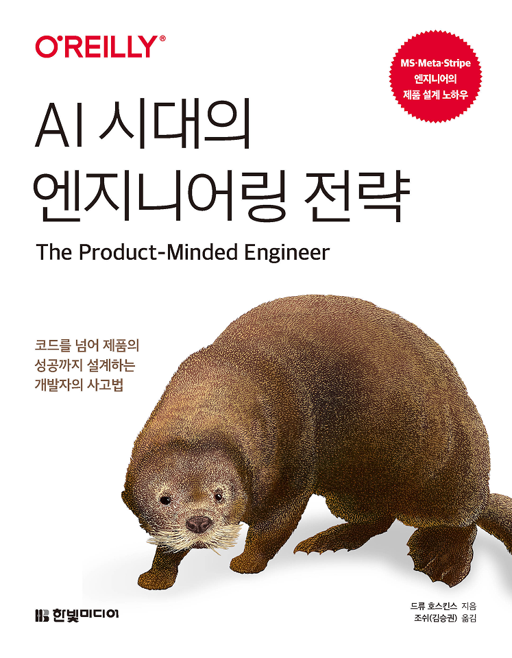

:::info
한빛미디어 서평단 \<나는리뷰어다\> 활동을 위해서 책을 협찬받아 작성된 서평입니다.
:::

## Book Info

:::tip
책 이미지를 클릭하면 교보문고 사이트로 이동합니다!
:::

- 제목: AI 시대의 엔지니어링 전략
- 저자: 드류 호스킨스
- 역자: 조쉬(김승권)
- 출판사: 한빛미디어
- 출간: 2026-07-31

{/* truncate */}

## Intro

요즘은 AI의 도움을 받아 코드와 테스트 초안을 만드는 일이 자연스러워졌다. 구현 속도가 빨라진 만큼 좋은 엔지니어의 기준은 무엇인지 더 자주 고민하게 된다. 주어진 기능을 빠르게 만드는 사람과 사용자의 문제를 제대로 해결하는 사람 사이에는 분명한 차이가 있기 때문이다. 오픈소스 기여와 취업 준비를 이어가면서도 기술을 많이 아는 것만큼 그 기술로 무엇을 왜 만들 것인지 판단하는 능력도 중요하다고 느끼고 있었다.

사실 이 책을 처음 알게 된 건 약 6개월 전이었다. 링크드인에서 팔로우하고 있는 당근의 엔지니어링 리드이신 분이 원서 리뷰를 올렸는데 주어진 요구 사항을 빠르게 구현하는 데서 벗어나 제품과 사용자의 문제까지 바라봐야 한다는 내용이 인상적이었다. 당시에는 이 책을 바로 읽지 않았지만 "프로덕트 엔지니어는 구체적으로 어떻게 일해야 할까?"라는 궁금증이 남았다. 그때부터 기회가 되면 한번 읽어보고 싶다고 생각했던 책이라 이번에 한국어판이 나온 것을 보고 반가운 마음으로 선택했다.

처음에는 제목 때문에 AI 코딩 도구나 개발 생산성 전략을 다루는 책이라고 생각했다. 하지만 원제인 "The Product-Minded Engineer"가 책의 내용을 더 정확하게 보여준다. AI 도구 사용법이 이 책의 주제는 아니다. AI 코딩 어시스턴트와 에이전트가 구현에 드는 시간을 줄여주는 시대에 엔지니어가 무엇을 왜 만들지 판단하는 프로덕트 사고가 핵심이다. 이 책은 코드를 넘어 사용자와 제품의 성공까지 생각하는 프로덕트 중심 엔지니어(product-minded engineer)가 되려면 어떤 질문과 행동이 필요한지를 다룬다.

## Book Review

이 책을 읽고 가장 크게 달라진 질문은 "어떻게 만들까?"에서 "왜 만들고 누가 사용할까?"였다. 저자는 프로덕트 사고를 PM이나 디자이너만의 영역으로 두지 않는다. API, 개발자 도구, 사내 플랫폼처럼 화면이 없는 소프트웨어에도 사용자가 있으며 엔지니어의 기술적 결정은 결국 그들의 경험으로 이어진다고 설명한다.

### How보다 먼저 Why를 묻는다

책의 첫 장은 시나리오 없이 개발한 경우와 시나리오를 먼저 작성한 경우를 비교한다. 새로운 기능을 접하면 데이터베이스 구조나 API부터 떠올리기 쉽지만 저자는 사용자가 어떤 상황에서 무엇을 하려는지 먼저 이야기로 적어보라고 한다. 시나리오는 단순한 요구 사항 요약이 아니다. 사용자 인터뷰에서 얻은 맥락을 담고 제품의 빈틈과 마찰을 드러내며 구현하려는 기능을 검증하는 작은 시뮬레이션이 된다. 이후에는 테스트와 우선순위를 정하는 기준으로도 사용할 수 있다.

나 역시 새로운 문제를 보면 구현 방법부터 생각하는 편이라 이 부분이 가장 먼저 와닿았다. AI는 불완전한 요구 사항도 빠르게 코드로 바꿔준다. 그래서 출발점이 잘못되면 이전보다 더 빠르게 필요 없는 기능을 완성할 수도 있다. 구현 속도가 빨라질수록 코드를 작성하기 전에 사용자, 상황, 목적을 구체화하는 시간이 더 중요해진다는 뜻이다.

### 사용자는 화면 밖에도 있다

책에서 말하는 사용자는 앱 화면을 직접 보는 고객만을 뜻하지 않는다. 내가 만든 API를 호출하는 개발자, 사내 도구를 사용하는 동료, 라이브러리를 설치하는 사람도 모두 사용자다. 이 관점으로 보면 함수 이름, 기본값, 문서, 샘플 코드와 호환성도 제품 경험의 일부가 된다.

오픈소스에 기여할 때도 같은 기준을 적용할 수 있다. 수정한 코드가 테스트를 통과하는 것과 다른 개발자가 문서와 API만 보고 기능을 문제없이 사용하는 것은 다른 일이다. 기능이 존재해도 사용자가 발견하지 못하거나 의미를 이해하지 못하거나 실제 작업에 적용하지 못하면 제품은 역할을 다하지 못한다. 책이 사용자 여정을 발견, 이해, 사용으로 나누는 이유도 여기에 있다.

### 에러 메시지도 제품의 인터페이스다

개인적으로 가장 인상 깊었던 주제는 에러와 경고였다. 개발자는 에러 메시지를 예외 처리 뒤에 붙이는 문구나 디버깅 정보로 보기 쉽다. 하지만 사용자에게 에러는 제품이 문제를 설명하고 다음 행동을 안내하는 순간이다. 단순히 "잘못된 요청"이라고 알려주는 것과 어떤 입력이 왜 잘못됐고 어떻게 고쳐야 하는지 알려주는 것은 전혀 다른 경험을 만든다.

좋은 진단은 문제가 원인에서 멀리 퍼진 뒤가 아니라 원인에 가까운 지점에서 일찍 실패하게 한다. 메시지에는 사용자가 처한 맥락과 해결 방법이 함께 있어야 한다. 이 내용을 읽으면서 안정적인 코드를 만드는 것과 사용자가 스스로 문제를 해결할 수 있게 만드는 일이 분리되어 있지 않다는 생각이 들었다. 에러 메시지는 마무리 단계의 자잘한 작업이 아니라 엔지니어의 제품 감각이 가장 직접적으로 드러나는 인터페이스였다.

### 직접 사용하고 마찰을 기록한다

도그푸딩, 문서 주도 개발, 마찰 로그를 다루는 부분은 바로 적용해보기 좋았다. 개발자는 이미 제품의 구조와 사용법을 알기 때문에 처음 쓰는 사람이 멈추는 지점을 쉽게 지나친다. 직접 설치하고 첫 작업을 끝까지 수행해보면서 불필요하게 고민한 순간, 설명이 부족한 부분, 반복되는 단계를 마찰 로그에 남기면 익숙함 때문에 보이지 않던 문제를 찾을 수 있다.

문서를 코드를 완성한 뒤 쓰는 설명서가 아니라 설계 도구로 사용하는 접근도 좋았다. 사용 방법을 먼저 적어보면 인터페이스가 지나치게 복잡한지 입력과 결과가 자연스러운지 구현 전에 확인할 수 있다. 다만 팀 내부의 도그푸딩만으로 실제 사용자를 완전히 이해할 수는 없다. 저자도 피드백과 제품 지표를 함께 보며 출시 이후에도 계속 사용자를 배워야 한다고 강조한다. 직접 사용해보는 일은 고객 발견의 대체재가 아니라 더 나은 질문을 만드는 출발점에 가깝다.

### 아키텍처도 사용자 경험에서 시작한다

마지막 장의 프로덕트 아키텍처도 흥미로웠다. 지연 시간, 가용성, 일관성, 확장성과 같은 비기능 요구 사항(Non-Functional Requirements, NFR)은 보통 시스템 내부의 품질로만 생각하기 쉽다. 이 책은 그 수치를 사용자의 경험으로 다시 번역한다. 긴 지연 시간은 단순히 벤치마크가 나쁜 것이 아니라 사용자의 작업 흐름을 끊고, 낮은 가용성은 서비스를 믿고 사용할 수 없게 만든다. 일관성 역시 데이터베이스가 제공하는 속성만이 아니라 사용자가 제품에서 기대하는 동작과 연결된다.

이 관점이 좋았던 이유는 프로덕트 사고가 기술을 덜 중요하게 만드는 것이 아니라 기술적 선택의 기준을 더 분명하게 만들기 때문이다. 먼저 어떤 경험을 지켜야 하는지 정하면 모든 지표를 무조건 높이는 대신 사용자에게 중요한 부분에 비용과 복잡성을 쓸 수 있다. 좋은 시스템 설계와 좋은 제품 설계가 따로 존재하지 않는다는 메시지가 책의 마지막까지 이어진다.

### 제품 판단에 더 깊이 참여한다

한편 프로덕트 중심 엔지니어가 PM이나 디자이너를 무조건 대신해야 한다는 뜻은 아니다. 책은 엔지니어가 PM이나 디자이너와 더 잘 협업하는 방법을 설명하면서도 상황에 따라 제품 방향을 더 주도적으로 이끌거나 프로덕트/엔지니어링 하이브리드로 성장할 수 있다고 말한다. 모든 제품 의사결정을 혼자 떠안으라는 의미라기보다 기술적 제약과 사용자 경험을 함께 이해한 사람이 판단 과정에 더 깊이 참여하라는 뜻으로 읽혔다.

내가 이 부분에서 가져가고 싶은 것은 새로운 직무를 하나 더 맡아야 한다는 부담보다 주어진 요구 사항을 그대로 구현하지 않고 더 적극적으로 의견을 내는 태도였다. 왜 필요한지 묻고 더 작은 실험을 제안하고 출시 뒤의 반응까지 확인하는 것이다. 이 정도의 주도성은 직급과 상관없이 연습할 수 있다고 생각한다.

### 읽으면서 느낀 장점과 한계

가장 큰 장점은 추상적인 "사용자 중심"을 시나리오, 진단, 도그푸딩, 마찰 로그, 페르소나, 제품 지표처럼 실행 가능한 도구로 바꿔준다는 점이다. 각 장의 예제에서 먼저 답을 생각하고 저자의 답안과 비교할 수 있는 구성도 좋았다. 제품 문제에는 하나의 정답이 없기 때문에 내가 놓친 관점을 확인하는 과정 자체가 공부가 된다.

다만 다루는 범위가 넓다 보니 모든 개념을 같은 깊이로 설명하지는 않는다. 더블 다이아몬드(Double Diamond)와 해야 할 일(Jobs to Be Done, JTBD)은 전체 흐름을 설명하는 틀에 가깝다. 반면 페르소나와 시나리오는 고객 인터뷰부터 요구 사항과 우선순위로 바꾸는 과정까지 꽤 구체적으로 다룬다. 이미 제품 조직에서 오래 일한 독자에게는 익숙한 내용도 있을 것이다. 반대로 개발을 막 시작한 독자는 개념을 이해하더라도 실제 경험과 연결하기 어려울 수 있다. 에러 처리, 운영, 사용자 피드백, 아키텍처의 트레이드오프를 한 번이라도 겪어본 독자가 더 많은 내용을 가져갈 수 있다고 생각한다.

무엇보다 제목만 보고 AI 도구 사용법을 기대하면 방향이 다르다. Claude Code나 Cursor 사용법, 프롬프트 작성법, AI 애플리케이션 구현법을 가르치는 책은 아니다. 다만 7장에서는 AI 어시스턴트를 사례로 제품 테제, 타깃 오디언스, 북극성 시나리오와 요구 사항을 구체화한다. AI를 완전히 비켜가는 책이 아니라 AI를 어떻게 만들지보다 무엇을 왜 만들지에 초점을 둔다. 새로운 기술 하나를 배우는 책이라기보다 이미 가진 기술을 어디에 어떻게 써야 하는지 기준을 세워주는 책이었다.

## 대상 독자

- 요구 사항을 구현하는 데서 그치지 않고 제품에 더 적극적으로 기여하고 싶은 개발자
- API, 라이브러리, 플랫폼, 사내 도구를 만들며 자신의 사용자가 누구인지 다시 생각해보고 싶은 개발자
- PM이나 디자이너와 협업하면서 기술적 판단을 사용자 경험과 연결하고 싶은 개발자
- 팀 프로젝트 경험이 있고 AI가 구현을 도와주는 시대에 엔지니어의 경쟁력이 무엇인지 고민하는 취업 준비생과 주니어 개발자
- 시니어 개발자나 테크 리드로 성장하며 제품과 아키텍처를 함께 바라보고 싶은 개발자
