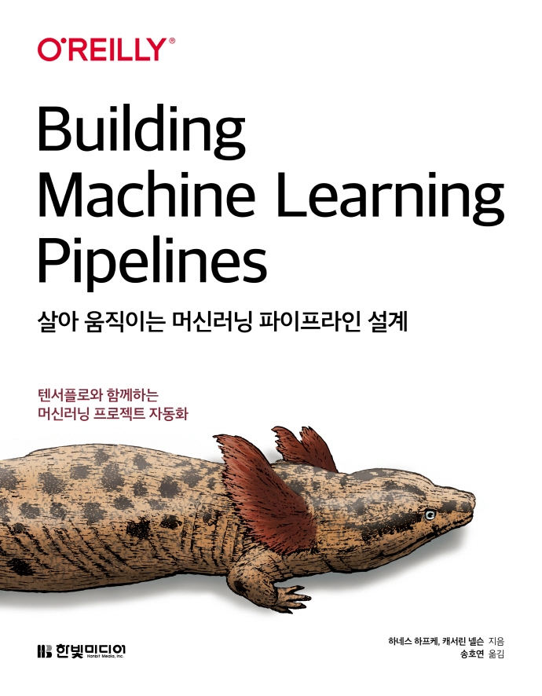

---
title: "[Book Review] 살아 움직이는 머신러닝 파이프라인 설계"
date: 2021-11-20T22:38:23+09:00
categories: ["책 리뷰"]  
tags: ["머신러닝", "파이프라인"]

summary: 텐서플로와 함께하는 머신러닝 프로젝트 자동화

weight: 1
math: false
draft: false
---  

**
한빛미디어 <나는 리뷰어다> 활동을 위해서 책을 제공받아 작성된 서평입니다.
**

## Book Info

`책 이미지를 클릭하면 교보문고 사이트로 이동합니다!`

- 제목: 살아 움직이는 머신러닝 파이프라인 설계
- 저자: Hannes Hapke, Catherine Nelson
- 역자: 송호연
- 출판사: 한빛미디어
- 출간: 2021-10-11

## 책 소개

### 머신러닝 지식과 클라우드 지식

머신러닝 파이프라인을 설계해보려면 설계 전에 머신러닝에 대한 기본 지식은 알아야겠죠? 이 책을 읽기 전에 TensorFlow와 Keras 코드 읽기가 익숙하신지 생각해보시길 바랍니다. 또한, 파이썬에도 엄청 익숙하셔야 합니다! 이 책을 고려하시는 분이라면 당연하실 거라 믿습니다.

또한, 이 책을 읽기 위한 필수 지식은 아니지만 클라우드를 사용해보신 분이 읽으시면 책을 읽으시는 데 도움이 될 것입니다. 특히 GCP(Google Cloud Platform) 또는 AWS(Amazon Web Services) 환경을 한 번이라도 사용해보셨으면 됩니다. 파이프라인을 설계하면서 클라우드 서비스를 활용하여 최적화할 수 있는 방법들을 설명하기에 사전에 GCP 또는 AWS를 사용해보셨다면 읽으시는 데 훨씬 편할 것입니다. 

### 전반적인 내용 정리

TensorFlow Extended(TFX)를 사용하여 데이터 수집 -> 데이터 검증 -> 데이터 전처리 -> 모델 학습 -> 모델 분석 및 검증 -> 모델 배포 순으로 파이프라인을 설계해봅니다. 전반적으로 텐서플로우 생태계를 사용해본다고 생각하시면 됩니다. TFX 공식 문서가 잘 번역이 되어 있어서 공식 문서도 보시면서 책을 읽으시면 더욱 도움이 될 것 같습니다!

마지막으로는 파이프라인을 실행하는 데 사용하는 오케스트레이션 도구를 사용해봅니다. 개인적으로 파이프라인을 설계하는 부분도 흥미가 있어 재밌게 읽었지만, 마지막 부분에 세 가지 오케스트레이션 도구(Apache Beam, Apache Airflow, Kubeflow)를 설명하는 부분을 꽤 재밌게 읽었습니다. 커뮤니티에서 듣기만 해봤던 도구들이라 이 책을 통해 사용해볼 기회가 생겨서 도움이 됐습니다.

### 부록

부록에서는 머신러닝에 유용한 인프라 도구이며 컨테이너를 관리하는 도커나 쿠버네티스를 간단히 소개합니다. 또한, 구글 클라우드에 쿠버네티스 클러스터를 설정해봅니다. 도커나 쿠버네티스를 사용해보시지 않으셨더라면 부록에서 체험해보실 수 있습니다. 

## 대상 독자

이 책은 머신러닝 프레임워크에 익숙하시고 머신러닝 파이프라인을 직접 설계해보시고 싶은 분들께 추천합니다. 비록 이 책의 머신러닝 코드가 텐서플로와 케라스 기반이지만, 핵심적인 개념은 어떠한 프레임워크에서도 적용할 수 있을 것으로 예상됩니다. 

TensorFlow 생태계에 관심이 많으신 머신러닝 엔지니어분들이 읽으셔도 도움이 될 책이라고 예상합니다. 또한, MLOps에 관심이 있으신 DevOps 엔지니어 분이 읽으셔도 도움이 될 책이라고 생각합니다. 