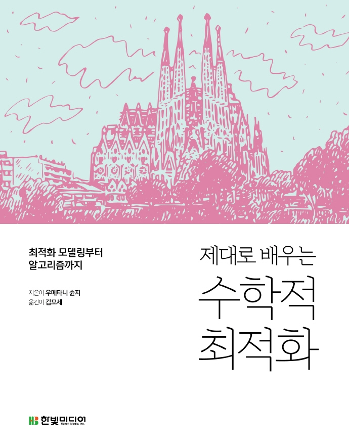

---
title: "[Book Review] 제대로 배우는 수학적 최적화"
date: 2021-10-21T13:23:46+09:00
categories: ["책 리뷰"]  
tags: ["최적화", "optimization"]

summary: 최적화 모델링부터 알고리즘까지

weight: 1
math: false
draft: false
---  

**
한빛미디어 <나는 리뷰어다> 활동을 위해서 책을 제공받아 작성된 서평입니다.
**

## Book Info

`책 이미지를 클릭하면 교보문고 사이트로 이동합니다!`

- 제목: 제대로 배우는 수학적 최적화
- 저자: Shunji Umetani(우메타니 슌지)
- 역자: 김모세
- 출판사: 한빛미디어
- 출간: 2021-09-30

## 책 소개

### 수학적 지식이 필요한 책

제목에서부터 `수학`이라는 말이 들어가는 것을 보면 알 수 있듯이 최적화 이론을 공부하기 위해서는 선수 지식들이 필요합니다. 최적화 문제란 간단하게 설명하면 어떤 목적 함수의 결과 값을 최적화(최대화 또는 최소화)하는 솔루션을 찾는 문제입니다. 단순하게 보면 수학 문제로 밖에 안 보이지만 거의 대부분의 머신러닝, 딥러닝 분야에서 쓰입니다. 예를 들어서 Gredient discent, Convex optimization 등이 쓰이죠. 다양한 수학적 지식들과 알고리즘으로 이루어져 있기 때문에 선수 지식들이 꽤 필요한 편이며 대표적으로 선형대수, 대표적인 알고리즘, 자료구조, 미적분 등을 알고 있어야합니다.  

전 이 책을 읽기 위한 준비가 됐다고 생각했었는데 전혀 그렇지 않았습니다. 선수지식들을 모두 공부해봤어도 읽는데 어려움이 있었습니다. 처음 이 책을 대충 훑어봤을 때는 수치해석과 비슷하다고 느껴 `비슷한 내용이니 크게 어렵지 않겠지?`라는 생각을 했었습니다. 완전 어리석은 생각이었습니다. 

### 다양한 예시 문제 적용

단순히 수학적인 지식만 설명하는 것이 아닌 수학적 최적화의 사고방식을 알려주기 위해 예시를 들어 `어떻게 하면 최적화 할 수 있을까?`에 대한 답을 알려줍니다. 전 이부분이 이 책의 가장 큰 장점이라고 생각합니다. 어짜피 수많은 이론들을 알아봤자 그걸 이해하지도 못하고, 적용할 수도 없다면 무의미해집니다. 이 책에서는 구체적으로 예시를 들면서 설명해주니 이해하기 쉬웠습니다.

### 연습문제와 참고문헌

개념만 공부하면 기억에 오래 남지 않는다고 생각해서 수학 책에 연습 문제가 있다는 것이 좋다고 생각합니다. 공부하는 학생 입장에서도 도움이 꽤 되며 이 책은 다른 책들과 다르게 연습문제에 대한 해설도 부록으로 제공해줍니다. 문제를 먼저 풀어보고 해설과 비교해볼 수 있겠죠.

참고문헌도 매 단원이 끝날 때마다 열심히 공부하라고 넣어주십니다. 이 책의 범위가 매우 방대하다는 것을 예상할 수 있죠. 매단원마다 많은 양의 책들을 참고하라고 추천해주시는데 참고문헌이 대부분 일본어 책이라서 조금 부담됩니다. 그래도 영어로 쓰여진 몇몇 책들을 알려주셔서 나중에 필요한 내용들이 있다면 참고하거나 읽어볼 예정입니다.

## 대상 독자

전 일단 첫번째로 `최적화 이론에 관심 있는 사람`이 읽으셨으면 좋겠습니다. 관심도 없는데 머신러닝, 딥러닝에 관련되어 있다고 해서 공부하시는 건 추천드리지 않습니다. 컴퓨터 공학과 기준으로 학부생이 읽는 것도 별로 추천드리고 싶지는 않습니다. 읽어도 4학년 때 머신러닝 수업을 들으면서 읽어보시고 다른 책으로 먼저 최적화 이론에 대해 공부해보는 것을 추천드립니다. 

최적화 지식에 대해 전반적으로 알고 싶으신 분이 읽으셨으면 좋겠습니다. 이 책은 수학적 최적화에 대해 기본 지식을 배우기 위한 책입니다. 결국 입문서라는 거죠. 더 자세히 공부해보고 싶으시다면 이 책에 나와있는 참고문헌의 책들과 같이 읽어보시길 바랍니다.