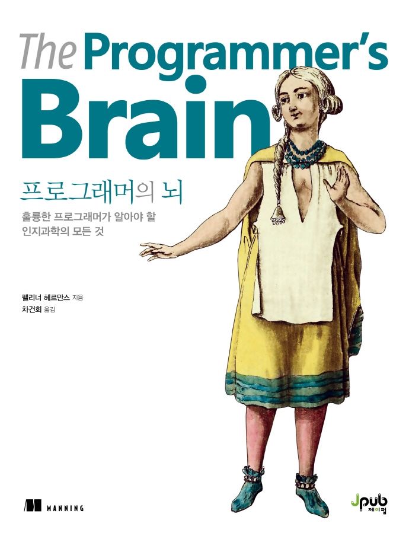

## Book Info

**
제이펍 <믿고 보는 IT 전문서 리뷰어> 활동을 위해서 책을 제공받아 작성된 서평입니다.
**

**
`책 이미지를 클릭하면 교보문고 사이트로 이동합니다!`
**

- 제목: 프로그래머의 뇌
- 저자: Felienne Hermans
- 역자: 차건회
- 출판사: 제이펍
- 출간: 2022-01-12

## Intro

서론만 봤을 때는 좀 생소한 단어도 많이 보이고, 인지 과학에 접목하여 설명하는 모습이 보여 상당히 고민됐지만 도움이 될 것 같아 읽게 됐습니다. 또한, 전체적인 프로그래밍을 진행하면서 어떻게 뇌가 인지하는지 그 과정을 이 책에서는 어떻게 설명하는가 궁금하여 읽기로 결심했습니다.

## Book Review

### 공부

프로그래밍이든지 책이든지 뭐든 간에 그저 한 번 읽어보고, 검색하며 공부한다고 해서 자신이 아는 것이 아니라는 걸 다시 한번 깨닫게 해줍니다. 이 책에서는 코드를 인식할 때의 뇌가 어떻게 작동하는지, 그리고 코드를 어떻게 하면 빠르게 파악하고 읽을 수 있는지에 대해 설명합니다. 이런 부분들이 사실 코딩뿐만 아니라 다양한 공부에도 접목할 수 있는 부분이라 제가 지금까지 했던 공부들을 반성하기도 하면서 꽤 재밌게 읽었습니다.

### 과학적

Intro에서도 설명했듯이 이 책은 전체적인 프로그래밍 과정을 인지 과학에 접목하여 설명합니다. 몇몇 생소한 단어들이 보여 읽기 어려웠으나, 모두 과학적으로 입증된 연구 결과를 기반으로 설명하기에 흥미로웠습니다. 주석으로 어떤 연구를 진행했는지 모두 나와 있기에 신빙성이 높아 큰 걱정 없이 읽었습니다.

### 코드

사실 예전에도 어느 책에서 좋은 코드를 작성하는 방법에 대해 읽은 적이 있습니다. 그 책은 단순히 "이런 코드는 좋고 이런 코드는 좋지 않다"를 예시를 들어 설명했지만, 이 책은 예시를 들어 설명하기도 하지만, 인지과학적으로 설명하는 부분이 인상 깊었습니다.

## 대상 독자

이 책은 전체적인 프로그래밍 과정을 인지 과학에 접목하여 설명합니다. 그렇기에 자신이 프로그래머로서 무의식적으로 하고 있는 일들이 뇌에서 어떻게 일어나는지 궁금하신 분들께 추천해 드립니다.

제 기준으로 미묘하게 이해가 안 되는 부분들이 몇몇 있기에 개인적으로 실무를 경험해본 분들께 더욱 추천합니다. 꼭 필수는 아닙니다. 자바, 파이썬 코드를 읽을 수 있고 코딩을 꽤 경험해본 대학생 정도면 충분히 읽어볼 만한 책인 것 같습니다. 생산성 관점에서도 도움이 되는 내용이 많기에 생산성 향상에 관심 있으신 분들께도 추천해 드립니다. 