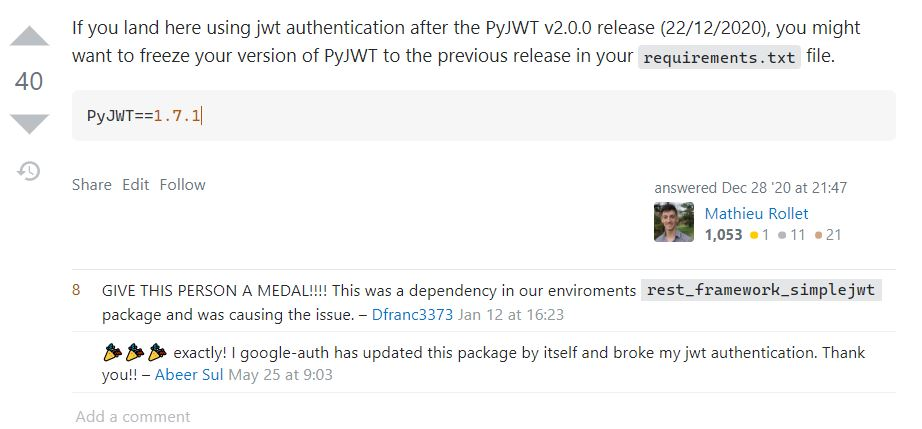

## decode 에러

PyJWT를 활용하여 JWT를 만들고 있었는데 분명히 책에서 따라한 코드가 맞는데 에러가 떴다.

```python
token = jwt.encode(payload, app.config['JWT_SECRET_KEY'], 'HS256')

return jsonify({'access_token': token.decode('UTF-8')})
```

```bash
AttributeError: 'str' object has no attribute 'decode'
```

"뭐지?"라고 생각하면서 일단 코드를 잘못 썼을 수도 있으니 책에서 주어진 코드를 복붙했다. 그래도 에러는 다시 나타났다.

## 해결

에러가 다시 나타나니 방법은 구글링 밖에 없었다. 바로 stackoverflow가 뜨길래 해결은 깔끔하게 됐다.

```python
token = jwt.encode(payload, app.config['JWT_SECRET_KEY'], 'HS256')

return jsonify({'access_token': token})
```

그냥 decode를 지워주면 되는 문제였다. 근데 '왜 decode가 붙어있던걸까?'라는 의문이 들었고 stackoverflow를 계속 탐험했다.



대충 버전과 관련있어 보이는 답변을 발견했고, 바로 공식문서를 읽어보는 방법을 선택했다. 현재 내가 쓰고 있는 버전은 2.1.0으로 가장 최근 버전이다. 저 코드가 레거시 코드라는 예상을 해보고 PyJWT 공식 문서의 Changelog를 읽어봤다.


역시나 내 예상은 맞았다. v2.0.0으로 바뀌면서 `jwt.encode(...)`의 return type이 바뀌었다는 것. 예전에는 토큰의 타입을 byte string으로 return했었던 것 같다. 현재는 str 타입으로 return되고 파이썬에서 모든 문자열은 UTF-8이므로 딱히 저걸 decode할 필요가 없다는 의미이다.

## 느낀점

역시 책을 읽으면서 공부하는 방법도 장점만 있는 것이 아니다. 얼마나 오래 됐느냐에 따라서 레거시 코드가 존재할 수도 있다. 책으로 공부하려면 가장 최근에 나온 책을 먼저 읽어보는 것이 좋을듯하다.


## References

>- [stackoverflow](https://stackoverflow.com/questions/50979667/python-attributeerror-str-object-has-no-attribute-decode) 
>- [stackoverflow](https://stackoverflow.com/questions/65798281/attributeerror-str-object-has-no-attribute-decode-python-error/66065560#66065560)
>- [PyJWT](https://pyjwt.readthedocs.io/en/latest/index.html)