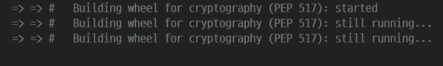
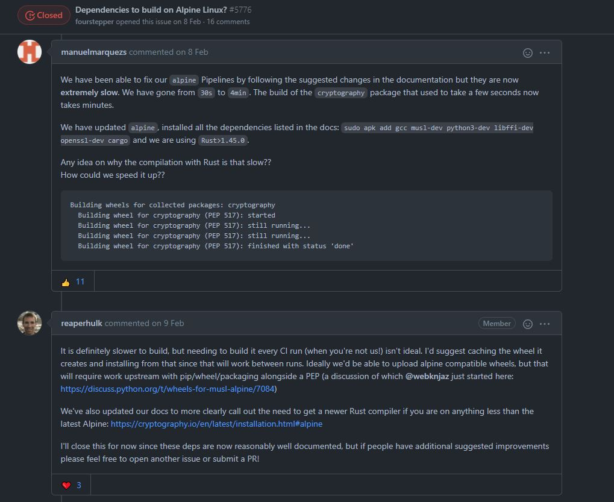

## alpine linux와 cryptography의 호환성 문제

Django 블로그 프로젝트를 docker로 옮기는 도중 에러가 떴다. alpine linux와 python에서 암호화 알고리즘이 구현된 패키지인 cryptography의 호환성 문제였다. 

```Dockerfile
FROM python:3.8-alpine
```

```bash
cryptography==3.4.7
```

현재 Dockerfile에서 사용하는 image 버전과 requirements.txt에 적힌 cryptography 버전은 위와 같다.

```bash
docker-compose build
```

```
ERROR: No matching distribution found for cryptography==3.4.7
```

`Dockerfile`, `docker-compose.yml`을 다 만들고 난 후에 마지막으로 위의 명령어로 빌드를 하던 중 위의 Error를 만났다. 

## 첫 번째 문제 해결


아무리 구글링을 해도 찾지를 못 해서 공식 문서를 보기로 결정했고 어느정도 해결책을 찾았다.

대략 요약하면 cryptography 패키지는 Rust를 사용하기에 Rust compiler도 같이 다운로드 해야지 돌아간다는 것이다. Rust는 cryptography를 빌드할 때 필요하며 stackoverflow에서 참고한 답변에서는 rust 설치를 스킵하는 명령어를 추가하는 방법도 알 수 있었다.

```Dockerfile
ENV CRYPTOGRAPHY_DONT_BUILD_RUST=1
```

multi-stage를 사용하여 빌드하라고 한다. 물론 multi-stage를 사용하면 이미지를 경량화하는 것도 좋은 방법이지만 도커를 자세히 배운 사람이 아니라 잘 모르기 때문에 이 방법은 패스했다. 

```shell
$ sudo apk add gcc musl-dev python3-dev libffi-dev openssl-dev cargo
```

위의 명령어를 Dockerfile에 추가하면서 첫 번째 문제는 끝났다.

## 빌드가 오래 걸리는 문제



위의 명령어를 Dockerfile에 추가하고 다시 build 하니 위와 같이 에러 아닌 에러가 떴다. 이미지를 보면 알 수 있듯이 still running이 지속되는 상황이다. 대략 10분 정도 그대로 놔뒀는데도 빌드가 안 되는 상황이다.



cryptography GitHub 저장소에서 가져온 이슈 이미지다. 현재의 상황과 같길래 답변을 참고하려 했으나 내 지식으로는 이해 불가였다. 대략 요약하자면 파이썬 패키지 포맷과 관련된 답변과 alpine linux에 대해 공식 문서로 잘 정리되어 있다는 내용이다. 결론적으로는 도움이 안 됐지만, 혹시 저 답변으로 해결할 수 있는 분이 있을 수 있기에 가져와봤다.

현 시점의 문제는 빌드가 오래 걸린다는 것이다. 이 문제를 해결하기 위해 다시 구글링을 하면서 도커에 대해 공부하게 됐고, 파이썬 환경에서 도커를 이용할 때 어떤 OS를 사용하는 것이 더 유리한 가에 대해 공부했다.

## 두 번째 문제 해결

### alpine linux가 파이썬 환경에서 적절하지 않은 이유

대부분의 사람들이 도커를 처음 사용할 때 alpine linux로 사용하는데 그 이유는 Ubuntu linux와 비교했을 때 용량도 작고 빌드할 때 더 빠르기 때문이다. 그러나 python 환경에서는 적절하지 않다.

그 이유는 사용하는 라이브러리의 차이에서 시작된다. 대부분의 리눅스 배포판은 파이썬을 포함한 모든 C언어 프로그램에 필요한 C언어 표준 라이브러리인 GNU 라이브러리(glibc)를 사용한다. 그러나 Alpine Linux는 좀 더 경량화하기 위하여 GNU 라이브러리를 사용하는 것이 아니라 musl 라이브러리를 사용한다. 이 musl 라이브러리는 GNU 라이브러리로 컴파일 된 `Wheel 바이너리`를 지원하지 않는다. 그렇기 때문에 `.whl` 확장자를 갖는 패키지를 다운 받는 것이 아니라 `.tar.gz` 확장자 파일을 다운 받게 된다. 그렇기 때문에 alpine linux를 사용하는 경우 사용하는 모든 파이썬 패키지의 C코드를 컴파일 해야 하므로 빌드 시간도 오래 걸리며 용량도 커진다는 것이다. 

최근 대부분의 파이썬 패키지에는 PyPI의 Wheel 바이너리가 포함되어 있어 설치 시간이 빠르다. Wheel은 사실 .whl 확장자와 특별한 형식의 파일 이름으로 이루어진 ZIP 형식을 아카이브한 것이다. 쉽게 말하면 확장자만 바꾼 것이다.

1. 빌드가 느리다.
2. 이미지 용량이 커진다.
3. 시간이 많이 낭비된다.(빌드하는 과정)
4. 런타임 버그들을 만날 수 있다.

간단하게 요약하자면 위의 이유들이 Alpine Linux가 python 환경에서 적절하지 않은 이유이다.

### 그럼 어떤 OS를 사용해야 할까?

성능에 관심 있으면 ubuntu, 가볍게 도커를 시작해보려면 alpine이 좋겠지만 현재 나는 파이썬 환경에서 도커를 사용해보려 하니 Debian buster를 기반으로 한 3.8-slim-buster를 사용한다.

```Dockerfile
RUN apk update \
&& apk add postgresql-dev gcc python3-dev musl-dev zlib-dev jpeg-dev libffi-dev openssl-dev cargo
```

```Dockerfile
FROM python:3.8-slim-buster
```

위의 apk로 패키지 설치한 부분의 명령어를 지우고, slim-buster로 바꿔준다.

이후 다시 build 했을 때 잘 되는 모습을 확인할 수 있다.

## References

>- [Cryptography installation](https://cryptography.io/en/latest/installation/)
>- [Dependencies to build on Alpine Linux?](https://github.com/pyca/cryptography/issues/5776)
>- [도커 이미지 잘 만드는 방법](https://jonnung.dev/docker/2020/04/08/optimizing-docker-images/)
>- [Using Alpine can make Python Docker builds 50x slower](https://pythonspeed.com/articles/alpine-docker-python/)
>- [The best Dockeer base image for Python application](https://pythonspeed.com/articles/base-image-python-docker-images/)
