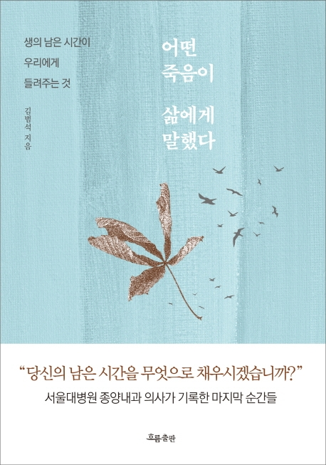

## Book Info

- 제목: 어떤 죽음이 삶에게 말했다
- 저자: 김범석
- 출판사: 흐름출판
- 출간: 2021-01-18

## 이 책을 읽게 된 이유

사실 이 책은 도서관에서 빌린 책도 아니며, 제가 직접 산 책도 아닙니다. 이 글을 읽고 있으신 분이 만약 삼성 폰을 쓰신다면 지금 글을 쓰는 4월 30일까지는 다운로드해 볼 수 있습니다. `교보eBook for SAMSUNG`어플은 매달 좋은 책 한 권을 읽을 수 있도록 제공해줍니다. 내일이면 또 새로운 책을 무료로 읽을 수 있겠네요. 한 권뿐이지만 상당히 좋은 서비스라고 생각합니다. 제가 생각지도 못한 책들을 읽어보라고 제공해주니까요.

전 `이 책을 읽을까? 말까?`라는 고민을 했었습니다. 저에게 죽음이란 다소 무거운 주제가 아닌가 생각이 들었거든요. 근데 최근 유튜브에서 한 영상을 보고 이 책을 읽어보고 싶게 됐습니다.



최근 `유퀴즈`라는 프로그램을 유튜브로 자주 봅니다. 어느 날 유튜브 알고리즘이 위의 영상을 추천해서 보게 됐습니다. 이 책의 저자가 이 영상에 나오는데 실물을 모르니까 처음에는 '누구지? 누구지? 어디서 들어본 사람 같은데...' 계속 생각하다가 이 책의 저자인 것을 알게 되고 이 책을 읽기로 결심했었습니다.

## 책 소개

이 책은 크게 4부로 나누어져 있습니다. 1부는 예정된 죽음 앞에서 만난 사람들의 이야기, 2부는 암에 걸렸어도 그럼에도 살아가는 사람들의 이야기, 3부와 4부는 생사의 경계에서의 이야기입니다.

저자는 `서울대병원 종양내과 전문의`라는 직업을 갖고 있습니다. 그렇기에 누구보다도 암으로 돌아가시는 환자분들의 죽음을 가까이서 본 분이라고 생각합니다. 이 책은 그런 의사가 환자를 치료하면서 경험하고, 느낀 것들이 기록된 책입니다. 삶의 끝을 먼저 맞이한 사람들을 지켜보며 많은 질문을 스스로 던지면서 생각하는 모습들을 보여줍니다.

## 감상

이 책을 읽으려고 했을 때는 근처에 암 환자가 없어서 크게 공감하지 못 할 줄 알았는데 책을 읽으면서 생각이 바뀌었습니다. 이 책에서 들려주는 이야기들은 암 환자들의 이야기지만, 암이 중심이 아닙니다. 암이 아니라 죽음이 중심입니다. 죽음이 다가올 때 사람들의 모습들, 의사로서 죽음에 대한 생각들 등이 중점이라고 생각합니다.

전 이 책이 꽤 무겁다고 생각이 들어 읽는 데 오랜 기간이 걸렸습니다. 에세이 형식이라 한 소단원 즉, 한 이야기씩 읽으면 되어서 최대한 기간을 두고 읽으려고 했습니다. 개인적으로 책을 읽었을 때 한 번에 전부 읽는 것을 좋아하지만, 이 책은 도저히 그렇게 읽을 수 없었습니다. 위에서 말했듯이 한 이야기를 읽으면서 제 생각도 곱씹어보고 싶었습니다. 그렇기에 더 천천히 읽고 싶었습니다.

에세이라는 장르는 대개 공감이 안 되는 내용도 많았었는데 이 책은 많이 달랐습니다. 제가 마치 서울대병원 종양내과 전문의가 된 것처럼 느꼈습니다. 평범한 대학생으로서 이 책의 저자의 경험이 소중하게 느껴졌습니다. 이런 경험들과 생각들은 책이 없었더라면 알지 못했었을 거라고 생각합니다. 

## 마지막 

`정말 많은 생각들이 남게 되는 책입니다. 제 생각들도 많이 남기고 싶지만, 너무 많기도 하고 너무나도 개인적인 생각들이라 남기지 못하겠습니다. 이 책을 읽어볼까 고민이 되신다면 고민할 필요가 없다고 말씀드리고 싶습니다. 읽어보세요. 그리고 생각해 봐요.`