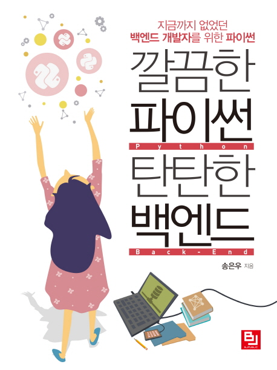

## Book Info

:::tip
책 이미지를 클릭하면 교보문고 사이트로 이동합니다!
:::

- 제목: 깔끔한 파이썬 탄탄한 백엔드
- 저자: 송은우
- 출판사: 비제이퍼블릭
- 출간: 2019-01-25

## Intro

이 책은 flask로 API를 제작해볼 수 있도록 도와주는 책입니다. 사실 flask 책은 최근에 [Do it! 점프 투 플라스크](http://www.kyobobook.co.kr/product/detailViewKor.laf?ejkGb=KOR&mallGb=KOR&barcode=9791163031970&orderClick=LEa&Kc=)라는 좋은 책이 나왔죠. 그런데도 이 책을 선택한 이유는 단순히 플라스크만 공부하는 것이 아니라 API 개발을 공부해보고 싶었기 때문입니다. 특히 백엔드에서 거의 필수적으로 사용하는 REST 아키텍처 패턴을 사용해서 말이죠.

이 책은 플라스크, REST API를 같이 공부할 수 있는 책 중에 그나마 가장 최근에 나왔습니다. 다른 책들은 더 오래된 책이거나, 책 리뷰가 없어서 큰 고민 없이 이 책을 구매했었습니다. 아무래도 저희 나라에서는 파이썬을 활용한 백엔드보다 자바 스프링을 더 많이 사용해서 그런지 파이썬을 활용한 백엔드 책이 꽤 적은 것 같습니다. 파이썬을 즐겨 쓰는 사람으로서 파이썬을 활용한 백엔드 책도 많이 나왔으면 좋겠습니다.

## Book Review

### API 제작

twitter의 일부 핵심 기능들을 구현해서 미니 버전의 트위터를 만들어봅니다. 이 API를 만들어보면서 HTTP, 데이터베이스, unit test, AWS 배포 등 백엔드 개발을 경험하고 기본적인 개념들을 공부하는 방식이죠. 그렇기에 전반적인 백엔드 공부에는 도움이 되지만, 플라스크 기능에 대한 공부에는 크게 도움이 되지는 않은 것 같습니다.

HTTP 개념들을 다시 복습해볼 수 있었고 인증 부분을 다루는 것도 재밌었습니다. 아키텍처를 다루는 부분도 있었는데 "이런 부분도 다뤄준다고?" 생각이 들 정도로 도움이 됐던 것 같습니다. 

### 키워드 제시

전 책들을 읽을 때 끝에 부록에서라도 다음에 공부할 주제를 제시해주는 것을 선호하는 편입니다. 간단하게라도 어떤 키워드를 제시해주면 그에 대해 구글링을 해보면서 또는 다음 주제에 대한 책, 강의를 보면서 공부를 할 수 있으니까요. 그런 부분에선 저는 이 책이 괜찮았다고 생각합니다. 

### 레거시 코드

이 책이 2019년 초반에 출간되었기 때문에 2021년 중반에 읽는 지금 어느 정도는 예상했던 부분입니다. "설마 많이 나오겠어?"라는 생각을 하면서 이 책을 읽었습니다. 다행히 [decode 에러](https://teddygood.github.io/python/AttributeError-str-decode/) 말고는 딱히 코드를 돌리는 데 어려움은 없었던 것 같습니다. 

### 생략된 코드

아무래도 책이 다양한 주제들을 다루다 보니 구현해야 하는 일부 코드를 생략합니다. 이 부분은 좀 아쉬웠지만 이런 부분까지 상세하게 다뤘다면 아무래도 책이 400쪽이 아니라 대략 500~600쪽이 됐을 거 같으니 이런 부분은 저자의 입장이 이해됩니다.

## 대상 독자 

파이썬으로 전반적인 백엔드를 경험해보고 싶은 분들께 추천해 드립니다. 예전엔 목표하는 직군에 대해 직접 경험해보지 못한 부분들은 어떻게 공부해야 하나 고민했을 텐데 책을 통하여 쉽게 경험할 수 있어서 좋은 것 같습니다. 개인적으로 이렇게 프로젝트 하나를 주제로 전반적인 부분을 다룰 수 있는 책들이 더 많이 나와줬으면 하는 바람입니다. 