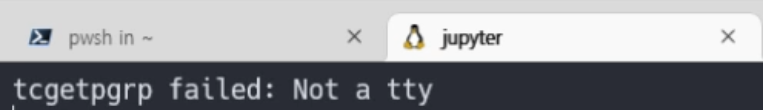
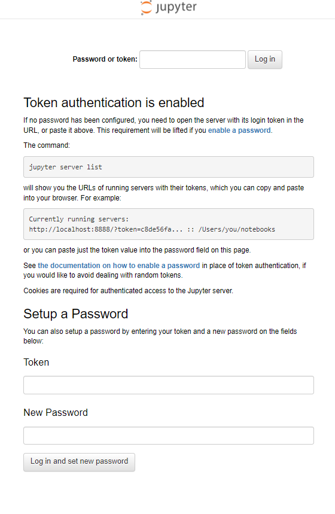
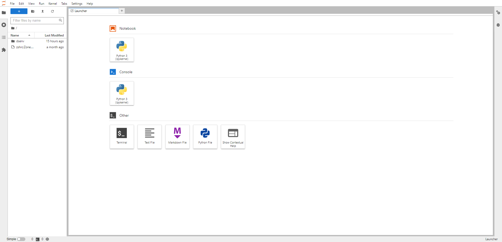
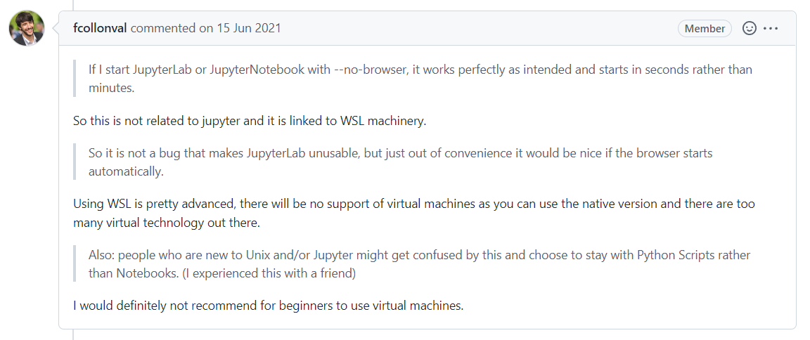

## 🤔 문제

보통 주피터 노트북 또는 주피터 랩을 사용할 때 `jupyter notebook` 또는 `jupyter lab`이라는 명령어를 치고 들어간다. 보통은 브라우저와 함께 주피터가 실행되는데 브라우저가 열리지도 않고 주피터가 실행됐는지도 모르는 문제를 만났다.



WSL2에서 Jupyter Lab을 실행시키면 위의 에러 문장이 1초도 안 되게 빠르게 사라지고 갑자기 터미널이 clear되는 상황이다. Jupyter 서버가 돌아가고 있는지도 알 수가 없었다. 



혹시나 서버가 작동하고 있는 것일 수도 있으니 Jupyter 주소인 `localhost:8888`에 접속해봤다. 서버는 제대로 작동하고 있는 것을 확인. 근데 문제는 토큰 값을 모른다는 것이다. 보통 Jupyter를 실행시킬 때 터미널에서 토큰을 출력시켜 보여준다. 우리는 그걸 복사, 붙여넣기를 하면 된다. 그러나 지금 상황은 터미널 조차도 clear되어 있으므로 토큰 값을 모른다.

<!--truncate-->

## 🚩 해결

### 방법 1

```
jupyter server list
```

가장 쉬운 방법은 터미널을 한 개 더 열어서 위의 명령어를 누른 후, 토큰 값을 확인하여 주피터 랩에 접속하면 된다.

### 방법 2

근데 위의 방법으로 쓰면 솔직히 너무 불편하고 왜 저런 문제가 생겼는지 궁금하여 stackoverflow에서 검색을 좀 해봤다. 정확한 원인은 모르겠으나 다른 해결 방법 하나를 알 수 있었다.

```bash
jupyter lab --no-browser
```

간단하다. 그냥 위의 명령어를 실행시키면 된다. 주피터를 실행될 때 같이 켜지는 브라우저를 사용하지 않겠다는 의미이다.

그럼 어떻게 주피터에 접속해야 하는가?  

주소는 주피터를 실행시키면 터미널에 나온다. 즉, 우리가 직접 브라우저를 켜서 주소를 입력하면 된다. 



그럼 위와 같이 제대로 사이트에 접속할 수 있게 된다.

## ✔️ Appendix



GitHub에 있는 [jupyter lab Repo의 issue](https://github.com/jupyterlab/jupyterlab/issues/10413)를 확인하니 나랑 같은 문제를 접한 사람이 있었고 누군가의 답변을 확인할 수 있었다. 그의 답변을 대충 요약하면 주피터랑은 관련이 없으며 WSL과 관련이 있다고 한다. 

대략적으로 예상해보면 아마 WSL은 CLI로 이루어진 환경이라 브라우저가 없으니 거기서 브라우저를 작동시키려고 할 때 문제가 생길 수 있다고 생각한다. 

더 생각해보면 WSL 자체가 애초에 가상환경이라 거기서 작동시켜 실제 환경의 브라우저를 여는 것이 문제가 있을 수도 있다고 생각이 든다. 

근데 그렇기에는 WSL에서 VS Code는 너무 잘 작동이 되는데? 진짜 이유를 모르겠다.

어쨌든 나는 1번 방법은 귀찮으니 WSL에서 Jupyter를 사용할 경우에는 아마 2번 방법을 사용하지 않을까 싶다.

## 🌐 References

- [https://stackoverflow.com/questions/50882266/using-jupyter-with-windows-subsystem-for-linux](https://stackoverflow.com/questions/50882266/using-jupyter-with-windows-subsystem-for-linux)
- [Jupyter Lab hangs on startup and then 'tcgetpgrp failed: Not a tty' appears (in WSL2)](https://github.com/jupyterlab/jupyterlab/issues/10413)