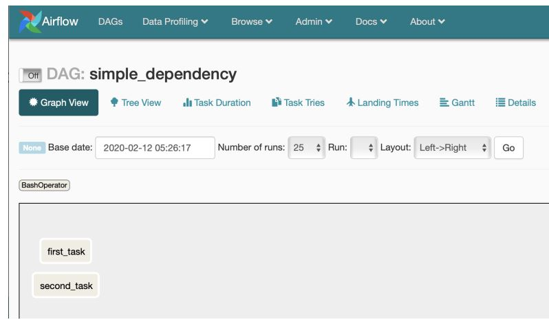
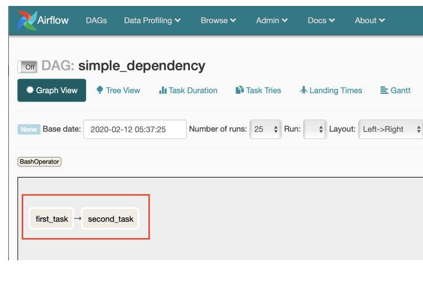
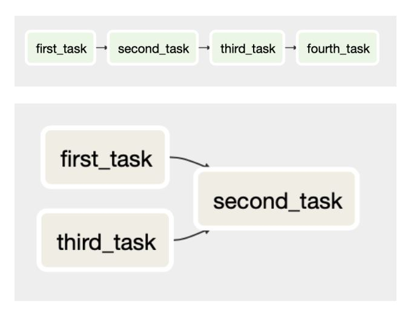
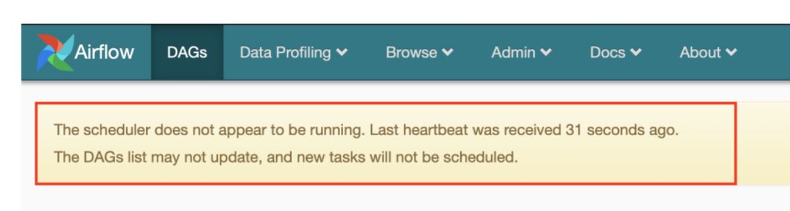

# Introduction to Airflow in Python

## Intro to Airflow

### Data Engineering

- 데이터 엔지니어링
  - 데이터와 관련된 모든 작업을 수행하고 신뢰할 수 있고 반복 가능하며 유지관리 가능한 프로세스를 만드는 것

### workflow

- workflow 
  - 데이터 엔지니어링 작업을 수행하기 위한 단계
  - 사용자의 필요에 따라 다르게 다양한 수준의 복잡성을 가짐
- workflow tool
  - Airbnb에서 시작한 Apache Airflow
  - Spotify의 Luigi
  - Microsoft의 SSIS
  - Bash Script

### Airflow

- Airflow
  - workflow의 생성, 스케쥴링(scheduling), 모니터링(monitoring)을 포함하여 복잡한 workflow를 프로그래밍할 수 있는 플랫폼
  - 다양한 도구와 언어를 사용할 수 있지만 실제 workflow는 Python으로 작성됨
  - workflow를 DAG(Directed Acyclic Graph)으로 구현함
  - 코드, command-line, built-in web interface으로 엑세스 가능
  - web interface를 제공
    - Graph View, Tree View 등 DAG에 대해 다양하게 확인할 수 있음
    - Code 기능은 말 그대로 코드를 보는 기능이며 읽기 전용임
      - 모든 DAG 코드의 변경은 DAG 스크립트를 통해 수행해야 함
    - Log 페이지에서는 웹 서버 시작, 그래프 또는 트리 노드 보기, 사용자 만들기, DAG 시작 등과 같은 항목이 포함됨
    - 사용하기 쉬움
  - command line로 사용하면 SSH 등을 통해 엑세스가 더 간단할 수 있음


### Airflow에서 workflow 실행

```bash
airflow run <dag_id> <task_id> <start_date>
```

```bash
airflow run example-etl download-file 2020-01-10
```

### DAG 

- DAG(Directed Acyclic Graph)
  - Airflow에서 workflow를 구성하는 작업 집합
  - 작업 간 의존성으로 구성됨
  - DAG에 대한 다양한 세부 정보로 생성됨
    - 이름, 시작일, 소유자, 이메일 등
  - 모든 의존성이 완전히 계산되지 않은 상태에서 일부 작업이 시작하지 않도록 방지
    - 이전 작업이 끝나지 않으면 다음 작업 실행 X
  - Directed(방향성)
    - task의 의존성에 따라 실행 경로가 정의가 되며 흐름이 있다는 의미
  - Acyclic(비순환성)
    - 그래프가 이전에 완료된 task에 연결되지 않아야 한다는 의미
      - 그렇지 않으면 파이프라인이 끝없이 실행될 수 있음 -> 워크플로가 완료되지 않음
  - Airflow 내에서 DAG는 파이썬으로 작성되지만 다른 언어나 기술로 작성된 것도 사용 가능
    - e.g. Bash script, Apache Spark 
  - task: operator, sensor 등과 같이 실행될 것
  - 명시적 또는 암묵적으로 정의된 의존성이 포함되어 있음
    - 의존성은 실행 순서를 정의하기에 Airflow가 워크플로의 어느 지점에서 어떤 요소를 실행해야 하는지 알 수 있음

- DAG 정의
  ```python
  from airflow.models import DAG
  from datetime import datetime

  default_arguments = {
      'owner': 'jdoe',
      'email': 'jdoe@datacamp.com',
      'start_date': datetime(2020, 1, 20)
  }

  etl_dag = DAG( 'etl_workflow', default_args=default_arguments ) # 실제로 Airflow 인터페이스에 표시되지 않음
  ```

- airflow 명령어 command-line에서 사용 
  - airflow의 subcommand 설명을 보고 싶다면 `airflow -h` 사용 
  - 많은 subcommand는 DAG와 관련 있음
  - `arflow list_dags`를 사용하여 인식된 모든 DAG 확인 가능 

- command line
  - Airflow 프로세스(i.e. 웹 서버 또는 scheduler)를 시작하는 데 사용 
  - DAG나 task를 수동으로 실행하고 로그를 검토하는 데 사용
  - command-line에서 특정 task 실행
    ```bash
    airflow run <dag_id> <task_id> <date>
    ```
  - 전체 DAG 실행
    ```bash
    airflow trigger_dag -e <date> <dag_id>
    ```
- Python
  - DAG 생성과 편집에 사용

## Implementing Airflow DAGs

### Operator

- operator
  - workflow에서 single task
  - 독립적으로 실행
    - 작업을 완료하는 데 필요한 리소스는 operator 내에 포함되어 있음
  - operator는 서로 정보를 공유하지 않음
    - workflow를 단순화하고 airflow가 가장 효율적인 방식으로 작업을 실행할 수 있도록 하기 위함
    - 정보를 공유할 수 있지만 지금 과정에서는 생략
  - Airflow에는 다양한 작업을 수행하는 다양한 연산자 포함
    - 주요한 operator는 `airflow.operators` 또는 `airflow.contrib.operators` 라이브러리에 있음

### BashOperator
  
- 주어진 Bash command 또는 script를 실행
- `task_id`, `bash_command`, `dag` 인수를 가짐
- 나중에 자동으로 정리되는 임시 디렉토리에서 명령 실행
- 로컬 시스템에서 작업을 수행하는 것처럼 환경 변수를 지정할 수 있음
- example
  ```python
  from airflow.operators.bash_operator import BashOperator
  example_task = BashOperator(
      task_id='bash_ex',
      bash_command='echo 1',
      dag=dag)
  ```
  ```python
  bash_task = BashOperator(
      task_id='clean_addresses',
      bash_command='cat addresses.txt | awk "NF==10" > cleaned.txt',
      dag=dag)
  ```
  ```python
  BashOperator(
      task_id='bash_example',
      bash_command='echo "Example!"',
      dag=ml_dag)
  ```
  ```python
  BashOperator(
      task_id='bash_script_example',
      bash_command='runcleanup.sh',
      dag=ml_dag)
  ```

### Operator 문제점
- 각각의 operator들이 같은 장소 또는 환경에서 실행된다는 보장이 없음
  - 한 연산자가 특정 설정으로 주어진 디렉토리에서 실행되었기 때문에 다음 연산자가 반드시 동일한 정보에 접근할 수 있는 것은 아님 -> 필요한 경우 명시적으로 설정
- BashOperator에 대한 환경 변수를 설정해야 할 수 있음
- 높은 권한으로 task를 실행하는 것이 까다로울 수 있음
  - 리소스에 대한 모든 접근이 task를 실행하는 특정 사용자에 대해 설정되어야 함
  - 높은 권한은 시스템에서 root 또는 administrator를 의미

### Task

- task
  - 인스턴스화 된 연산자
  - 일반적으로 Python 변수에 할당
  - Airflow tool 내에서 task는 변수 이름이 아닌 task_id로 참조됨

- task dependency
  - 작업 완료 순서를 정의
  - 필수는 아니지만 일반적으로 task dependency가 있음
  - task dependency가 정의되지 않은 경우 작업 실행은 순서 보장없이 Airflow 자체에서 처리됨
  - task dependency를 uptream task 또는 downstream task로 나뉨
    - upstream task는 downstream task 전에 완료해야 함
    - uptream은 이전, downstream은 이후를 의미
  - Airflow 1.8 이후 task dependency는 bitshift operator를 사용하여 정의됨
    - `>>`: upstream operator
    - `<<`: downstream operator
  - example
      
    ```python
    # Define the tasks
    task1 = BashOperator(
                task_id='first_task',
                bash_command='echo 1',
                dag=example_dag)
    task1 = BashOperator(
                task_id='second_task',
                bash_command='echo 2',
                dag=example_dag)

    # Set first_task to run before second_task
    task1 >> task2 # or task2 << task1
    ```
      

  - multiple task dependencies
    ```python
    task1 >> task2 >> task3 >> task4
    ```
    ```python
    task1 >> task2 << task3
    ```
    ```python
    task1 >> task2
    task3 >> task2
    ```
    

### PythonOperator

- PythonOperator
  - 파이썬 함수 또는 callable 메서드 실행
  - 필요에 따라 `python_callable`에 argument 또는 keword argument를 전달할 수 있음 
  - 지정된 task에 argument를 추가하는 것을 지원
    - position, keyword arugment
    - keyword argument는 `op_kwargs`를 통해 구현
    - `op_kwargs`는 dictionary
  - example
    ```python
    from airflow.operators.python_operator import PythonOperator

    def printme():
        print("This goes in the logs!")

    python_task = PythonOperator(
        task_id='simple_print',
        python_callable=printme,
        dag=example_dag
    )
    ```
    ```python
    def sleep(length_of_time):
        time.sleep(length_of_time)

    sleep_task = PythonOperator(
        task_id='sleep',
        python_callable=sleep,
        op_kwargs={'length_of_time': 5} # 함수의 인자와 이름이 동일해야 함
        dag=example_dag
    )
    ```

### EmailOperator

- Airflow 작업 내에서 이메일을 보냄
- HTML 컨텐츠 및 첨부 파일을 포함하여 이메일의 일반적인 구성 요소를 포함할 수 있음
- example
  ```python
  from airflow.operators.email_operator import EmailOperator

  email_task = EmailOperator(
      task_id='email_sales_report',
      to='sales_manager@example.com',
      subject='Automated Sales Report',
      html_content='Attached is the latest sales report',
      files='latest_sales.xlsx',
      dag=example_dag
  )
  ```

### DAG Runs

- 특정 시점 workflow의 instance
- DAG은 수동으로 실행하거나 DAG 정의될 때 전달된 `schedule_interval` parameter를 통해 실행할 수 있음
- 각 DAG Runs는 task에 대한 상태(running, failed, success)를 갖고 있으며, 개별 task는 이런 상태 또는 기타 상태(queued, skipped)도 가질 수 있음

### Schedule

- DAG을 scheduling할 때 요구 사항에 따라 고려해야 할 여러 특성이 있음
- `start_date`: DAG을 처음으로 예약할 수 있는 시간 지정
  - 일반적으로 Python datetime 객체로 정의
- `end_date`: DAG을 예약할 수 있는 마지막 시간 지정
- `max_tries`: DAG run이 완전히 실패하기 전에 재시도 할 횟수
- `schedule_interval`: 얼마나 DAG을 scheduling하는지 측정 횟수
  - DAG가 완전히 실행될 때가 아니라 예정된 시간의 최소값과 최대값을 나타냄
  - cron 구문 또는 내장된 설정을 통해 몇 가지 방법으로 정의할 수 있음
    - Unix cron format
    - Airflow에는 자주 사용되는 시간 간격을 나타내는 preset 존재
      - `@hourly`: 한 시간에 한 번 실행 - `0 * * * *`
      - `@daily`: 하루에 한 번 실행 - `0 0 * * *`
      - `@weekly`: 일주일에 한 번 실행 - `0 0 * * 0` 
      - `@montly`: 한 달에 한 번 실행 - `0 0 0 * 0`
      - `@yearly`: 한 해에 한 번 실행 - `0 0 0 0 0`
    - Special preset
      - `None`: DAG을 scheduling하지 않으며, 수동으로 trigger되는 workflow에 사용
      - `once`: DAG을 한 번만 예약
  - scheduling은 시작 날짜와 잠재적인 종료 날짜 사이에 발생
  - DAG run을 예약할 때 Airflow는 시작 날짜를 가능한 가장 빠른 값으로 사용하지만 적어도 하나의 `schedule_interval`이 시작 날짜를 지나기 전까지는 실제로 아무것도 예약하지 않음
   - 아래의 코드 상황일 때 25일이 아니라 다음 날짜인 26일을 사용
     ```python
     'start_date': datetime(2020, 2, 25),
     'scedule_interval': @daily
     ```

## Maintaining and monitoring Airflow workflows

### Sensor

- 특정 조건이 참이 되기를 기다리는 특별한 종류의 연산자
  - 생성 대기
  - DB record 업로드
  - 웹 request의 특정 response
- 센서를 사용하면 조건이 참인지 확인하는 빈도를 정의
- 연산자의 한 종류이기 때문에 일반 연산자와 같이 task에 할당 
  - bitshift도 사용 가능
- `airflow.sensors.base_sensor_operator`
- argument
  - `mode`: 센서의 조건을 알려주는 방법
    - `mode='poke'`: default, worker slot을 포기하지 않고 완료될 때까지 계속 확인
    - `mode='reschedule`: worker slot을 포기하고 다른 slot이 사용 가능할 때까지 기다리는 것
      - worker slot: task 실행 기능 
  - `poke_interval`: poke 모드에 사용, Airflow에 조건을 확인하는 빈도를 알려줌
    - Airflow scheduler에 과부하가 걸리지 않도록 하려면 1분 이상이어야 함
  - `timeout`: sensor task를 실패로 표시하기 전에 대기할 시간
    - 문제를 방지하려면 timeout을 shedule interval보다 훨씬 짧게 설정해야 함
  - 연산자이므로 task_id, dag와 같은 attribute도 포함

### File Sensor

- FileSensor
  - `airflow.contrib.sensors` 라이브러리에 존재
  - 파일 시스템의 특정 위치에 파일이 있는지 확인
  - 주어진 디렉토리 내의 모든 파일을 확인
  - example
    ```python
    from airflow.contrib.sensors.file_sensor import FileSensor
    
    file_sensor_task = FileSensor(task_id='file_sense',
                                  filepath='salesdata.csv',
                                  poke_interval=300,
                                  dag=sales_report_dag)
    
    init_sales_cleanup >> file_sensor_task >> generate_report 
    ```

### Other sensor

- `ExteranlTaskSensor`: 다른 DAG에 있는 작업이 완료될 때까지 기다림
  - 하나의 workflow를 너무 복잡하게 만들지 않고도 다른 workflow task에 느슨하게 연결할 수 있음
- `HttpSensor`: 웹 URL을 request(요청)하고 response(응답) 받을 content를 정의할 수 있음
- `SqlSensor`: SQL query를 실행하여 content 확인
- `airflow.sensors`와 `airflow.contrib.sensors`에서 다양한 센서를 사용할 수 있음

### sensor와 operator는 언제 사용하는가

- 대부분의 경우 일반적인 operator를 사용
- sensor를 사용하는 경우
  - condition이 언제 참인지 확실하지 않는 경우
    - 예를 들어 원래는 그 날 완료될 것을 예상하고 있지만, 1시간 정도 차이가 날 수 있는 경우 센서를 사용하여 완료될 때까지 확인할 수 있음
  - condition을 계속 확인하고 싶지만 전체 DAG을 즉시 실패하지 않으려는 경우
    - DAG를 정의할 때 약간의 유연성 제공
  - DAG에 cycle 추가 없이 반복적으로 검사하려는 경우

### Executor

- workflow 내 정의되어 있는 task를 실제로 실행하는 요소
- task 집합을 실행하기 위한 기능과 동작을 가짐
- 일부는 로컬 시스템에서 한 번에 하나의 task를 실행하거나 cluster의 모든 시스템 간에 개별 작업을 분할할 수 있음 -> 사용 가능한 worker slot의 수
- example of executor
  - SequentialExecutor
  - LocalExecutor
  - CeleryExecutor
- 필요한 경우 고유한 executor를 만들 수도 있음

### SequentialExecutor

- Airflow의 기본 실행 엔진
- 한 번에 하나의 작업만 실행
  - 동일한 시간에 여러 workflow를 scheduling하면 예상보다 시간이 오래 걸릴 수 있음
- task의 flow를 따르는 것이 간단하기 때문에 디버깅에 유용
  - 일부 IDE에서 사용할 수도 있음
- 학습 및 테스트에는 매우 유용하지만, task 리소스의 제한으로 인해 실제 프로덕션에는 권장되지 않음

### LocalExecutor

- single 시스템에서 실행됨
- 각 작업을 로컬 시스템의 프로세스로 취급하며 시스템 리소스(CPU, 메모리 등)에서 원하는, 허용되는, 요청하는 만큼의 동시에 task를 시작할 수 있음
  - 여기서 동시에 시작한다는 것은 시스템의 병렬 처리를 의미하며, parallelism 설정값에 따라 두 가지 구조로 나뉨
    - parallelism 설정값이 0인 경우에는 모든 요청에 대해 무한대로 task를 실행
    - parallelism 설정값이 0 이상일 경우 설정값의 개수만큼 프로세스 수를 제한하여 task 실행 
- single production 시스템에 적합하며, 지정된 호스트 시스템의 모든 리소스를 활용할 수 있음

### CeleryExecutor

- 여러 시스템이 기본 cluster로 통신할 수 있도록 Python으로 작성된 일반 대기열 시스템
- 여러 Airflow 시스템을 특정 workflow/task의 집합에 대한 worker로 구성할 수 있음 
- workflow의 균형을 맞추기 위해 언제든지 시스템을 추가할 수 있음
- 설정 및 구성하는 것이 더 어려움
  - Airflow를 구성하기 전에 작동하는 Celery를 구성해야 함
  - 구성하기 더 어렵지만 많은 수의 DAG로 작업하거나 처리 요구 사항이 증가할 것으로 예상되는 곳에 사용

### 사용 중인 executor 확인

- `airflow.cfg` 파일을 확인 
  ```bash
  cat airflow/airflow.cfg | grep "executor = "
  ```
  - `airflow.cfg` 파일: executor의 type을 포함하여 대부분의 Airflow instance에 대한 구성 및 설정이 정의되는 파일
- `airflow list_dags`를 실행하여 확인
  ```bash
  airflow list_dags
  ```

### Debugging and troubleshooting in Airflow

- Airflow를 사용하며 발생하는 문제
  - 일정에 따라 실행되지 않는 DAG
    - 가장 일반적인 이유는 scheduler가 실행되고 있지 않은 경우
      - Airflow scheduler는 DAG run과 task scheduling을 처리
      - 실행되고 있지 않으면 새로운 task가 실행되지 않음
      
      - airflow scheduler를 command-line에서 실행하여 해결
    - 시작 날짜 또는 마짐가 DAG run 이후 적어도 하나 이상의 schedule_interval이 지나지 않은 경우
      - 요구사항에 맞게 시작 날짜나 일정 간격을 수정하는 것이 좋음
    - executor가 task를 실행할 수 있는 충분한 여유 slot이 없는 경우
      - executor 유형을 더 많은 작업이 가능한 것으로 변경(LocalExecutor 또는 CeleryExecutor)
      - 시스템 리소스(RAM, CPU)를 추가
      - DAG의 scheduling을 변경
  - 시스템에 로드되지 않는 DAG
    - web UI 또는 `airflow list_dags` 결과 화면에 나타나지 않은 경우
      - 파이썬 파일이 예상 DAG 폴더에 있는지 확인
      - airflow.cfg 파일을 검토하여 현재 DAG 폴더 설정을 확인 가능
        - `dags_folder`를 확인
      - 폴더 경로는 절대경로이여야 함
  - Syntax error
    - 파이썬 코드에서 구문 오류
      - `airflow list_dags` 사용
        ```bash
        airflow list_dags
        ```
      - 파이썬으로 DAG 스크립트 실행 -> 파이썬 인터프리터를 사용
        ```bash
        python3 <dagfile.py>
        ```

### SLA and reporting in Airflow

- SLA
  - Service Level Agreement
  - 비즈니스에서는 가동 시간 또는 가용성 보장
  - Airflow에서는 task 또는 DAG를 실행하는 데 필요한 시간
- SLA miss
  - task 또는 DAG가 SLA의 예상 타이밍을 충족하지 못하는 상황
  - SLA가 누락된 경우 시스템 구성에 따라 이메일 경고가 전송됟고 로그에 메모가 작성됨
  - web UI에서 `Browse -> SLA Misses` 메뉴에서 확인 가능
- SLA 정의
  - 다양한 방법이 존재
  - task에 대한 `sla` argument를 사용
    ```python
    task1 = BashOperator(
        task_id='sla_task',
        bash_command='runcode.sh',
        sla=timedelta(seconds=30),
        dag=dag)
    ```
  - `default_args` dictionary를 사용하고 sla key를 정의하는 방법
    ```python
    default_args={
        'sla': timedelta(minutes=20),
        'start_date': datetime(2020, 2, 20)
    }
    dag = DAG('sla_dag', default_args=default_args)
    ```
      - timedelta 객체
        - datetime 객체처럼 datetime 라이브러리에 있음
        - `from datetime import timedelta`
        - days, hours, minutes, seconds, weeks를 argument로 받음
        - milliseconds, microseconds argument도 존재하지만 Airflow에서 적용 불가
        ```python
        from datetime import timedelta

        timedelta(seconds=30)
        timedelta(weeks=2)
        timedelta(days=4, hours=10, minutes=20, seconds=30)
        ```
- 일반적인 reporting
  - 보고 목적으로 Airflow에 내장된 이메일 알람을 사용할 수 있음
    - 성공, 실패, 에러/재시도 시 메시지를 보내기 위한 built-in 옵션이 존재
  - DAG 생성 시 전달되는 default_args dict의 key를 통해 처리됨
  ```python
  default_args={
    'email': ['airflowalerts@datacamp.com'],
    'email_on_failure': True,
    'email_on_retry': False,
    'email_on_success': True,
    ...
    }
  ```

## Building production pipelines in Airflow

### Templates

- DAG run 중에 정보를 대체할 수 있음
  - template 정보가 포함된 DAG이 실행될 때마다 정보가 해석되어 DAG run에 포함됨
- task를 정의할 때 추가적인 유연성 제공
- `Jinja` 템플릿 언어를 사용하여 생성
- Non-Templated BashOperator example
  ```python
  t1 = BashOperator(
          task_id='first_task',
          bash_command='echo "Reading file1.txt"',
          dag=dag)
  t2 = BashOperator(
          task_id='second_task',
          bash_command='echo "Reading file2.txt"',
          dag=dag)
  ```
- Templated Bashoperator example
  ```python
  temlated_command = """
  echo "Reading {{ params.filename }}"
  """
  t1 = BashOperator(
          task_id='template_task',
          bash_command=templated_command,
          params={'filename': 'file1.txt'}
          dag=example_dag)
  ```
  ```python
  templated_command = """
  echo "Reading {{ params.filename }}"
  """
  t1 = BashOperator(
          task_id='template_task',
          bash_command=templated_command,
          params={'filename': 'file1.txt'}
          dag=example_dag)
  t2 = BashOperator(
          task_id='template_task',
          bash_command=templated_command,
          params={'filename': 'file2.txt'}
          dag=example_dag)
  ```
- Jinja template for문 사용 예제
  ```python
  templated_command="""
  
      echo "Reading {{ filename }}"
  
  """
  t1 = BashOperator(
      task_id='template_task',
      bash_command=templated_command,
      params={'filenames': ['file1.txt', 'file2.txt']}
      dag=example_dag)
  ```

### Variables

- 템플릿 시스템의 일부로 Airflow는 built-in runtime 변수들을 제공
- DAG runs, task, 시스템 구성에 대한 다양한 정보 제공
- example
  - 이 예제 말고 다른 변수들도 많으니 Airflow 문서 참고
  - datetime 객체가 아니라 문자열
  - `{{ ds }}`: Execution Date, YYYY-MM-DD
  - `{{ ds_nodash }}`: Execution Date, no dashes, YYYYMMDD
  - `{{ prev_ds }}`: Previous Execution date, YYYY-MM-DD
  - `{{ prev_ds_nodash }}`: Prev Execution date, no dashes, YYYYMMDD
  - `{{ dag }}`: DAG object
  - `{{ conf }}`: Airflow config object

### Macros

  - Airflow 템플릿에 대한 다양한 유용한 객체 또는 메서드에 대한 참조를 제공
  - example
    - 이 예제 말고 다른 매크로도 많으니 Airflow 문서 참고
    - `{{ macros.datetime }}`: `datetime.datetime` object
    - `{{ macros.timedelta }}`: `datetime.timedelta` object
    - `{{ macros.uuid }}`: Python의 `uuid` object
    - `{{ macros.ds_add('2020-04-15', 5) }}`: Modify days from a date, this example returns 2020-04-20

### Branch

- conditional logic 제공
  - operator의 결과에 따라 task를 선택적으로 실행하거나 스킵하는 기능
- `BranchPythonOperator` 사용
  - 이밖에도 다른 branch operator가 있으며 필요한 경우 직접 만들 수 있음
- `from airflow.operators.python_operator import BranchPython Operator`
- PythonOperator와 마찬가지로 `python_callable` 인자 사용
  - 실행할 task_id의 이름을 반환
  - 함수에 전달된 keword arguments에 대한 참조
- example
  ```python
  def branch_test(**kwargs):
      if int(kwargs['ds_nodash']) % 2 == 0:
          return 'even_day_task'
      else:
          return 'odd_day_task'

  branch_task = BranchPythonOperator(
                    task_id='branch_task',
                    dag=dag,
                    provide_context=True, # 함수에 대한 runtime 변수와 매크로에 대한 엑세스를 제공하도록 Airflow에 지시하는 요소
                    # Airflow 2.0으로 업데이트 되면서 없어짐
                    python_callable=branch_test)

  # Define the dependencies
  start_task >> branch_task >> even_day_task >> even_day_task2
  branch_task >> odd_day_task >> odd_day_task2  
  ```

