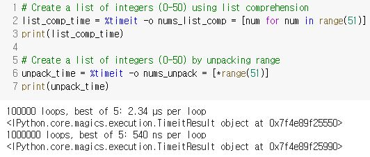

# Writing Efficient Python Code

## Foundations for efficiencies

### Efficient

- Minimal completion time (fast runtime)
- Minimal resource consumption (small memory footprint)
  - unnecessary overhead X
  - memory footprint: 프로그램이 실행하는 동안 사용하거나 참조하는 메모리 양
- The goal of writing efficient code
  - reduce latency and overhead

### Defining Pythonic

- Focus on readability
- Follow best practices and guiding principles of Python
- Python은 Pythonic하지 않은 문법들도 지원하지만 그런 문법들은 더 느리게 실행될 수 있다.

### The Zen of Python

```python
import this
```

```
Beautiful is better than ugly.
Explicit is better than implicit.
Simple is better than complex.
Complex is better than complicated.
Flat is better than nested.
Sparse is better than dense.
Readability counts.
Special cases aren't special enough to break the rules.
Although practicality beats purity.
Errors should never pass silently.
Unless explicitly silenced.
In the face of ambiguity, refuse the temptation to guess.
There should be one-- and preferably only one --obvious way to do it.
Although that way may not be obvious at first unless you're Dutch.
Now is better than never.
Although never is often better than *right* now.
If the implementation is hard to explain, it's a bad idea.
If the implementation is easy to explain, it may be a good idea.
Namespaces are one honking great idea -- let's do more of those!
```

### The Python Standard Library

- Built-in types
  - list, tuple, set, dict, ...
- Built-in functions
  - pinrt(), len(), enumerate(), map(), ...
- Built-in modules
  - os, sys, itertools, collections, ...

- `range(start, stop, step)`
  -  range()를 적용하고 list()를 적용해야함.
  ```python
  # range(start, stop)
  nums = range(0, 11)
  print(type(nums)) #   <class 'range'>
  ```

  ```python
  # range(stop)
  nums = rane(11)
  nums_list = list(nums)
  print(nums_list)
  ```

  ```python
  even_nums = range(2, 11, 2)
  even_nums_list = list(even_nums)
  print(even_nums_list)
  ```

  ```python
  nums_list = [*range(1,13,2)]
  print(nums_list) # [1, 3, 5, 7, 9, 11]
  ```

- `enumerate(iterable, start=0)`
  - iterable 자료형(lsit, tuple, dict, set)을 입력으로 받아 인덱스 값을 포함하는 객체 반환

  ```python
  letters = ['a', 'b', 'c', 'd']
  indexed_letters = enumerate(letters)
  indexed_letters_list = list(indexed_letters)
  print(indexed_letters_list) # [(0, 'a'), (1, 'b'), (2, 'c'), (3, 'd')]
  ```

  ```python
  letters = ['a', 'b', 'c', 'd']
  indexed_letters = enumerate(letters, start=5)
  indexed_letters_list = list(indexed_letters)
  print(indexed_letters_list) # [(5, 'a'), (6, 'b'), (7, 'c'), (8, 'd')]
  ```

  ```python
  names = ['Jerry', 'Kramer', 'Elaine', 'George', 'Newman']
  indexed_names_comp = [(i,name) for i,name in enumerate(names)]
  print(indexed_names_comp) # [(1, 'Jerry'), (2, 'Kramer'), (3, 'Elaine'), (4, 'George'), (5, 'Newman')]
  ```

  ```python
  indexed_names_unpack = [*enumerate(names, 1)]
  print(indexed_names_unpack) # [(1, 'Jerry'), (2, 'Kramer'), (3, 'Elaine'), (4, 'George'), (5, 'Newman')]
  ```

- `map(function, iterable)`
  - return value는 map object -> list or tuple로 casting
  - lambda(anonymous function)

  ```python
  nums = [1.5, 2.3, 3.4, 4.6, 5.0]
  rnd_nums = map(round, nums)
  print(list(rnd_nums))
  ```

  ```python
  nums = [1, 2, 3, 4, 5]
  sqrd_nums = map(lambda x: x ** 2, nums)
  print(list(sqrd_nums))
  ```

### NumPy array

- 많은 숫자 데이터를 리스트에 관리할 때 속도가 느리고 메모리 많이 차지
- 배열을 사용하면 적은 메모리로 많은 데이터 빠르게 처리 가능
- 리스트와 다른 점
  - 모든 원소가 같은 자료형(homogeneous)
    - 자료형이 다르면 NumPy가 동일하게 맞춤
    - `dtype`으로 타입 확인
  - 원소의 개수를 바꿀 수 없다.
- `[행, 열]`
  
  ```python
  import numpy as np
  nums_np = np.array(range(5)) # array([0, 1, 2, 3, 4])
  ```

- broadcasting
  - vectorized operation 지원 -> 반복문을 사용하지 않고 모든 값에 반복 연산 가능
  - 서로 다른 크기를 가진 두 배열의 연산 지원
    - 크기가 작은 배열을 확장시켜 큰 배열에 맞춤

  ```python
  nums_np = np.array([-2, -1, 0, 1, 2])
  nums_np ** 2
  ```

  ```python
  nums = [[1, 2, 3],
          [4, 5, 6]]
  nums_np = np.array(nums)
  print(nums_np[0, 1]) # 2
  print(nums_np[:, 0]) # [1 4]
  ```

- boolean indexing
  
  ```python
  nums = [-2, -1, 0, 1, 2]
  nums_np = np.array(nums)
  ```

  ```python
  nums_np > 0 # array([False, False, False,  True,  True])
  ```

  ```python
  nums_np[nums_np > 0] # array([1, 2])
  ```

## Timing and profiling code

### Comparing runtime

- 효율적인 코드
- 빠른 코드
- IPython에는 `%timeit`로 runtime 계산
- magic commands
  - `%`가 앞에 붙음
  - `%lsmagic`로 사용가능한 commmand 확인
- `%timeit`
  - 평균과 표준편차 제공
  - 루프 횟수
  - 옵션
    - `-r`: 런타임을 추정하는 데 사용할 반복 횟수
    - `-n`: 루프 수
    - `-o`: 저장

```python
import numpy as np

%timeit rand_nums = np.random.rand(1000)
```

```python
# Set number of runs to 2 (-r2)
# Set number of loops to 10 (-n10)
%timeit -r2 -n10 rand_nums = np.random.rand(1000)
```

```python
# Single line of code
%timeit nums = [x for x in range(10)]
```

```python
# Multiple lines of code
%%timeit
nums = []
for x in range(10):
nums.append(x)
```

```python
times = %timeit -o rand_nums = np.random.rand(1000)
```

```
times.timings
```

```
times.best
```

```
times.worst
```

### data structure 정의 방법에 따른 시간 차이

- using formal name

  ```python
  formal_list = list()
  formal_dict = dict()
  formal_tuple = tuple()
  ```

- using literal syntax

  ```python
  formal_list = []
  formal_dict = {}
  formal_tuple = ()
  ```

- `%timeit`를 사용해보면 literal syntax가 더 빠르다.

### 간단한 코드 시간 비교

- list comprehensiion과 unpacking
  - unpacking 방법이 더 빠름



### Code profiling

- 프로그램의 시간 복잡도, 공간 복잡도, 함수 호출 주기, 빈도 등을 측정하는 데 사용되는 기술
- 한 줄씩 분석
- `line_profiler` package 사용
- 설치
```
pip install line_profiler
```
- extension loading 
```
%load_ext line_profiler
```
- magic command 사용 
  - 개별 코드 줄에 대한 런타임 수집
  - `-f`: function name argument
```
%lprun -f convert_units convert_units(heroes, hts, wts)
```
- 결과
```
Timer unit: 1e-06 s

Total time: 0.000194 s
File: <ipython-input-15-0ea9949fa4c4>
Function: convert_units at line 1

Line #      Hits         Time  Per Hit   % Time  Line Contents
==============================================================
     1                                           def convert_units(heroes, heights, weights):
     2         1        169.0    169.0     87.1    new_hts = [ht * 0.39370 for ht in heights]
     3         1          8.0      8.0      4.1    new_wts = [wt * 2.20462 for wt in weights]
     4         1          2.0      2.0      1.0    hero_data = {}
     5         4          8.0      2.0      4.1    for i,hero in enumerate(heroes):
     6         3          6.0      2.0      3.1      hero_data[hero] = (new_hts[i], new_wts[i])
     7         1          1.0      1.0      0.5    return hero_data
```
- %timeit는 평균과 표준편차를 구하기 위해 반복하기 때문에 line_profiler와 실행 시간이 일치하지 않을 수 있다.

### 객체 크기 

```python
import sys

nums_lsit = [*range(1000)]
sys.getsizeof(nums_list)
```
```python
import numpy as np

nums_lsit = np.array(range(1000))
sys.getsizeof(nums_list)
```

### 메모리 사용량

- `memory_profiler` 사용
  - 함수가 import되어 있어야 함
    - e.g. hero_funcs.py
```
pip install memory_profiler
```

```python
from hero_funcs import convert_units

%load_ext memory_profiler

%mprun -f convert_units convert_units(heroes, hts, wts)
```

- memroy_profiler는 운영체제의 정보를 사용하기 때문에 파이썬 인터프리터가 실제로 사용하는 메모리 양과 다를 수 있다.

## Gaining efficiencies

### zip

- iterable 객체를 인자로 받아 tuple의 형태로 접근할 수 있는 iterator 반환
```python
names = ['Bulbasaur', 'Charmander', 'Squirtle']
hps = [45, 39, 44]

combined_zip = zip(names, hps)
combined_zip_list = [*combined_zip]
print(combined_zip_list)
```
```
[('Bulbasaur', 45), ('Charmander', 39), ('Squirtle', 44)]
```

### The collections module

- Python Standard Library
  - built-in module
- 특수한 데이터 타입들이 있음
  - dict, list, set, tuple 대신 사용
- Counter
  - 루프가 필요 없음
  - key-value 형태로 출력
  - 가장 높은 수에서 가장 낮은 수로 정렬
  ```python
  from collections import Counter
  poke_types = ['Grass', 'Dark', 'Fire', ...]
  type_counts = Counter(
  ```

### The itertools module
- Python Standard Library
  - built-in module
- iterator를 만들거나 사용할 수 있는 툴
- combinations
  - 조합
```python
from itertools import combinations

poke_tpyes = ['Grass', 'Dark', 'Fire', 'Fries','Ghost']
combos_obj = combinations(pokr_types, 2)
print([*combos_obj])
```

### Set 

```python
list_a = ['Bulbasaur', 'Charmander', 'Squirtle']
list_b = ['Caterpie', 'Pidgey', 'Squirtle']

set_a = set(list_a)

set_b = set(list_b)

print(set_a.intersection(set_b)) # a & b(and)
print(set_a.union(set_b)) # set_a | set_b(or)
print(set_a.symmetric_difference(set_b)) # a ^ b(xor)
print(set_a.difference(set_b)) # a - b
print(set_b.difference(set_a)) # b - a
```

- %timeit을 사용하여 runtime을 측정했을 때 list, tuple, set 중 set이 가장 빠름
- set은 list와 다르게 원소가 중복되지 않음

### 루프 제거


- 효율적인 코드를 작성하려면 가능하면 루프는 사용하지 말아야 한다.
- The Zen of Python
  - Flat is better than nested
- 일반적인 for문보다 list comprehension이 더 빠르고 그것보다 map을 사용하여 unpacking하는 것이 더 빠르다.
```python
# List of HP, Attack, Defense, Speed
poke_stats = [
[90, 92, 75, 60],
[25, 20, 15, 90],
[65, 130, 60, 75],
...
]
# For loop approach
totals = []
for row in poke_stats:
    totals.append(sum(row))
# List comprehension
totals_comp = [sum(row) for row in poke_stats]
# Built-in map() function
totals_map = [*map(sum, poke_stats)]
```

- NumPy 사용, built-in module을 사용하여 중복은 최대한 제거하자.

### 루프를 효율적으로 만드는 방법

- 루프 내에서 수행되는 방법을 분석
  - 불필요하게 계속 반복되는 코드는 루프 외로 빼자.
  - 한 번에 결과 값을 변환해야 하는 경우가 있으면 루프 밖에서 진행하자.

## Basic pandas optimizations

### pandas 다시 정리

- 데이터 분석을 위한 라이브러리
- DataFrame
  - lable이 있는 row와 column으로 구성된 tabular data

### 새로운 열 만들기

```python
import pandas as pd

baseball_df = pd.read_csv('baseball_stats.csv')
```

- 한 시즌 동안 각 팀의 승률을 저장하는 column 만들기
  - row를 반복하고 함수를 적용해야 함

- iloc()를 사용하는 방법
  ```python
  win_perc_list = []
  for i in range(len(baseball_df)):
      row = baseball_df.iloc[i]
      wins = row['W']
      games_played = row['G']
      win_perc = calc_win_perc(wins, games_played)
      win_perc_list.append(win_perc)
  baseball_df['WP'] = win_perc_list
  ```
- iterrows()를 사용하는 방법
  ```python
  win_perc_list = []
  for i,row in baseball_df.iterrows():
      wins = row['W']
      games_played = row['G']
      win_perc = calc_win_perc(wins, games_played)
      win_perc_list.append(win_perc)
  baseball_df['WP'] = win_perc_list
  ```

- runtime을 비교하면 `iloc()`을 사용하는 방법보다 `iterrows()`를 사용하는 방법이 더 빠르다.

### itertuples()

- DataFrame의 row를 collections 모듈의 namedtuple이라는 자료형으로 반환
- `iterrows()`를 사용하는 방법보다 `itertuples()`를 사용하는 방법이 더 빠르다.
```python
for row_tuple in team_wins_df.iterrows():
    print(row_tuple)
```
```python
for row_namedtuple `in t`eam_wins_df.`itertuples()`:
    print(row_namedtuple)
```

### apply()

- 정의한 함수에 따라 데이터프레임이나 특정 column 값들을 일괄적으로 변경할 때 사용
- 루프를 이용한 방법
  ```python
  run_diffs_iterrows = []
  for i,row in baseball_df.iterrows():
      run_diff = calc_run_diff(row['RS'], row['RA'])
      run_diffs_iterrows.append(run_diff)
  baseball_df['RD'] = run_diffs_iterrows
  print(baseball_df)
  ```
- apply()를 이용한 방법
  - lambda와 같이 사용할 수도 있음
  - 테이블 형식 데이터로 작업하기 때문에 함수가 작동할 축을 지정
  - axis
    - 0: column
    - 1: row
  ```python
  run_diffs_apply = baseball_df.apply(
      lambda row: calc_run_diff(row['RS'], row['RA']), axis=1)
  baseball_df['RD'] = run_diffs_apply
  print(baseball_df)
  ```
- 단순히 루프를 사용하는 방법보다 apply를 사용하는 방법이 더 빠르다.

### 브로드 캐스팅 사용

- pandas는 NumPy에 구축된 라이브러리
  - pandas의 DataFrame은 NumPy array처럼 효율적으로 활용 가능
    - 브로드 캐스팅 사용
    - 위의 방법보다 훨 빠름

```python
run_diffs_np = baseball_df['RS'].values - baseball_df['RA'].values
baseball_df['RD'] = run_diffs_np
print(baseball_df)
```

# Writing Functions in Python

## Best Practices

### Docstring

- 함수의 기능, 인수, 반환 값, 발생하는 오류에 대한 정보, 함수에 대해 설명하고 싶은 정보 등 표기
- format style
  - Google Style
  - Numpydoc
  - reStructuredText
  - EpyText

### Google Style

```python
def function(arg_1, arg_2=42):
  """Description of what the function does.
      
  Args:
    arg_1 (str): Description of arg_1 that can break onto the next line if needed.
    arg_2 (int, optional): Write optional when an argument has a default value.

  Returns:
    bool: Optional description of the return value
    Extra lines are not indented.

  Raises:
    ValueError: Include any error types that the function intentionally raises.

  Notes:
    See https://www.datacamp.com/community/tutorials/docstrings-python for more info.
  """
```

### Numpydoc

```python
def function(arg_1, arg_2=42):
  """
  Description of what the function does.

  Parameters
  ----------
  arg_1 : expected type of arg_1
    Description of arg_1.
  arg_2 : int, optional
    Write optional when an argument has a default value.
    Default=42.

  Returns
  -------
  The type of the return value
    Can include a description of the return value.
    Replace "Returns" with "Yields" if this function is a generator.
  """
```

### docstring 받기

- `__doc__`
- `inspect`의 `getdoc()` 사용
  - 함수에 대한 정보를 얻는 데 도움이 되는 유용한 함수를 제공

```python
def the_answer():
  """Return the answer to life,
  the universe, and everything.
  Returns:
    int
  """
return 42

print(the_answer.__doc__)
```

```python
import inspect

print(inspect.getdoc(the_answer))
```

- `__doc__`와 `getdoc()`의 차이점
  - `__doc__`는 시각적으로 보기 좋게 공백이 포함되어 정렬되지만 `getdoc()`는 공백이 제거되어 왼쪽에 붙어서 나온다.

### DRY and "Do One Thing"

- DRY(Don't repeat yourself)
  - 중복되는 코드를 사용하지 말자. -> 복사, 붙여넣기 하지 말자.
  - 발견하기 어려운 에러를 우연히 발생시키기 쉽다.
  - 에러가 발생하면 여러 곳을 수정해야 한다.
  - 반복되는 코드는 `함수`를 사용해라.
- Do One Thing
  - 하나의 일만 있으면 된다.
  - 함수를 쪼갤 수 있으면 쪼개는 것이 좋다.
- 이점
  - 더 유연해진다.
  - 다른 개발자가 이해하기 쉽다.
  - 테스트와 디버깅이 더 간단해진다.
  - 코드를 업데이트해야 하는 경우 변경이 쉬워진다.
- code smell
  - 코드에서 문제를 더 일으킬 가능성이 있는 코드의 특징
  - refactoring이 필요

### Pass by assignment

- immutable object는 call by value
  ```python
  def foo(x):
    x[0] = 99
  my_list = [1, 2, 3]
  foo(my_list)
  print(my_list) # [99, 2, 3]
  ```
- mutable object는 call by reference
  ```python
  def bar(x):
    x = x + 90
  my_list = 3
  bar(my_list)
  print(my_list) # 3
  ```
  - 값이 계속 변할 수 있기 때문에 함수를 반복적으로 사용해야 할 때 함수의 argument로 사용하는 것은 조심하자.
    ```python
    def foo(var=[]):
      var.append(1)
      return var
    foo() # [1]
    foo() # [1, 1]
    ```
    ```python
    def foo(var=None):
      if var is None:
        var = []
      var.append(1)
      return var
    foo() # [1]
    foo() # [1]
    ```

## Context Managers

- 원하는 타이밍에 정확하게 리소스를 할당하고 제공하는 역할
- with 구문을 사용하는 example
  - open()으로 확인만 하여 close()를 호출하지 않아도 파일을 닫을 수 있음
  ```python
  with open('my_file.txt) as my_file:
    test = my_file.read()
    length = len(text)

  print('The file is {} characters long'.format(length))
  ```

### context manager를 작성하는 방법

- Class-based -> magic method 사용
  - e.g. __enter__(), __exit__()
- Function-based -> decorator 사용
  1. Define a function.
  2. (optional) Add any set up code your context needs.
  3. Use the "yield" keyword -> 특별한 종류의 함수임을 파이썬에게 알린다.
  4. (optional) Add any teardown code your context needs.
  5. Add the `@contextlib.contextmanager` decorator.

### yield

- generator
  - iterator를 생성해주는 함수
  - 함수 내부에 yeild 키워드를 사용
- 함수 안에서 yield를 사용하면 함수는 generator가 되며 yield에는 값(변수)을 지정한다.

```python
@contextlib.contextmanager
def my_context():
  print('hello')
  yield 42
  print('goodbye)
```

```python
with my_context() as foo:
  print('foo is {}'.format(foo))
```

```
hello
foo is 42
goodbye
```

- 데이터베이스도 쉽게 사용 가능
  ```python
  @contextlib.contextmanager
  def database(url):
    # set up database connection
    db = postgres.connect(url)
    yield db
    # tear down database connection
    db.disconnect()

  url = "http://datacamp.com/data"
  with database(url) as my_db:
      course_list = my_db.execute(
      'SELECT * FROM courses'
      )
  ```

### Nested contexts

- 파일이 너무 커서 복사하기 힘든 상황에도 끝까지 작동할 수 있다.
  ```python
  def copy(src, dst):
    """Copy the contents of one file to another.
    Args:
    src (str): File name of the file to be copied.
    dst (str): Where to write the new file.
    """
    # Open the source file and read in the contents
    with open(src) as f_src:
      contents = f_src.read()
    # Open the destination file and write out the contents
    with open(dst, 'w') as f_dst:
      f_dst.write(contents)
  ```

- 파일 크기에 대한 걱정 없이 파일을 복사할 수 있다.
  - context 내에서 실행되는 코드는 f_src와 f_dst 파일 객체 모두에 엑세스할 수 있다. -> 한 줄로 파일을 복사할 수 있다.
  ```python
  def copy(src, dst):
    """Copy the contents of one file to another.
    Args:
    src (str): File name of the file to be copied.
    dst (str): Where to write the new file.
    """
    # Open both files
    with open(src) as f_src:
      with open(dst, 'w') as f_dst:
        # Read and write each line, one at a time
        for line in f_src:
          f_dst.write(line)
  ```

### Handling errors

- 코드가 복잡해지면 파일을 닫기전에 에러가 발생할 수 있다.
  - `try`, `except`, `try`를 사용하여 에러 핸들링 필요
    ```python
    try:
      # 실행할 코드
    except:
      # 예외가 발생했을 때 처리하는 코드
    finally:
      # 예외 발생 여부와 상관없이 항상 실행할 코드
    ```
    ```python
    def get_printer(ip):
      p = connect_to_printer(ip)

      try:
        yield
      finally:
        p.disconnect()
        print('disconnected from printer')

    doc = {'text': 'This is my text.'}

    with get_printer('10.0.34.111') as printer:
      printer.print_page(doc['txt'])
    ```

## Decorators

### Functions as variables

- 일급 객체(first-class object)
  - 변수나 자료구조에 넣을 수 있어야 한다.
  - 매개변수에 전달할 수 있어야 한다.
  - return 값으로 사용할 수 있어야 한다. 
- 일급 함수(first-class function)
  - 일급 객체의 조건을 만족
  - run-time에 함수를 생성할 수 있어야 한다.
- 파이썬도 def안에 def를 만들거나 lambda를 사용하여 실행 중에 함수를 생성할 수 있기 때문에 일급 함수이다.
- 변수에 함수를 할당할 때 함수 이름 뒤에 괄호를 포함하지 않는다.
  - 괄호 없이 함수 이름을 입력하는 것은 함수 자체를 참조하는 것 -> 함수 객체
  
```python
def my_function():
  print('Hello')
x = my_function
type(x) # <type 'fucntion'>
```

```python
x() # Hello
```

```python
PrintyMcPrintface = print
PrintyMcPrintface('Python is awesome!') # Python is awesome!
```

```python
list_of_functions = [my_function, open, print]
list_of_functions[2]('I am printing with an element of a list')
```

```python
dict_of_functions = {
    'func1' : my_function,
    'func2' : open,
    'func3' : print
}
dict_of_functions['func3']('I am printing with a value of dict!')
```

### Functions as arguments

- 함수는 파이썬에서는 객체이므로 다른 함수의 인자로 전달할 수 있다.
  ```python
  def has_docstring(func):
      """Check to see if the function
      'func' has a docstring.

      Args:
          func (callable): A function.
      
      Returns:
          bool
      """
      return func.__doc__ is not None

  def no():
      return 42

  def yes():
      """Return the value 42
      """
      return 42

  has_docstring(no) # False
  ```

### 다른 함수 내에서 정의하기

- if문이 길어서 코드를 읽기 힘든 상황
  ```python
  def foo(x, y):
      if x > 4 and x < 10 and y > 4 and y < 10:
          print(x * y)
  ```

- 이렇게 코드를 작성하면 가독성이 좋다고 하는데 솔직히 잘 모르겠다.
  ```python
  def foo(x,y):
      def in_range(v):
          return v > 4 and v < 10

      if in_range(x) and in_range(y):
          print(x * y)
  ```

### 함수를 반환 값으로 사용하기

```python
def get_function():
    def print_me(s):
        print(s)
    return print_me

new_func = get_function()
new_func('This is a sentence.')
```

### Scope

- 파이썬 interpreter는 local -> nonlocal -> global -> builtin 순으로 찾음
  - nonlocal: 함수가 중첩되어 있을 때 자식 범위가 아닌 부모 함수의 범위

```python
x = 7
y = 200
print(x) # 7

def foo():
    x = 42
    print(x) # 42
    print(y) # 200
foo(x)
```

```python
x = 7
def foo():
    global x
    x = 42
    print(x) # 42
foo()
print(x) # 42
```

```python
def foo():
    x = 10
	def bar():
        nonlocal x
        x = 200
        print(x) # 200
    bar()
    print(x) # 200
foo()
```

### Closure

- 함수를 둘러싼 환경(지역 변수, 코드 등)을 계속 유지하다가, 함수를 호출할 때 다시 꺼내서 사용하는 함수

```python
def foo():
    a = 5
    def bar():
        print(a)
    return bar

func = foo()

print(func()) # 5
print(type(func.__closure__)) # <class 'tuple'>
print(len(func.__closure__)) # 1
print(func.__closure__[0].cell_contents) # 5
```

```python
def parent(arg_1, arg_2):
    value = 22
    my_dict = {'chocolate':'yummy'}
    
    def child():
        print(2*value)
        print(my_dict['chocolate'])
        print(arg_1+arg_2)
        
    return child

new_function = parent(3,4)
print([cell.cell_contents for cell in new_function.__closure__]) # [3, 4, 22, {'chocolate': 'yummy'}]
```

### Decorator

- 함수를 수정하지 않은 상태에서 추가 기능을 구현할 때 사용
- 호출할 함수를 매개변수로 받고 호출할 함수를 감싸는 wrapper 함수를 만든다.
- wrapper 함수 안에서는 매개변수로 받은 func를 호출하고 함수 밖에서는 return을 사용하여 wrapper 함수 자체를 반환

```python
def double_args(func):
    # Define a new function that we can modify
    def wrapper(a, b):
        # For now, just call the unmodified function
        return func(a * 2, b * 2)
    return wrapper

def multiply(a, b):
    return a * b

multiply = double_args(multiply)
multiply(1, 5) # 20
```

```python
def double_args(func):
    def wrapper(a, b):
        return func(a*2, b*2)
    return wrapper

@double_args
def multiply(a, b):
  return a * b

multiply(1, 5) # 20
```

## More on Decorators

### Timer

- decorating된 함수를 실행한 다음 함수가 실행되는데 걸린 시간 출력
  ```python
  import time

  def timer(func):
      """A decorator that prints how long a function took to run."""
      # Define the wrapper function to return.
      def wrapper(*args, **kwargs):
          # When wrapper() is called, get the current time.
          t_start = time.time()
          # Call the decorated function and store the result.
          result = func(*args, **kwargs)
          # Get the total time it took to run, and print it
          t_total = time.time() - t_start
          print('{} took {}s'.format(func.__name__, t_total))
          return result
      return wrapper

  @timer
  def sleep_n_seconds(n):
      time.sleep(n)

  sleep_n_seconds(5)
  ```

### Memoize

- 함수의 결과를 저장하여 다음에 함수가 동일한 인수로 호출될 때 반복 수행을 제거하여 실행 속도를 빠르게 하는 기술

```python
def memoize(func):
    """Store the results of the decorated function for fast lookup
    """
    # Store results in a dict that maps arguments to results
    cache = {}
    # Define the wrapper function to return.
    def wrapper(*args, **kwargs):
        # If these arguments haven't been seen before,
        if (args, kwargs) not in cache:
        # Call func() and store the result.
        cache[(args, kwargs)] = func(*args, **kwargs)
        return cache[(args, kwargs)]
    return wrapper

@memoize
def slow_function(a, b):
    print('Sleeping...')
    time.sleep(5)
    return a + b
```

```python
slow_function(3, 4)
```

```
Sleeping...
7
```

```python
slow_function(3, 4) # Sleeping...이 안 나오고 바로 7을 반환
```

### Decorators and metadata

- 데코레이터의 문제점: 데코레이터가 데코레이팅 된 함수의 메타 데이터를 감싸주기(덮기) 때문에 알맞게 출력이 되지 않는다.
  ```python
  @timer
  def sleep_n_seconds(n=10):
      """Pause processing for n seconds.

      Args"
          n (int): The number of seconds to pause for.
      """
      time.sleep(n)
  print(sleep_n_seconds.__doc__) # 아무것도 출력되지 않음
  print(sleep_n_seconds.__name__) # wrapper
  ```

- 해결
  - functools의 wraps 사용
    ```python
    from functools import wraps
    def timer(func):
        """A decorator that print show how long a function took to run."""

        @wraps(func)
        def wrapper(*args, **kwargs):
            t_start = time.time()

            result = func(*args, **kwargs)
            
            t_total = time.time() - t_start
            
            print('{} took {}s'.format(func.__name__, t_total))
            
            return result
        return wrapper

    @timer
    def sleep_n_seconds(n=10):
        """Pause processing for n seconds.

        Args"
            n (int): The number of seconds to pause for.
        """
        time.sleep(n)

    print(sleep_n_seconds.__doc__) # sleep_n_seconds의 docstring
    print(sleep_n_seconds.__name__) # sleep_n_seconds
    print(sleep_n_seconds.__defaults__) # (10,)
    print(sleep_n_seconds.__wrapped__) # closure를 통해서도 접근할 수 있지만 더 접근하기 쉬운 방법
    ```

### decorator의 argument

- 데코레이터는 하나의 인수만 있어야 한다.
  - 데코레이션하는 기능만 필요

```python
def run_n_times(n):
    """Define and return a decorator"""
    def decorator(func):
        def wrapper(*args, **kwargs):
            for i in range(n):
                func(*args, **kwargs)
        return wrapper
    return decorator

```

- 동일하게 작동
  ```python
  run_three_times = run_n_times(3)
  @run_three_times
  def print_sum(a,b):
      print(a + b)
  ```

  ```python
  @run_n_times(3)
  def print_sum(a, b):
      print(a + b)
  ```

```python
@run_n_times(5)
def print_hello():
  print('Hello!')

print_sum(3, 5) # 8이 3번 반복 출력
print_sum(1, 3) # Hello!가 5번 반복 출력
```

### Timeout

- 함수가 예상보다 오래 실행되면 오류를 발생시키는 데코레이터

```python
import signal

def raise_timeout(*args, **kwargs):
    raise TimeoutError()
# When an "alarm" signal goes off, call raise_timeout()
signal.signal(signalnum = signal.SIGALRM, handler = raise_timeout)
# Set off an alarm in 5 seconds
signal.alarm(5)
# Cancel the alarm
signal.alarm(0)
```

```python
def timeout(n_seconds):
    def decorator(func):
        @wraps(func)
        def wrapper(*args, **kwargs):
            # Set an alarm for 5 seconds
            signal.alarm(n_seconds)
            try:
                # Call the decorated func
                return func(*args, **kwargs)
            finally:
                # Cancel alarm
                signal.alarm(0)
        return wrapper
    return decorator

@timeout(5)
def foo():
    time.sleep(10)
    print('foo!')

@timeout(20)
def bar():
    time.sleep(10)
    print('bar!')

foo() # TimeoutError
bar() # bar!
```