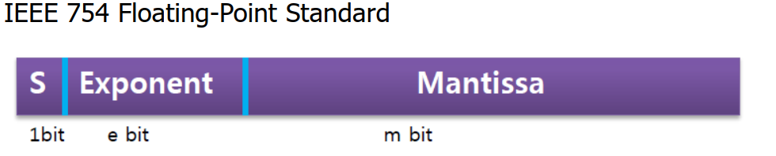
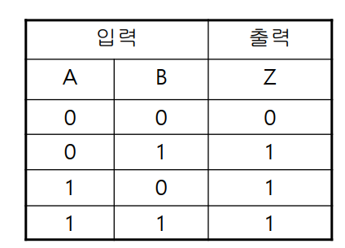
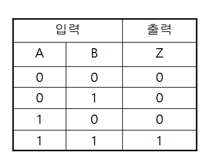
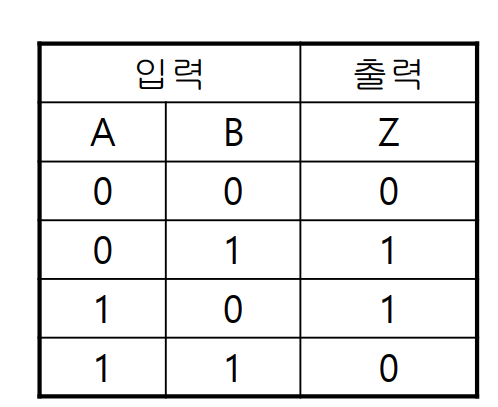

## 자바

### 자바란?

썬 마이크로시스템즈(Sun Microsystems)에서 개발되었으며 1996년 1월에 공식 발표된 객체지향 프로그래밍 언어이다.

### 자바의 역사

1991년 썬 마이크로시스템즈의 엔지니어들이 고안한 오크(Oak)라는 언어에서 시작됐고, 여러 OS가 등장하자 Oak를 웹에 융합하도록 방향을 바꾸면서 자바가 만들어졌다. 자바로 작성된 애플릿(Applet)이 인기가 많았지만 보안상 이슈로 최신 브라우저에서 더 이상 지원하지 않으며, 대신 서블릿(Servlet)과 JSP(Java Server Pages)를 사용한다.

### 자바 언어의 특징

1. 운영체제에 독립적
    - 자바 프로그램은 OS나 HW가 아닌 JVM과 통신하고 JVM이 프로그램으로부터 전달받은 명령을 해당 OS가 이해할 수 있도록 변환하여 전달
		- 속도가 느림
    - 결국 OS에는 독립적이지만 JVM에는 종속적
  		- OS 종류에 관계없이 실행 가능하며 OS에 따라 프로그램을 변경할 필요가 없다.
        - 썬에서는 여러 OS에 설치할 수 있는 서로 다른 버전의 JVM 제공 -> 근데 이러면 무슨 의미가 있냐?
    - Write once, run anywhere
2. 객체지향언어(Object-Oriented programming language, OOP)
    - 상속, 캡슐화, 다형성 등이 잘 적용됨
3. 비교적 배우기 쉽다.
    - 과연 그럴까. 난 절차지향 언어가 더 배우기 편했다.
    - 연산자와 기본구문은 C++, 객체지향 관련 구문은 스몰톡(small talk)이라는 OOP 언어에서 가져옴
    -  배우기 어렵다는 단점을 이겨냈으며 OOP의 확대에 크게 기여함
 4. 자동 메모리 관리(Garbage Collection)
    - garbage collector가 자동으로 메모리를 관리해주기 때문에 따로 관리할 필요가 없음
        - 없으면 사용하지 않는 메모리를 체크하고 반환하는 일을 수동적으로 처리해야 함 -> C언어의 동적할당
        - 메모리 자동 관리가 비효율적일 수 있지만, 프로그래머가 프로그래밍에 집중할 수 있게 도와줌
5. 네트워크와 분산처리 지원
    - 인터넷과 대규모 분산환경을 고려한 언어
    - Java API를 통해 비교적 짧은 시간에 네트워크 관련 프로그램을 쉽게 개발할 수 있음
6. 멀티쓰레드 지원
    - multi-thread는 OS에 따라 구현방법도 다르며, 처리 방식도 다름
        - 자바에서는 시스템과 관계없이 구현 가능
        - Java API가 제공되어 구현이 쉬움
    - 여러 쓰레드에 대한 스케줄링(scheduling)을 자바 인터프리터가 담당
7. 동적 로딩(Dynamic Loading) 지원
    - 자바로 작성된 애플리케이션은 여러 개의 클래스로 구성됨
        - 실행 시 모든 클래스가 로딩되지 않고 필요한 시점에 클래스를 로딩하여 사용할 수 있음
        - 일부 클래스가 변경되어도 전체 애플리케이션을 다시 컴파일하지 않아도 됨
        - 변경사항이 발생해도 비교적 적은 작업만으로도 처리할 수 있음

### JVM(Java Virtual Machine)

Java를 실행하기 위한 가상머신이며, Java로 작성된 프로그램이 실행되기 위해서는 반드시 JVM이 필요하다. 일반 프로그래밍 언어와는 다르게 자바는 JVM을 한 번 더 거치고, 하드웨어에 맞게 완전히 컴파일된 상태가 아니라 실행 시에 해석(interpret)되는 형태라 속도가 느리다. 최근에는 byte code를 기계어로 바로 변환해주는 JIT 컴파일러와 Hotspot과 같은 신기술의 도입으로 JVM의 기능이 향상됨으로써 속도 문제가 상당히 개선됐다.

- JIT 컴파일(just-in-time compilation), 동적 번역(dynamic translation): 프로그램을 실제 실행하는 시점에 기계어로 번역하는 컴파일 기법
- Hotspot: desktop과 서버 컴퓨터를 위한 JVM, Java HotSpot Performance Engine

## 자바개발환경 구축하기

### 자바 개발도구(JDK) 설치하기

- JDK(Java Develoment Kit)
    - JVM과 Java API 외에 자바를 개발하는데 필요한 프로그램들이 설치되어 있다.
    - JDK의 하위 디렉토리인 bin을 Path라는 환경변수에 추가해줘야 한다
        - [OpenJDK](https://openjdk.org/)는 JAVA_HOME이라는 환경 변수를 만든 후 Path에 `%JAVA_HOME%\bin`를 추가하면 된다.
    - bin 디렉토리에 있는 주요 실행파일
        - `javac.exe`: 컴파일러, 소스코드를 byte code로 컴파일
            - byte code: JVM이 이해할 수 있는 기계어
        - `java.exe`: 자바 인터프리터, 컴파일러가 생성한 byte code를 해석하고 실행
        - `javap.exe`: 역어셈블러, 컴파일된 클래스파일을 원래의 소스로 변환
        - `javadoc.exe`: 자동문서생성기, 소스파일에 있는 주석을 이용하여 Java API 문서와 같은 형식의 문서를 자동으로 생성
        - `jar.exe`: 압축프로그램, 클래스 파일과 프로그램의 실행에 관련된 파일을 하나의 jar 파일로 압축하거나 압축해제
    - `JRE + 개발에 필요한 실행파일`로 정의할 수 있다.
        - JRE(Java Runtime Environment)
            - 자바로 작성된 응용프로그램이 실행되기 위한 최소 환경
            - JVM + 클래스 라이브러리(Java API)

### Java API 문서 설치하기

[오라클에서 제공하는 Java 18 API](https://docs.oracle.com/en/java/javase/18/docs/api/index.html)

자바에서 제공하는 클래스 라이브러리(Java API)를 잘 사용하기 위해서는 Java API 문서가 필수적이라고 저자는 설명한다. 그러나 평소에 개발 공부하는 것처럼 레퍼런스 문서를 다 외우고 볼 필요는 없다. 필요할 때마다 잘 찾아보자.

## 자바로 프로그램작성하기

### Hello.java

```java
public class Hello {  
    public static void main(String[] args) {  
        System.out.println("Hello, world!");  
    }  
}
```

java 파일을 `javac.exe`가 컴파일 -> 생성된 class 파일을 `java.exe`가 실행 -> 문자열 출력

자바는 서로 관련된 코드들은 그룹으로 묶어 클래스로 구성되어 있으며 반드시 모든 코드가 클래스 안에 존재해야 한다. 클래스 파일은 클래스마다 하나씩 만들어진다. 하나의 소스코드에 둘 이상의 클래스를 정의하는 것도 당연히 가능하다. 

모든 클래스가 main 메서드를 갖고 있어야 하는 것은 아니지만, 하나의 Java 프로그램에서는 main 메서드를 포함한 클래스가 반드시 하나는 있어야 한다.

소스파일의 이름은 public class의 이름과 일치해야 한다. 소스코드 내 public class가 없다면 소스코드의 이름은 어떤 클래스의 이름으로 해도 상관없다. 즉, 하나의 소스코드에 둘 이상의 public class만 존재하지 않으면 된다.

### 자바 프로그램의 실행과정

1. 프로그램의 실행에 필요한 클래스를 로드
2. 클래스 파일 검사(파일형식, 악성코드 체크)
3. 지정된 클래스에서 main 호출

### 주석(comment)

C++와 동일하다.

```java
public class Hello {  
    public static void main(String[] args) {  
        System.out.println("Hello, world!"); 
        // single-line
        // System.out.println("Hello, world!");  
        // multi-line
        /*
        System.out.println("Hello, world!"); 
        */
    }  
}
```

## 변수

### 변수의 선언과 초기화

변수란 단 하나의 값을 저장할 수 있는 메모리 상의 공간을 의미한다.

`자료형 변수명`으로 선언할 수 있으며, `자료형 변수명 = 리터럴`로 초기화(initialization) 할 수 있다. 초기화는 변수를 사용하기 전에 처음 값을 저장하는 것을 의미한다. 초기화를 해주지 않으면 쓰레기값(garbage value)가 저장되기 때문에 반드시 변수를 선언 후 초기화를 하는 것이 좋다.

사용 예제

```java
class VarEx1 {
	public static void main(Strin[] args) {
		int year = 0;
		int age = 14;

		System.out.println(year);
		System.out.println(age);
	}
}
```

변수 값 교환하기 

```java
class VarEx2 {
	public static void main(Strin[] args) {
		int x = 10, y = 20;
		int tmp = 0;

		System.out.println("x: " + x + " y: " + y); // 덧셈연산자는 문자열과 숫자를 하나로 결합

		tmp = x;
		x = y;
		y = tmp;
		System.out.println("x: " + x + " y: " + y);
	}
}
```

### 변수의 명명규칙

식별자(identifier)는 프로그래밍에서 사용하는 모든 이름을 의미한다. 잘 쓰이지 않는 용어인 것 같지만 혹시 몰라서 적어둔다.

변수 명명 규칙  

1. 대소문자가 구분되며 길이에 제한이 없다.
2. 예약어를 사용할 수 없다.
    - 예약어는 keyword 또는 reserved word라고 부르며 if, void, true 등과 같이 언어에서 지정된 단어이다.
3. 숫자로 시작하면 안 된다.
4. 특수문자는 `_`와 `$`만 허용한다.

자바 프로그래머들에게 권장하는 규칙(convention)  

1. 클래스 이름의 첫 글자는 항상 대문자
	- 변수와 메서드의 이름의 첫 글자는 항상 소문자
2. 여러 단어로 이루어진 이름은 단어의 첫글자를 대문자
3. 상수의 이름은 모두 대문자
	- 띄어쓰기 구문이 필요한 경우 `_` 사용

변수 이름은 길더라도 용도를 알기 쉽게 의미있는 이름으로 하는 것이 협업할 때, 다시 코드를 읽을 때 편하다.

convention은 회사에 따라 언제든지 변경될 수 있다.

## 변수의 타입 

- 기본형(primitive type)
	- 실제 값을 저장
	- boolean, char, byte, short, int, long, float, double
- 참조형(reference type)
  - 주소(memory address) 값을 저장
  - 기본형이 아닌 것들은 모두 참조 변수
  - 자바는 C언어와 달리 참조형 변수 간의 연산을 할 수 없다.
  - 클래스의 이름이 참조변수의 자료형이 된다.
    - 새로운 클래스를 만든다는 것은 새로운 참조형을 만드는 것이다.
  - 참조 변수는 null 또는 객체의 주소를 값으로 가짐
    - OS에 따라 달라지며, OS가 32 bit면 4 byte, 64 bit면 8 byte이다.

- 참조변수의 초기화

```java
Date today = new Date(); // Date 객체를 생성해서 주소를 today에 저장
```

### 기본형(primitive type)

- boolean, char, byte, short, int long, float, double
- char
	- 문자를 내부적으로 정수(유니코드)로 저장
	- 연산 가능
	- C언어와 다르게 2 byte -> 유니코드를 사용하기 때문
- boolean
	- 1 byte
	- boolean을 제외한 나머지 type과 연산 불가능
	- true, false
- 정수형
	- byte
		- 1 byte
	- short
		- 2 byte
	- int
		- CPU가 가장 효율적으로 처리할 수 있는 타입
		- 4 byte
	- long
		- 8 byte
- 실수형
	- double이 기본 자료형
	- 정밀도(precision)가 높을수록 발생할 수 있는 오차의 범위가 줄어든다.
	- float
		- 실수값을 부동 소수점(floating-point) 방식으로 저장
		- 4 byte
	- double
		- 8 byte

### 상수와 리터럴(constant & literal)

상수는 한 번 값을 저장하면 다른 값으로 변경할 수 없다. 예전에는 반드시 선언과 동시에 초기화를 했지만 JDK 1.6부터 상수를 선언과 동시에 초기화 하지 않아도 된다. 사용하기 전에만 초기화 하면 된다.

암묵적으로 상수의 네이밍은 대문자로 한다. 구분자를 사용해야 할 경우 `_`를 사용한다.

```java
final int MAX_SPEED = 10;
```

리터럴은 값 그 자체이다. 일부 중요한 리터럴(값)에 의미있는 이름을 붙여서 코드의 이해와 수정을 쉽게 하기 위해 상수를 사용한다. 

```java
// 2014, 100은 리터럴
int year = 2014;
final int MAX_VALUE = 100;
```
    
- 리터럴의 타입과 접미사
	- 정수형
		- long 타입의 리터럴에 `l` 또는 `L` 접미사
		- 16진수 `0x`, 2진수 `0b`, 8진수 `0` 접두사 
			- `int hexNUM = 0x10;`
		- 접미사가 없으면 int 타입의 리터럴
	- JDK 1.7부터 정수형 리터럴에 구분자 `_`를 넣을 수 있음 -> 읽기가 편리
		- `long big = 100_000_000_000L;`
	- 실수형
		- float은 `f`, double은 `d` 접미사
		- double이 기본 자료형이라 `d` 생략 가능

변수와 타입이 달라도 저장범위가 넓은 타입에 좁은 타입의 값을 저장하는 것은 허용된다. 값이 변수의 타입 범위를 넘어서거나, 변수의 타입보다 저장범위가 넓으면 컴파일 에러를 발생시킨다.

### 문자와 문자열

작은 따옴표로 감싸면 문자, 큰 따옴표로 감싸면 문자열이 된다. 작은 따옴표 안에는 반드시 하나의 문자가 있어야 하며, 큰 따옴표 안에는 문자열이 있을 필요가 없다. 즉, 빈 문자열도 만들 수 있다는 의미이다.

두 문자 이상은 문자열로 취급하며 큰 따옴표로 감싸야 한다. 문자열은 String 타입을 사용하여 저장한다. 사실 String은 클래스이기에 객체를 생성하는 연산자 `new`를 사용해야 하지만 `String str = "";` 같이 사용이 가능하다.

파이썬처럼 덧셈 연산자를 사용하여 문자열과 숫자를 붙일 수 있다. 어느 한 쪽이 String이면 나머지 한 쪽을 자동으로 String으로 변환해서 붙여진다. 숫자를 문자열로 변환하고 싶을 때는 빈 문자열을 더해주면 String이 된다.

```java            
`String str = "Java" + 8.0;`
`7 + ""` -> `"7"`
```

### 형식화된 출력

`printf()`는 `println()`과 달리 출력 후 줄바꿈을 하지 않는 메서드이다. %d, %f 등과 같은 format string(또는 format specifier)을 사용한다. 

```java
system.out.printf("age: %d", age);
```

`%c`, `%d`, `%f`, `%s` 등 다양하게 존재하며	굳이 외울 필요는 없는 내용이라 생각한다. 어짜피 많이 쓰다보면 자연스럽게 몇 개는 외워진다. `printf()`를 잘 사용할 일이 있는지는 모르겠지만, 필요할 때 구글링 하면 되는 내용이다.

출력에 공백 또는 `0`을 넣을 수도 있고, 접두사를 붙일 수도 있다.

10진수를 2진수로 출력

```java
System.out.printf("binNum=%s\n", Integer.toBinarySt4ring(binNum));
```

문자를 %c가 아닌 %d로 출력

```java
System.out.printf("c=%c, %d %n", c, (int)c)
```

### 화면에서 입력받기

Scanner클래스에는 `nextInt()` 같이 변환없이 숫자로 바로 입력 받을 수 있는 메서드가 존재한다. 화면에서 연속적으로 값을 입력받아 사용하기에 까다로울 때는 모든 값을 `nextLine()`으로 입력받아 변환하는 방법을 사용하자.

```java
import java.util.*;

class ScannerEX {
	pulic static void main(String[] args) {
		Scanner scanner = new Scanner(System.in);
		System.out.print("두자리 정수 입력: ");
		String input = scanner.nextLine(); // 입력받은 내용을 input에 저장
		int num = Integer.parseInt(input); // 입력받은 문자열 숫자로 변환
		// int num = scanner.nextInt(); // 정수를 입력받아서 num에 저장
		System.out.println("입력 내용: " + input);
		System.out.printf("num=%d%n", num);
	}
}
```

## 진법

### 10진법과 2진법

1946년 개발된 컴퓨터인 ENIAC은 사람에게 익숙한 10진법을 사용하도록 설계됐다. 그러나 전기회로는 전압이 불안정해서 전압을 10단계로 나누어 처리하는 데 한계가 있었다. 그 후 나온 것이 1950년에 개발된 EDVAC이며, 전기가 흐르면 1, 흐르지 않으면 0으로 동작하도록 설계됐다.

2진법은 자리수가 많아지지만 0과 1로 10진수를 완벽하게 표현할 수 있다. 모든 연산이 가능하며 덧셈으로 모든 걸 할 수 있다. 

### bit와 byte

bit(binary digit)는 2진수의 한 자리이다. 또한, 1비트는 컴퓨터가 값을 저장할 수 있는 최소 단위이다. 1 byte를 8 bit라고 한다. word는 CPU가 한 번에 처리할 수 있는 데이터의 크기를 의미하며 CPU의 성능에 따라 달라진다. 32 bit CPU는 4 byte, 64 bit CPU는 8 byte를 갖는다. word라는 단어도 잘 쓰이지는 않지만, word의 개념은 이해하고 있는 것이 다양한 OS에서 코딩을 할 때 도움이 되는 것 같다.

n비트로 표현할 수 있는 10진수의 개수는 $2^n$이며 값의 범위는 $0 \sim 2^n-1$가 된다.

### 8진법과 16진법

2진법은 값이 커지면 커질수록 길어지는 단점을 가져서 8진법 또는 16진법을 사용한다. 8진수는 2진수 3자리, 16진수는 2진수 4자리를 한 자리로 표현할 수 있어 자리수가 짧아진다. 근데 솔직히 8진법은 쓰이는지 잘 모르겠고 16진법은 쓰이기도 한 것 같다. 

2진법은 0과 1 2개의 숫자를 가지며 8진법은 0~7로 8개의 숫자, 16진법은 0~9, A~F로 16개의 숫자를 가진다. 

### 정수의 진법 변환

해당 진수로 나누고 나머지 값을 옆에 적는 걸 무한 반복하면 10진수를 n진수로 변환할 수 있다. 예를 들어 46을 2로 나누고 난 후의 나머지를 밑에서부터 위로 순서대로 적으면 101110이 된다.

10진수를 2진수로 바꾸는 함수

```java
public voimodifyDecimalToBinary(int n) {  
    if (n < 2) { // n == 0, 1  
        System.out.printf("%d"n);  
    }  
    else {  
        modifyDecimalToBina(n / 2);  
        System.out.printf("%d"n % 2);  
    }  
}
```
각 자리의 수에 해당 단위의 값을 모두 곱해서 모두 더하면 n진수를 10진수로 변환할 수 있다. 예를 들어 16진수 64F를 $6\times16^2+4\times16^1+15\times16^0$처럼 계산할 수 있다.

2진수를 10진수로 바꾸는 함수

```java
public void modifyBinaryToDecima(int n) {  
    int temp = 0;  
    int dec = 0;  
    int exponent = 1;  
  
    while(n > 0) {  
        temp = n % 10;  
        n /= 10;  
        dec += temp * exponent;  
        exponent *= 2;  
    }  
    System.out.println(dec);  
}
```
	
### 실수의 진법변환

10진 소수점을 2진 소수점으로 변환
1. 소수점이 0이 될 때까지 10진수의 소수점에 2를 계속 곱하기
	- $0.625\times2=1.25$, $0.25\times2=0.5$, $0.5\times2=1.0$
2. 정수 부분을 위에서 아래로(거꾸로) 적기 -> 0.101

2진 소수점을 10진 소수점으로 변환
- $0.101 = 1\times2^{-1}+0\times2^{-2}+1\times2^{-3}$
- 정수와 소수가 같이 있는 숫자는 따로 분리하여 변환 후 덧셈

### 음수의 2진 표현 - 2의 보수

부호가 없다면 $0\sim2^n$의 정수를 나타낼 수 있다. 음수를 고려한다면 어떻게 해야 할까? 처음 고안된 방안은 1의 보수이다. 1의 보수는 단순히 0과 1을 반전시킨 것이며 예를 들어 4는 0000 0100, -4는 1111 1011이 된다. 0이 2개(+0: 0000 0000, -0: 1111 1111)가 생기게 된다는 단점을 가져 `2의 보수`가 나오게 됐다.

2의 보수는 1의 보수 값에 1을 더한 값이며 예를 들면 0000 0001(1) -> 1111 1110(1의보수) -> 1111 1111(2의 보수 -1)의 순서로 진행된다.

참고로 가장 왼쪽의 비트는 `MSB(Most Significant Bit)`이며 가장 오른쪽 비트는 `LSB(Least Significant Bit)`라고 한다.

## 기본형(primitive type)

### 논리형 - boolean

1 byte 자료형이며 true 또는 false 값을 가진다. default 값은 false이며 무조건 소문자여야 한다.

### 문자형 - char

문자의 유니코드가 저장되며 연산이 가능하다. 외울 필요 없으며 필요할 때 찾아보면 된다. 그래도 외우면 도움이 될 수도 있는 코드는 A: 65, a: 97, 0: 48 정도가 있다.

char형은 음수를 갖지 않으며 작은 따옴표를 사용하여 문자를 저장한다. 

```java
char ch = 'A';
```

문자를 코드로 변환하는 것을 인코딩, 코드를 문자로 변환하는 것을 디코딩이라 한다.

### escape sequence

escape sequence는 백슬래시(`\`)뒤에 한 문자나 숫자 조합이 오는 문자 조합이다. `\t`: tab, `\n`: new line 등이 있다. `\`, `'`, `"` 등의 자바에서 쓰이는 특수 문자를 출력하려면 `\` 뒤에 출력하면 된다. 

### 아스키코드와 유니코드

아스키(ASCII)코드는 128개 문자 집합이다. 128개로는 모자르기 때문에 CP949 같은 확장 아스키코드도 존재한다. CP949는 윈도우에서 쓰이는 문자 인코딩이며 MS949라고 불리기도 한다. CP949에서 CP는 code page를 의미한다.

Unicode는 UTF-8, UTF-16 등의 종류가 있지만 자바에서는 UTF-16을 사용한다. UTF-8은 하나의 문자를 1~4 byte의 가변 크기로 표현한다. 반면, UTF-16은 모든 문자를 2 byte의 고정크기로 표현한다. UTF-16은 용량이 커지니 문서의 크기 또한 커진다. 인터넷에서는 전송속도가 중요하므로 UTF-8로 작성된 웹 문서가 늘어나고 있다.

### 정수형 - byte, short, int, long

가장 왼쪽의 비트(MSB)를 sign bit(부호가 존재하는 비트)로 사용한다.

메모리 용량을 엄청나게 아껴야 할 것이 아니라면 byte, short 보다 int를 사용하자. JVM의 피연산자 스택(operand stack)이 피연산자를 4 byte 단위로 저장하기 때문에 4 byte보다 작은 자료형의 값을 사용할 때도 결국 4 byte로 변환하여 연산이 수행된다.

타입이 표현할 수 있는 최댓값보다 커지는 것을 오버플로우(overflow)라고 하며 최대값 + 1 -> 최소값이 된다. 반대로 타입이 표현할 수 있는 최솟값보다 작아지는 것을 언더플로우(underflow)라고 하며 최소값 - 1 -> 최대값이 된다.

### 실수형 - float, double



전기 전자 기술자협회(IEEE, Institue of Electrical and Electronics Engineers) 표준 부동소수점 표현 방법을 사용한다. 

- sign bit: 부호, 0이면 양수, 1이면 음수
- exponent: 지수
- mantissa: 가수, 실제값을 저장하는 부분

$$
Value = (-1)^S\times(1.mantissa)\times2^{(exponent-127)}
$$

## 형변환

### 형변환(casting)

`(자료형)피연산자`

```java
`int score = (int)d;`
```

변수 또는 상수의 타입을 다른 타입으로 변환하는 것을 의미한다. 큰 타입에서 작은 타입으로 변환할 때는 값이 손실될 수도 있다.

정수형에서 작은 타입 -> 큰 타입 형변환이 일어날 경우 빈 공간은 양수인 경우 0, 음수인 경우는 1로 채워진다. 실수형인 경우에는 남는 자리는 0으로 채워진다.

### 정수형과 실수형 간의 형변환

정수형을 실수형으로 변환은 10진수를 $Value = (-1)^S\times(1.mantissa)\times2^{(exponent-127)}$ 형태의 2진수로 변환 후 float 형식으로 저장되는 형식이다.

반대로 실수형을 정수형으로 변환할 때는 반올림이 발생하지 않는다.

### 자동 형변환

변수가 저장할 수 있는 값의 범위보다 더 큰 값을 저장하는 경우에는 형변환을 생략하면 에러가 발생할 수도 있다.

그러나 컴파일러가 자동으로 캐스팅 하는 경우도 있다. boolean을 제외한 나머지 7개 기본형은 서로 형변환이 가능하며 기본형과 참조형은 서로 형변환할 수 없다. 또한, 값의 범위가 작은 타입에서 큰 타입으로의 형변환은 생략할 수 있다.

## 연산자(operator)

### 연산자와 피연산자

연산자(operator)는 연산을 수행하는 기호이며 피연산자(operand)는 연산자의 작업 대상이다.

### 연산자의 종류

- 산술 연산자: 사칙 연산(+, -, \*, /)과 나머지 연산(%), 비트 연산(<<, >>)
- 비교 연산자: >, <, >=, <=, \==, !=
- 논리 연산자: &&, ||, !, &, |, ^, ~
	- AND, OR 등
- 대입 연산자: =
- 기타
	- 형변환 연산자: (type)
	- 삼항 연산자: ?, :
	- instanceof 연산자: instanceof

### 연산자의 우선순위와 결합규칙

- 산술 > 비교 > 논리 > 대입
- 단항 > 이항 > 삼항

### 산술 변환

연산 수행 직전에 발생하는 피연산자의 자동 형변환이며 두 피연산자의 타입을 더 큰 타입으로 일치시킨다. 피연산자의 타입이 int보다 작은 타입이면 int로 변환한다.

### 단항 연산자

- 증감 연산자
	- ++, --
	- 전위형(prefix): 값이 참조되기 전에 증가
	- 후위형(postfix): 값이 참조된 후에 증가

```java
public void usePrefixPostfix(int n){  
    int i = 0;
    
    i = n++;  
    System.out.println("n=" + n +", i="+ i); // n=6, i=5  
    i = ++n;  
    System.out.println("n=" + n +", i="+ i); // n=7, i=7  
}
```

- 부호 연산자
	- 값 앞에 부호를 붙이는 연산자

### 산술 연산자

- 사칙 연산자
	- 덧셈, 뺄셈, 곱셈, 나눗셈
		- 나누기 연산자의 두 피연산자가 모두 int타입이면 결과도 int타입
			- 소수점까지 나오게 하고 싶다면 꼭 형변환을 사용하자.
		- 피연산자가 정수형인 경우 나누는 수를 0을 사용할 수 없다.
			- 부동 소수점 값인 `0.0f`, `0.0d`로 나누는 것은 가능하나 결과는 Inf다.

### 비교 연산자

- 대소 비교
- 등가 비교
- 결과는 true 또는 false로 나온다.
- 두 문자열을 비교할 때는 `==`대신 `equals()`라는 메서드 사용
	- 비교 연산자(==)는 두 문자열이 완전히 같은 것인지 비교
		- 내용은 같아도 서로 다른 객체면 false를 반환
	- 문자열의 내용이 같은지 비교하기 위해서는 equals() 사용
		- 객체가 달라도 내용이 같으면 true를 반환
	- 대소문자를 구별하지않고 비교하고 싶으면 `equalsIgnoreCase()`를 사용한다.
		- 같으면 true, 다르면 false 반환

```java
public void equalsString() {  
    String str1 = "abc";  
    String str2 = "abcd";  
  
    System.out.println(str1.equal(str2));  
}
```

### 논리 연산자

- OR: `||`
  - 피연산자 중 어느 한 쪽만 true이면 true
    - 한 쪽만 참이어도 전체 연산결과가 참이므로 좌측이 참이면 우측을 평가하지 않는다.



- AND: `&&`
  - 피연산자 어느 한 쪽이 false면 결과가 false
    - 한 쪽만 거짓이어도 전체 연산결과과 거짓이므로 좌측이 거짓이면 우측을 평가하지 않는다. 



- 논리 부정 연산자: `!`
  - true일 때 false를 반환, false일 때 true를 반환
- 비트 연산자
  - 비트 단위로 논리 연산
    - `|`(OR), `&`(AND), `^`(XOR)
    - XOR 연산자 진리표

  

  - 비트 전환 연산자: `~`
		- 2진수 비트로 되어 있을 때 0은 1로, 1은 0으로 바꾼다.
	- shift 연산자: `<<`, `>>`
		- 각각 비트를 2칸 옮긴다.
		- 왼쪽으로 이동될 경우 앞 쪽 비트는 버려지고 뒷 쪽 빈자리는 0으로 채워진다.
		- 오른쪽으로 이동될 경우 양수인 경우 0으로 채우고 음수인 경우 1로 채운다.
		- x << 2는 \\(x\times2^n\\)과 같다.
		- x >> 2는 \\(x \div 2^n\\)과 같다.

### 그 외의 연산자

- 조건 연산자: `?`, `:`
	- `조건 ? 참 : 거짓`
	- `num = x > 0 ? x : -x`
- 대입 연산자: `=`
	- 수식의 연산결과를 저장하는데 사용
	- lvalue, rvalue
		- 왼쪽 피연산자를 lvalue, 오른쪽 피연산자를 rvalue라고 한다.
		- rvalue는 식, 상수 등이 가능, lvalue는 변수처럼 값을 변경할 수 잇는 것이어야 한다. -> 상수 불가능
- 복합 대입 연산자
	- 대입 연산자와 다른 연산자를 결합하여 사용
	- e.g. `+=`, `-=`, `/=`, ...

## References

>- 남궁성, Java의 정석, 도우출판, 2016
>- 신용권, 혼자 공부하는 자바, 한빛미디어, 2019
