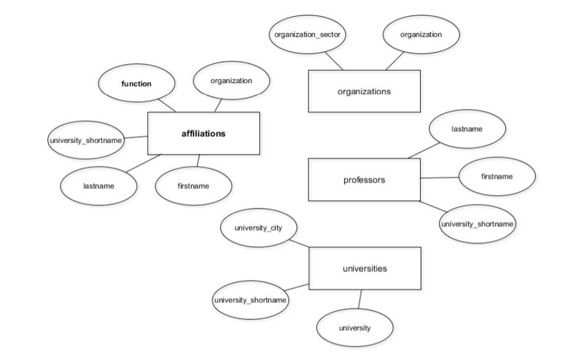

# Introduction to Relational Databases in SQL

## Your first database

### Relational database

- 현실의 entity를 table로 구현
- entity를 한 번만 저장하여 중복성 줄임
- data integrity by relationship
  - 수명 주기를 거치며 데이터의 정확성, 일관성, 유효성을 유지하고 보증하는 것
  - DBMS의 중요한 기능

- 세 가지 중요 개념
  - constraint(제약 조건)
    - 테이블의 하나 이상의 열에 적용되는 사항
  - key(키)
  - referential integrity(참조 무결성)
    - 참조 관계에 있는 두 테이블의 데이터가 항상 일관된 값을 갖도록 유지되는 것
    - 테이블간의 관계를 구성하는 키가 항상 유효하도록 foreign key constraint로 관리

- 간단한 사용 예제
  ```sql
  -- Query the right table in information_schema
  SELECT table_name 
  FROM information_schema.tables
  -- Specify the correct table_schema value
  WHERE table_schema = 'public';

  -- Query the right table in information_schema to get columns
  SELECT column_name, data_type 
  FROM information_schema.columns 
  WHERE table_name = 'university_professors' AND table_schema = 'public';

  -- Query the first five rows of our table
  SELECT * 
  FROM university_professors 
  LIMIT 5;
  ```

### Entity-Relationship Diagram



- 사각형은 entity(간단하게 table이라 생각) 유형, 원은 attribute(column)을 의미
  - 별개로 instance를 row라고 생각하면 편할듯

- 테이블 생성, entity type 설정
  ```sql
  -- Create a table for the professors entity type
  CREATE TABLE professors (
  firstname text,
  lastname text
  );

  -- Print the contents of this table
  SELECT * 
  FROM professors

  -- Create a table for the universities entity type
  CREATE TABLE universities (
  university_shortname text,
  university text,
  university_city text
  );

  -- Print the contents of this table
  SELECT * 
  FROM universities
  ```
- `ALTER`을 사용하여 테이블 수정
  ```sql
  -- Add the university_shortname column
  ALTER TABLE professors
  ADD COLUMN university_shortname text;

  -- Print the contents of this table
  SELECT * 
  FROM professors
  ```

### Migrate DB after update

- `DISTINCT`를 사용하여 중복 제거
  ```sql
  SELECT COUNT(DISTINCT organization)
  FROM university_professors;
  ```
- `INSERT INTO` 구문
  ```sql
  INSERT INTO table_name (column_a, column_b)
  VALUES ("value_a", "value_b");
  ```
- column의 이름을 바꾸고 column 삭제
  ```sql
  -- Rename the organisation column
  ALTER TABLE affiliations
  RENAME COLUMN organisation TO organization;

  -- Delete the university_shortname column
  ALTER TABLE affiliations
  DROP COLUMN university_shortname;
  ```
- 새로운 테이블로 중복된 데이터는 제외하고 복사
  ```sql
  -- Insert unique professors into the new table
  INSERT INTO professors 
  SELECT DISTINCT firstname, lastname, university_shortname 
  FROM university_professors;

  -- Doublecheck the contents of professors
  SELECT * 
  FROM professors;
  ```
  ```sql
  -- Insert unique affiliations into the new table
  INSERT INTO affiliations 
  SELECT DISTINCT firstname, lastname, function, organization 
  FROM university_professors;

  -- Doublecheck the contents of affiliations
  SELECT * 
  FROM affiliations;
  ```
- migration 후 필요없는 table 삭제
  ```sql
  -- Delete the university_professors table
  DROP TABLE university_professors;
  ```
## Enforce data consistency with attribute constraints

### Integrity constraints

- Attribute constraint
  - Column integrity
  - Domain integrity
  - e.g. data type on column
- Key constraint
  - Entity integrity
  - e.g. primary key
- Referential integrity 
  - foreign key로 관리

### Constaint가 필요한 이유 

- 제약 조건이 있음으로서 데이터를 동일한 형태를 갖게 함
  - 일관성 제공
  - 데이터 퀄리티 문제 해결 -> Data Scientist가 편하도록 제공

### Data type casting 

- 테이블 생성 후 데이터 넣기
  ```sql
  CREATE TABLE transactions (
  transaction_date date, 
  amount integer,
  fee text
  );

  -- Let's add a record to the table
  INSERT INTO transactions (transaction_date, amount, fee) 
  VALUES ('2018-09-24', 5454, '30');

  -- Doublecheck the contents
  SELECT *
  FROM transactions;
  ```

- type casting
  ```sql
  -- Calculate the net amount as amount + fee
  SELECT transaction_date, amount + CAST(fee AS integer) AS net_amount 
  FROM transactions;
  ```

### Domain integrity

- table에 존재하는 field(column)의 무결성을 보장하기 위한 것으로 field의 타입, NULL값 허용 등에 대한 사항을 정의
- 올바른 데이터의 입력 되었는지를 확인하는 것
- Domain integrity가 깨지는 경우 예시
  - 전화번호 field에 알파벳이 입력되는 경우

### PostgreSQL에서 가장 일반적인 type

- text
  - 모든 길이의 문자열 허용
- varchar(n)
  - 가변 길이
- char(n)
  - fixed-length(고정 길이) string
- boolean
  - TRUE, FALSE, NULL(unknown)
- date
  - 시간 제외, 4 byte
- time
  - 날짜 제외, 8 byte
- timestamp
  - 시간, 날짜 모두 포함, 8 byte
- numeric
  - 일반적인 숫자들, 소수도 가능
- integer
  - 정수만 허용
- 이밖에도 다른 type들이 존재하며 대부분 SQL 표준을 따름
- 자세한 건 PostgreSQL documentation 확인 

- `ALTER COLUMN`을 활용하여 type 변경
  ```sql
  -- Select the university_shortname column
  SELECT DISTINCT(university_shortname) 
  FROM professors;

  -- Specify the correct fixed-length character type
  ALTER TABLE professors
  ALTER COLUMN university_shortname
  TYPE char(3);

  -- Change the type of firstname
  ALTER TABLE professors
  ALTER COLUMN firstname
  TYPE varchar(64);
  ```
- `USING`을 사용하여 타입 변경
  - `SUBSTRING`을 사용하여 firstname을 16자로 줄임
  ```sql
  -- Convert the values in firstname to a max. of 16 characters
  ALTER TABLE professors 
  ALTER COLUMN firstname 
  TYPE varchar(16) 
  USING SUBSTRING(firstname FROM 1 FOR 16);
  ```

### NULL constraint

- field의 NULL constraint는 NULL 상태가 존재하는지를 지정
- NULL은 알 수 없거나 결정되지 않은 특수한 상태를 의미
- 허용하고 싶지 않다면 테이블을 생성할 때 `NOT NULL`을 추가
  ```sql
  CREATE TABLE students (
  ssn integer not null,
  lastname varchar(64) not null,
  home_phone integer,
  office_phone integer
  );
  ```
- 테이블 생성 후 제약 추가
  ```sql
  ALTER TABLE students
  ALTER COLUMN home_phone
  SET NOT NULL;
  ```
- 테이블 생성 후 제약 삭제
  ```sql
  ALTER TABLE students
  ALTER COLUMN home_phone
  DROP NOT NULL;
  ```

### Unique constraint

- 열에 대한 중복 항목이 없는지 확인
- `UNIQUE`만 붙여주면 됨
  ```sql
  CREATE TABLE table_name (
    column_name UNIQUE
  )
  ```
- `ADD CONSTRAINT`를 사용하여 기존 테이블에 제약 추가
  - NULL 제약 조건과 헷갈릴 수 있으니 주의
  ```sql
  ALTER TABLE table_name
  ADD CONSTRAINT some_name UNIQUE(column_name);
  ```
  - 예시
    ```sql
    -- Make universities.university_shortname unique
    ALTER TABLE universities
    ADD CONSTRAINT university_shortname_unq UNIQUE(university_shortname);
    ```

## Uniquely identify records with key constraints

### Key

- 테이블의 특정 record(row)를 읽거나 변경하려면 record끼리 구분할 수 있는 고유의 key(식별자)가 필요
  - 값이 꼭 있어야 함 -> NULL X
  - 고유값을 가져야 함 -> 중복 X
- superkey
  - attribute들의 집합으로 구성된 key
  - Unique는 만족하지만 Minimality는 만족하지 않음
    - Unique: 하나의 key 값으로 하나의 tuple을 유일하게 식별할 수 있어야 하는 조건
    - Minimality: key를 구성하는 attribute 중 하나라도 제외될 경우 유일하게 식별할 수 없도록 꼭 필요한 최소의 attribute로 구성되어야 한다는 조건
- candidate key(후보 키)
  - minimal superkey
  - attribute를 제거하여 더 간단한 superkey로 축소할 수 없는 superkey

- `SELECT, COUNT, DISTINCT`를 사용하여 key 식별
  ```sql
  SELECT COUNT(DISTINCT(firstname, lastname)) 
  FROM professors;
  ```

### Primary key

- 테이블의 각 행(record)을 고유 식별자로 사용할 수 있는 하나 이상의 열
  - 중복 또는 NULL 값을 허용하지 않는 열에 정의해야 함 
  - 2개 이상의 열이 결합하여 고유한 값을 가지는 기본 키는 `compound key(복합 키)`라고 부름 
- 거의 모든 DB의 table에는 candidate key에서 사용자가 선택한 primary key가 있어야 함
  - 기본 키가 아닌 후보 키는 alternate key(대리 키)라고 함
- 시간이 지나도 변경되지 않아야 함

- 원래 코드
  ```sql
  CREATE TABLE products (
    product_no integer UNIQUE NOT NULL,
    name text,
    price numeric
  );
  ```
- primary key 지정
  ```sql
  CREATE TABLE products (
    product_no integer PRIMARY KEY,
    name text,
    price numeric
  );
  ```
- 둘 이상의 primary key 지정
  ```sql
  CREATE TABLE example (
    a integer,
    b integer,
    c integer,
    PRIMARY KEY (a, c)
  );
  ```
- 기존 테이블에 primary key 제약 조건 추가
  ```sql
  ALTER TABLE table_name
  ADD CONSTRAINT some_name PRIMARY KEY (column_name)  
  ```
  - 예시
    ```sql
    -- Rename the organization column to id
    ALTER TABLE organizations
    RENAME COLUMN organization TO id;

    -- Make id a primary key
    ALTER TABLE organizations
    ADD CONSTRAINT organization_pk PRIMARY KEY (id);
    ```

### Natural key and Surrogate key

- primary key는 가능한 적은 수의 column으로 구성
- record의 primary key는 시간이 지나도 변경되지 않아야 함

- natural key(자연 키)
  - entity의 정보 중 고유한 값을 가져서 각 row마다 식별할 수 있는 의미를 가지는 column
  - 번호가 아닌 고유 값
- surrogate key(대리 키)
  - entity에서 파생된 정보가 아닌 임의의 고유 식별자
  - `일련번호`와 같은 가상의 값으로 기본 키의 역할을 하는 column
  - postgreSQL의 `serial`을 사용하여 추가하는 방법
    - 모든 레코드에 번호가 생기며 새로운 값이 추가될 때마다 자동으로 증가됨
    ```sql
    ALTER TABLE cars
    ADD COLUMN id serial PRIMARY KEY;
    ```
    - 예시
      ```sql
      ALTER TABLE professors 
      ADD COLUMN id serial;

      -- Make id a primary key
      ALTER TABLE professors 
      ADD CONSTRAINT professors_pkey PRIMARY KEY (id);
      ```
  - `CONCAT`을 사용하여 두 개의 기존 열을 새 열로 결합
    ```sql
    ALTER TABLE table_name
    ADD COLUMN column_c varchar(256);

    UPDATE table_name
    SET column_c = CONCAT(column_a, column_b)
    
    ALTER TABLE table_name
    ADD CONSTRAINT pk PRIMARY KEY (column_c);
    ```
    - 예시
      ```sql
      -- Count the number of distinct rows with columns make, model
      SELECT COUNT(DISTINCT(make, model)) 
      FROM cars;

      -- Add the id column
      ALTER TABLE cars
      ADD COLUMN id varchar(128);

      -- Update id with make + model
      UPDATE cars
      SET id = CONCAT(make, model);

      -- Make id a primary key
      ALTER TABLE cars
      ADD CONSTRAINT id_pk PRIMARY KEY(id);
      ```

## Glue together tables with foreign keys

### Foreign key

- 다른 table의 primary key를 식별하는 데 사용할 수 있는 하나 이상의 열
- 도메인과 데이터 유형이 기본 키 중 하나와 동일해야 함
- 참조된 테이블의 기본 키에 값으로 존재하는 외래 키 값만 허용 -> 외래 키 제약 조건(Referential integrity)
- 외래 키가 반드시 실제 키일 필요는 없음 -> 중복, NULL 값 허용되기 때문
- 기존 테이블에 외래 키 추가 방법
  ```sql
  ALTER TABLE a
  ADD CONSTRAINT a_fkey FOREIGN KEY (b_id) REFERENCES b (id);
  ```
  - 예제
    ```sql
    -- Rename the university_shortname column
    ALTER TABLE professors
    RENAME COLUMN university_shortname TO university_id;

    -- Add a foreign key on professors referencing universities
    ALTER TABLE professors 
    ADD CONSTRAINT professors_fkey FOREIGN KEY (university_id) REFERENCES universities (id);
    ```
- 테이블을 생성하면서 외래 키 생성
  ```sql
  CREATE TABLE manufacturers (
    name varchar(255) PRIMARY KEY);
  
  INSERT INTO manufacturers
  VALUES ('Ford'), ('VW'), ('GM');
  CREATE TABLE cars (
    model varchar(255) PRIMARY KEY,
    manufacturer_name varchar(255) REFERENCES manufacturers (name));
  
  INSERT INTO cars
  VALUES ('Ranger', 'Ford'), ('Beetle', 'VW');
  ```
  ```sql
  -- Throws an error!
  -- 외래 키 제약 조건으로 인해 저장되지 않은 데이터를 추가할 수 없음
  INSERT INTO cars
  VALUES ('Tundra', 'Toyota');  
  ```

### N:M-relationships 구현

- 두 entity를 가리키는 두 개의 외래 키 사용
- primary key가 없음
- 
  ```sql
  CREATE TABLE affiliations (
  professor_id integer REFERENCES professors (id),
  organization_id varchar(256) REFERENCES organizations (id),
  function varchar(256)
  );
  ```

### Referential integrity

- 다른 테이블의 레코드를 참조하는 레코드는 항상 기존 레코드를 참조해야 함
- 존재하지 않는 레코드를 가리킬 수 없음 -> 조건 위반
- 이미 참조된 테이블의 레코드가 삭제되면 조건에 위반됨
- 두 개의 테이블과 관련있는 제약 조건이기에 외래 키와 연관됨

- `ON DELETE NO ACTION`
  - 테이블에 있는 기존 행의 외래 키에서 참조하는 키가 있는 행을 삭제하려 할 때 오류를 발생시키고 DELETE 취소(RESTRICT)
  ```sql
  CREATE TABLE a (
	  id integer PRIMARY KEY,
	  column_a varchar(64),
	  ...,
	  b_id integer REFERENCES b (id) ON DELETE NO ACTION
  );
  ```
- `ON DELETE CASCADE`
  - 참조되는 부모 테이블의 기본 키 값에 대한 변경 사항을 자식 테이블에도 적용 -> 삭제
  ```sql
  CREATE TABLE a (
    id integer PRIMARY KEY,
    column_a varchar(64),
    ...
    b_id integer REFERENCES b (id)
  );
  ```

- `RESTRICT`와 `NO ACTION`은 `MySQL`에서는 동일한 의미를 가짐
- `PostgreSQL`
  - `RESTRICT`: 참조된 데이터가 있을 경우 삭제하지 않으며 integrity 검증을 tramsaction 이전에 실행
  - `NO ACTION`: 데이터 변경 또는 삭제를 진행하고 변경 또는 삭제된 데이터의 integrity를 검사
- `SET NULL`: 레코드의 외래 키 값을 NULL로 설정
- `SET DEFAULT`: 열에 대한 기본값을 지정한 경우 작동, default 값으로 자동 변경

## References

>- Alan Beaulieu, Learning SQL: Generate, Manipulate, and Retrieve Data, o'reilly, 2020