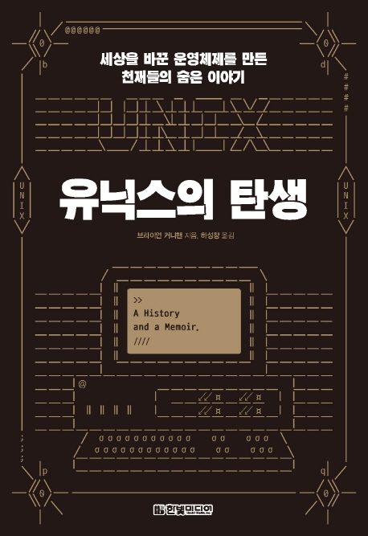

## ℹ️ Book Info

:::tip
Click the book image to go to the Kyobobook site!
:::

- Title: The Birth of UNIX
- Author: Brian W. Kernighan
- Translator: Ha Sung-chang
- Publisher: Hanbit Media
- Release Date: August 3, 2020

{/* truncate */}

## 🎬 Intro

I borrowed this book from a local library near my home. I first saw it on Hanbit Media's Facebook page. At the time, I was taking an operating systems course at university, so I thought I'd like to read it—but I was too busy during the semester to do so. I hadn't given it much thought until I stumbled upon it at the library. I wondered, "Why is this in a public library?" but ended up borrowing it anyway.

## 📖 Book Review

### What Kind of Book Is This?

This is a memoir by the author, Brian Kernighan. He's one of the co-authors of [The C Programming Language](http://www.kyobobook.co.kr/product/detailViewEng.laf?mallGb=ENG&ejkGb=ENG&barcode=9780131103627), a book familiar to anyone who's studied C from its original text. He wrote it with Dennis Ritchie, the creator of the C language.

The book shares interesting anecdotes about the author's experiences at Bell Labs and his fellow developers. It mentions legendary programmers like Dennis Ritchie, who co-created Unix with Ken Thompson (now co-developer of Go at Google), and highlights how brilliant and impactful Bell Labs was at the time. It also traces the history of Unix—how it was created and evolved.

This book truly deserves the word "awe-inspiring." At times, the Unix development process reads like a novel. The book also includes emails and interviews with colleagues, which I found an engaging way to present history. I was amazed at how much detail the author remembered—even if he kept records, I wondered, "How did he document all this?"

### Serious About Writing

The developers at Bell Labs had a serious attitude toward writing, and they supported each other's critiques, even with management's backing. That's probably why they could publish books that influenced developers worldwide. As a student who studied languages developed by these great programmers and read their books, I was deeply impressed by this aspect.

I'm a college student aiming to become a developer, but I also love writing. That's why I run a blog where I review books and organize what I've learned, hoping to help others. Moving forward, I want to keep practicing writing and become a developer who leaves knowledge for the world through my blog.

### Fun Anecdotes

The book is full of entertaining stories. For example, the name "Unix" was a pun on [Multics (Multiplexed Information and Computing Service)](https://ko.wikipedia.org/wiki/%EB%A9%80%ED%8B%B1%EC%8A%A4). The original name was UNICS, but AT&T lawyers didn't like it because it sounded like "eunuchs" (내시). 

There's also a story about Douglas McIlroy, who created the `malloc` library often used in C programming. If you've studied C, you'll find this particularly interesting. Another fun fact: the system call for creating files in UNIX, `creat`, was actually a typo by Ken Thompson.

I also learned that the BSD License, commonly used today (like on GitHub alongside the MIT License), originated from Unix. The book is packed with useful and fun tidbits like these. This is just what I remember now—there are many more interesting stories. If you're aspiring to be a developer, this is a fun book to read when you're bored.

## 🔖 Recommended Readers

I don't recommend this book for those just starting to learn programming. It's best for those who have studied operating systems or systems programming. I took an OS course but skimmed through it, and even then, this book was quite challenging. It might be even harder for those without that background.

My university had a systems programming course, so I could somewhat understand the code snippets and terms in the book. I'm not sure how others would fare—if you come across unfamiliar code, Google it diligently. Take your time, enjoy the read, and dive in!