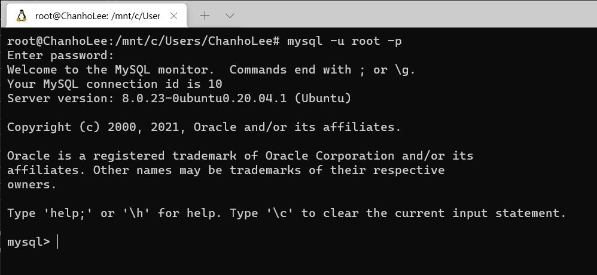

:::info  
This review was written as part of the Hanbit Media "I am a Reviewer" activity, where I received the book for review.  
:::

## Book Info

:::tip  
Click the book image to visit the Kyobobook store!  
:::

- **Title**: Learning SQL  
- **Author**: Alan Beaulieu  
- **Translators**: Soo-Mi Ryu, Hee-Jeong Song  
- **Publisher**: Hanbit Media  
- **Release Date**: March 30, 2021  

<!-- truncate -->

## 🎬 Intro  

Although I’m a computer engineering major, I’ve never properly studied databases. My department leans more toward Computer Engineering than Computer Science, and the database course is scheduled for my final semester. However, while studying web backends, I naturally felt the need to learn SQL and thought, *"I should study this someday."* Fortunately, I got the chance to participate in Hanbit Media’s "I am a Reviewer" program and was able to read this book.  

## 📖 Book Review  

### SQL  

As the title suggests, this book is about learning SQL. There are many types of SQL databases, such as MySQL, Oracle Database, IBM DB2, Microsoft SQL Server, and PostgreSQL. This book focuses on MySQL, which is one of the most widely used. While there are occasional examples from other SQL dialects, the syntax is largely similar, so it’s not a big issue.  

### Hands-On Environment  

  

Most SQL books require you to create tables, insert data, or download a pre-built database for practice. This book uses the Sakila database, a sample database developed by MySQL for tutorials and examples.  

Setting up the environment requires installing MySQL and importing the Sakila database, which can be challenging for beginners. To help, the original publisher, O'Reilly, provides a [Katacoda](https://www.katacoda.com/) environment for hands-on practice. This was one of the most impressive features, making it very convenient for newcomers.  

  

For those who prefer to set up their own environment, the book supports that too. I used WSL2 (Windows Subsystem for Linux 2) to set up MySQL. While the book uses terminal-based queries, I chose not to use MySQL Workbench and followed along in the terminal instead.  

### More Than Just an Introduction  

This book doesn’t stop at basic SQL queries. It starts with the fundamentals and progresses to advanced topics like partitioning, clustering, sharding, and big data. It even introduces Apache Drill, an open-source tool that debuted in 2015.  

### A Study-Friendly Book  

At 455 pages and 18 chapters, the book is thick but well-structured for gradual learning. Reading one chapter a day means finishing it in just 18 days—manageable without feeling overwhelmed.  

Each chapter ends with **"Learning Check Practice Problems"**, which I found very helpful. Many technical books provide examples but lack review exercises. This one includes problems with answers in the appendix, making it great for self-assessment.  

Additionally, the book offers plenty of practical code examples, often explaining when and why to use specific queries. It’s not just a reference—it’s a guide for applying SQL in real scenarios.  

## 🔖 Recommended Readers  

Occasionally, a chapter introduces concepts from other sections before they’re fully explained. For this reason, readers who have at least some prior SQL experience will benefit more.  

If you’re completely new to SQL, I recommend supplementing this book with other beginner-friendly resources. For those with some background, working through the examples and exercises will be an excellent way to reinforce your skills.