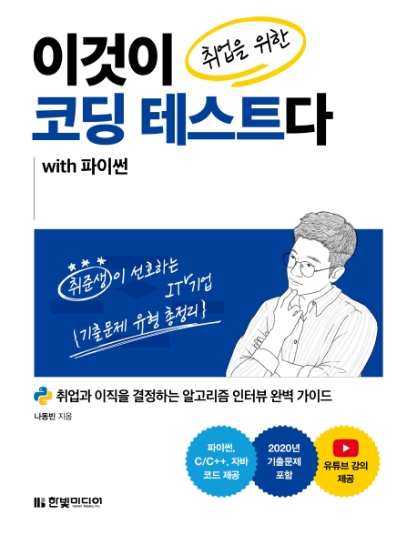

:::info  
This post was written as part of the Hanbit Media "I am a Reviewer" activity, where I was provided with the book.  
:::

## Book Info

:::tip  
Click the book image to visit the Kyobobook store!  
:::

- Title: *This Is the Coding Test for Getting a Job with Python*  
- Author: Na Dongbin  
- Publisher: Hanbit Media  
- Release Date: August 5, 2020  

<!-- truncate -->

## Intro  

Nowadays, coding tests have become a must-pass hurdle for job seekers trying to enter companies. While some companies don’t require them, most use coding tests as a screening step before interviews. Back in the day, people might have struggled alone with books like *Algorithm Problem-Solving Strategies*, but now there are many resources like this book to help prepare for job-oriented coding tests—something I’m grateful for.  

I was especially pleased to see that the author is Na Dongbin, whom many might recognize from his YouTube videos on coding. Since I prepared for coding tests using C++, I thought, *“I won’t get a chance to read this book,”* but this program gave me the opportunity. I’ve referenced his [YouTube lectures](https://www.youtube.com/c/dongbinna/videos) and [his blog, "Glasses Developer"](https://ndb796.tistory.com/), which are highly recommended for anyone studying or wanting to get into coding.  

This book is also part of Hanbit Media’s **"This Is"** series. I remember studying Ubuntu Linux from an older edition of this series, and it’s great to see the series rebranded with a fresh, modern look.  

## Book Review  

### Analysis of Recent Coding Tests  

This isn’t just a generic algorithm problem-solving book—it’s tailored for job seekers preparing for coding tests. Just as high school students analyze past exam papers, it’s essential to understand the trends in coding test questions.  

The book analyzes problem types from major companies’ coding tests between 2016–2020, guiding readers on how to prepare and highlighting the latest trends. The appendix even includes past problems from Kakao and Samsung Electronics, which will be especially helpful for those targeting specific companies.  

### Career Guidance  

While the book focuses on coding tests, it also offers broader career advice. It doesn’t dive deep into interview prep for specific roles, but it does cover general hiring processes, common technical interview formats, and how to prepare for them. For example, it explains typical recruitment stages at major companies and what to study for technical interviews.  

### A Very Friendly Book  

As the title suggests, this book uses Python. However, the [GitHub repository](https://github.com/ndb796/python-for-coding-test) also provides source code in C++ and Java—a thoughtful gesture for those who prefer other languages. The author’s effort in supporting multiple languages is impressive.  

The book’s friendliness doesn’t stop there. The author also offers free YouTube lectures that cover not just Python but also C++ and Java implementations. I remember binge-watching his videos the day before a coding test—it was a lifesaver!  

## Appendix & Helpful Content  

The author includes everything a job seeker might need: study plans, how to use this book effectively, and even a crash course on Python basics for those unfamiliar with the language.  

Modern coding tests often go beyond standard algorithm problems. Some companies include development-based tasks or unexpected challenges during video interviews. The appendix addresses this by covering REST API calls and JSON parsing—skills tested in Kakao’s coding exams. It explains the concepts and shows how to implement them in Python, making it a practical guide.  

## Target Audience  

I can’t promise that *this single book will guarantee a perfect coding test score and a smooth transition to interviews*—test outcomes depend on many factors, including the questions and your condition on the day. However, I believe this book covers about half of what you need to know for coding test prep.  

I recommend it to **aspiring developers just starting their job search**. The book is packed with insights that make you think, *“I wish I’d known this earlier.”* Reading books is a way to fast-track others’ experiences and useful information. Even if you’re not a job seeker, I’d suggest **computer science students read this early**—it could have made my own job search much smoother.