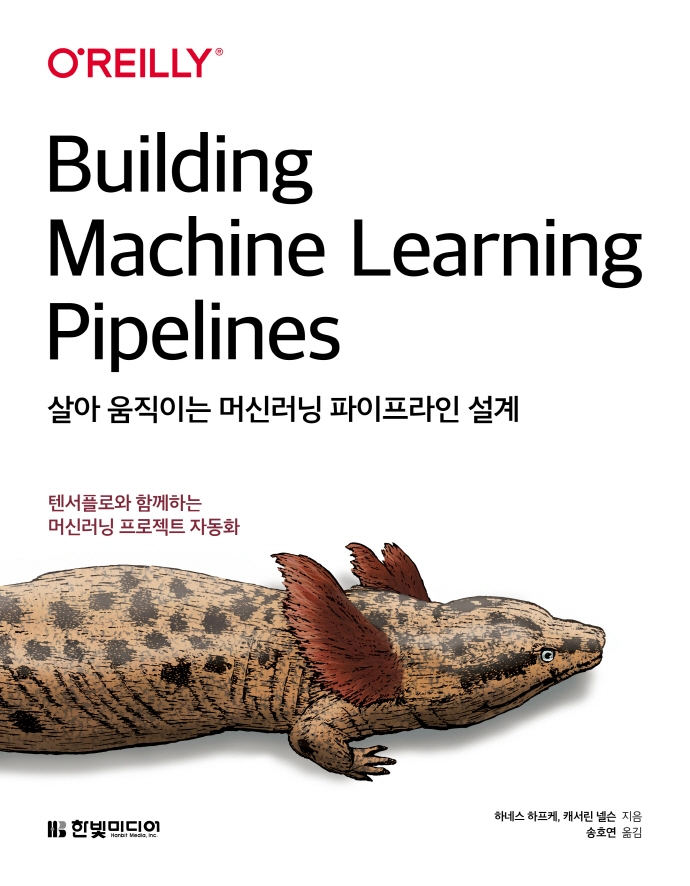

:::info  
This post was written as part of the Hanbit Media \<I am a Reviewer\> activity, where I was provided with the book for review.  
:::

## Book Info

:::tip  
Click the book image to visit the [Kyobobook](https://www.kyobobook.co.kr) site!  
:::

- **Title**: *Designing Machine Learning Pipelines That Scale*  
- **Authors**: Hannes Hapke, Catherine Nelson  
- **Translated by**: Ho-Yeon Song  
- **Publisher**: Hanbit Media  
- **Release Date**: October 11, 2021  

{/* truncate */}

## Book Overview

### Prerequisites: ML & Cloud Knowledge

Before diving into designing machine learning pipelines, you’ll need foundational ML knowledge. Consider whether you’re comfortable reading TensorFlow and Keras code before starting this book. Proficiency in Python is also essential! If you’re considering this book, I assume you already meet these criteria.  

While not strictly required, prior experience with cloud platforms will make this book more accessible. Familiarity with **GCP (Google Cloud Platform)** or **AWS (Amazon Web Services)**—even just basic usage—will help, as the book discusses optimizing pipelines with cloud services.  

### Key Content Summary

This book guides you through designing pipelines using **TensorFlow Extended (TFX)**, covering the full workflow:  
**Data Collection → Data Validation → Data Preprocessing → Model Training → Model Analysis & Validation → Model Deployment**.  

The entire process leverages the TensorFlow ecosystem. Since the official TFX documentation is well-translated, referring to it alongside the book will enhance your understanding!  

The final chapters explore orchestration tools for pipeline execution. While I found the pipeline design sections engaging, I particularly enjoyed the discussion of three orchestration tools: **Apache Beam, Apache Airflow, and Kubeflow**. Having only heard about these in the community, this book gave me a practical opportunity to explore them.  

### Appendix Highlights

The appendix introduces **Docker** and **Kubernetes**—essential infrastructure tools for ML—and walks you through setting up a Kubernetes cluster on Google Cloud. Even if you’re new to these technologies, the appendix provides a hands-on introduction.  

## Recommended Audience

This book is ideal for:  
- **ML Engineers** familiar with frameworks like TensorFlow/Keras who want to design scalable pipelines. While the examples use TensorFlow, the core concepts apply to other frameworks.  
- **ML Enthusiasts** interested in the TensorFlow ecosystem.  
- **DevOps Engineers** exploring **MLOps** and looking to understand pipeline orchestration.  

Whether you’re building production-ready systems or curious about end-to-end ML workflows, this book offers valuable insights.