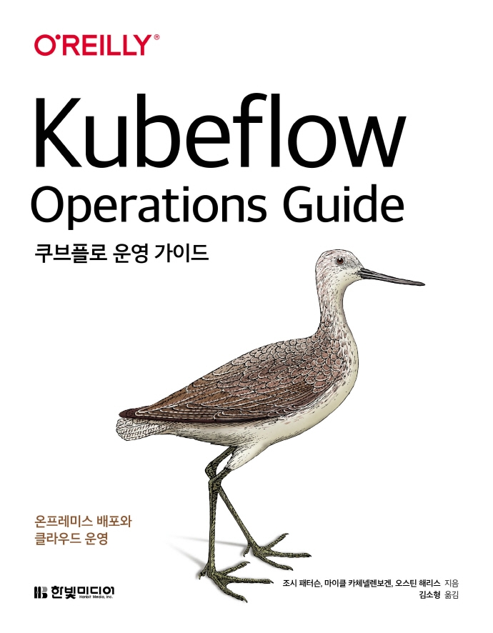

:::info  
This post is a book review written as part of the Hanbit Media \<I am a Reviewer\> activity, where the book was provided for review.  
:::

## Book Info

:::tip  
Click the book image to go to the **Kyobobook** site!  
:::

- **Title:** Kubeflow Operations Guide  
- **Authors:** Josh Patterson, Michael Katzenellenbogen, Austin Harris  
- **Translator:** SoHyung Kim  
- **Publisher:** Hanbit Media  
- **Release Date:** January 31, 2022  

<!-- truncate -->

## Book Review

### Introduction

As MLOps has gained traction in recent years, Kubernetes has become one of the most popular technologies. Kubeflow aims to simplify and scale ML workflows on Kubernetes. After experimenting with Airflow, I became interested in Kubeflow, and this book provided a great opportunity to dive deeper.

### Brief Overview of the Structure

The first three chapters cover the conceptual aspects of Kubeflow—why it emerged, its architecture, and suitable environments for its use. Personally, these sections, along with Chapter 8 (on KFServing) and the appendices, were the most challenging to read.  

Chapters 4 through 7 focus on building a Kubeflow environment, including on-premises and three cloud-based setups.  

Chapter 8 introduces KFServing, a core model management component of Kubeflow. It explains the concept, benefits, and how to deploy models using KFServing.

### Building Kubeflow in the Cloud

The book briefly describes GCP, AWS, and Azure services and how to set up Kubeflow in each. While helpful for those struggling with deployment, the lack of practical usage examples was disappointing. If you want to try Kubeflow after setup, I recommend following the [MNIST image classification](https://www.kubeflow.org/docs/started/kubeflow-examples/) example from the Kubeflow documentation. Note that this requires prior knowledge of cloud SDKs like AWS’s boto3 or GCP’s Cloud SDK, so general cloud familiarity is essential.

### Additional Resources

Beyond the book’s content, there are many Kubeflow-related resources. Since a single book can’t cover everything, the authors provide footnotes with further guidance—something I found helpful for future study.

## Target Audience

This book was quite challenging for me, and it made me realize why MLOps intern or entry-level positions are rare. It’s a reminder to keep studying!  

I recommend this book for engineers interested in MLOps who already have a solid understanding of Kubernetes and ML. It would be especially useful for DevOps engineers, ML engineers, and data engineers.