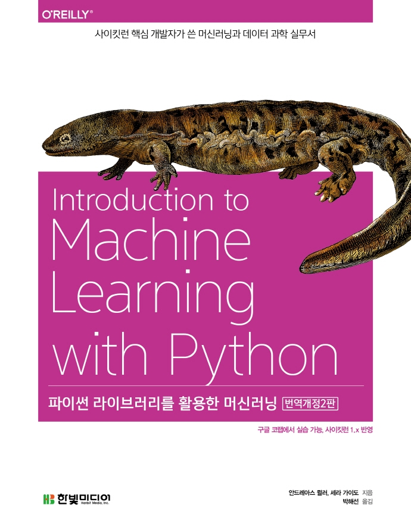

:::info  
This review was written as part of the Hanbit Media *I am a Reviewer* activity, where I received the book for review.  
:::

## Book Info

:::tip  
Click the book image to go to the Kyobobook store!  
:::

- **Title**: Introduction to Machine Learning with Python  
- **Authors**: Andreas C. Müller, Sarah Guido  
- **Translator**: Park Haesun  
- **Publisher**: Hanbit Media  
- **Release Date**: February 25, 2022  

<!-- truncate -->

## Intro  

Even before the revised edition, this book was already one of the most famous introductory machine learning books. I had always wanted to read it someday, and now I finally had the chance!

## Book Review  

### Brief Introduction  

Simply put, this is an introductory book on machine learning. However, it doesn’t focus on building everything from scratch—it teaches you how to use the *scikit-learn* library, which already has many implementations. This isn’t a deep learning book using TensorFlow or PyTorch, but rather a foundational guide to machine learning with `sklearn`. Additionally, no special environment setup is required—all code in this book can be practiced in Google Colab.

### Translation Notes  

The translator for this edition is **Park Haesun**, and as expected, the translation is clean and well-structured, just like their other works. While typical footnotes might only include brief references, Park Haesun’s translations often add helpful explanations to aid understanding. I strongly recommend reading the footnotes carefully—they’re packed with useful insights.

### Closing Thoughts  

Chapter 8 wraps up by guiding readers on what to study next. It recommends advanced resources for those who want to dive deeper into machine learning after finishing this book. I really appreciate books that provide such directional keywords—they feel thoughtful and are genuinely helpful for readers.

### Korean Edition Appendix  

The Korean edition includes an appendix on natural language processing using [KoNLPy](https://konlpy.org/ko/latest/), as well as additional content the translator wanted to include. Interestingly, the original authors also did an interview specifically for Korean readers, discussing changes in scikit-learn. If you’re interested in scikit-learn, this section is definitely worth reading.

## Recommended Audience  

This book is ideal for undergraduate students new to machine learning. It’s also a great choice for those curious about what’s changed in the latest scikit-learn updates.