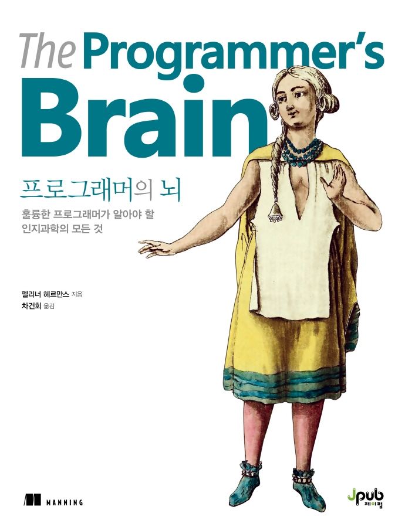

:::info  
This review was written after receiving the book as part of the Jpub \<Trusted IT Book Reviewer\> activity.  
:::

## Book Info

:::tip  
Click the book image to go to the Kyobobook site!  
:::

- **Title**: *The Programmer’s Brain*  
- **Author**: Felienne Hermans  
- **Translator**: Gunhwi Cha  
- **Publisher**: Jpub  
- **Release Date**: January 12, 2022  

{/* truncate */}

## Intro  

The introduction included some unfamiliar terms and cognitive science concepts, which made me hesitate at first. But I decided to read it because I thought it would be helpful. I was especially curious how the book explains the cognitive processes behind programming—how our brains perceive and process code during the entire development workflow.

## Book Review  

### Learning  

This book reinforced the idea that simply reading something once or looking it up doesn’t mean you truly understand it—whether it’s programming, a book, or any other subject. It explains how the brain processes code and how to read it more efficiently. These insights aren’t just for coding; they apply to learning in general. Reflecting on my past study habits, I found this section both eye-opening and engaging.  

### Scientific Approach  

As mentioned in the intro, the book bridges programming with cognitive science. Some technical terms were challenging, but the explanations were grounded in scientifically proven research, which made it fascinating. Footnotes citing studies added credibility, so I read without major reservations.  

### Code Examples  

I’ve read other books that explain "good code vs. bad code" with examples, but this one stood out by connecting those principles to cognitive science. While it does use examples, the deeper dive into *why* certain patterns aid comprehension was particularly insightful.  

## Recommended Readers  

This book explores programming through the lens of cognitive science, making it ideal for developers curious about the mental processes behind their daily work.  

Some sections were slightly confusing for me, so I’d recommend it more to those with practical coding experience—though it’s not a strict requirement. If you can read Java or Python and have some coding background (like a university student with moderate experience), you’ll find it accessible. It’s also great for anyone interested in boosting productivity, as the book offers science-backed tips for improving coding efficiency.