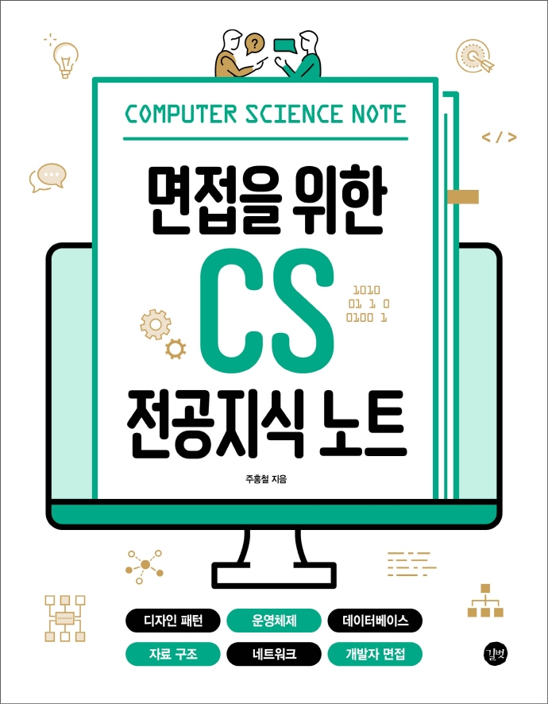

:::info  
This review was written after receiving the book as part of the "18th Developer Reviewer" activity by Gilbut.  
:::

## Book Info

:::tip  
Click the book image to go to the Kyobobook site!  
:::

- Title: CS Note for Interviews: A Guide to Core Computer Science Knowledge  
- Author: Hong-Cheol Joo  
- Publisher: Gilbut  
- Release Date: April 28, 2022  

## Intro  

As a new graduate preparing for a job, I believe the most important things are coding tests and interview preparation. While I’m still studying hard for coding tests, the real challenge was interview prep. I could give some answers, but I felt I was still lacking.  

Interviews often ask about projects, but they also frequently test core computer science knowledge. So I needed to review my CS fundamentals—but where to start? Operating systems, networks, data structures, databases, computer architecture… Each subject has massive textbooks, and the thought of revisiting them all was overwhelming. That’s when I found this book and decided to apply for the developer reviewer program to read it.  

### Design Patterns  

This was the most challenging yet useful section for me. I’d only studied design patterns superficially as a backend developer, and if someone asked me to explain the "Singleton Pattern" in detail, I’d struggle. This book helped me dive deeper into various patterns, which was a huge help.  

### Essential Core Knowledge  

The book distills the most critical concepts from each CS subject into concise, well-organized summaries. The explanatory diagrams were especially helpful, and I found it an excellent resource for quick reviews. While I cross-referenced other materials, this book provided the clearest explanations. I felt confident that if I could explain the content here well, I’d at least avoid negative marks in interviews. It’s not deeply technical, but it gave me a solid overview of design patterns—extremely valuable.  

### Final Interview Tips  

The author shares personal insights on portfolio-building and interview strategies, along with sample questions. Their real-world answers provided practical guidance on how to respond effectively.  

## Target Audience  

This book is great for last-minute interview prep, but since we can’t predict how deep follow-up questions will go, it might not cover everything. If you’re unfamiliar with the core subjects listed in the subtitle, you might find it tough. In that case, I recommend pairing it with other resources for a more comprehensive study.