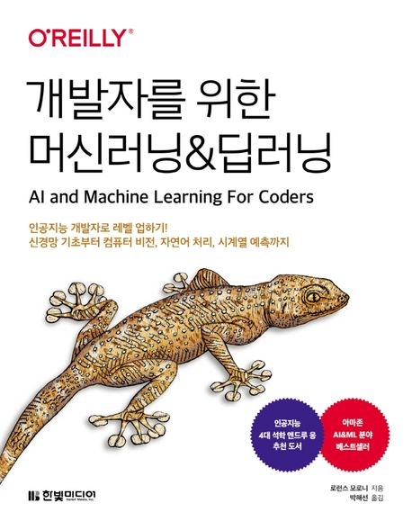

:::info  
This post is a book review written as part of the Hanbit Media *I am a Reviewer* activity.  
:::

## Book Info

:::tip  
Click the book image to visit the Kyobobook store!  
:::

- **Title**: AI & Machine Learning for Coders  
- **Author**: Laurence Moroney  
- **Translator**: Haesun Park  
- **Publisher**: Hanbit Media  
- **Release Date**: August 24, 2022  

{/* truncate */}

## Intro  

I’m writing another machine learning book review. As AI grows in popularity, more ML books are being published. While I wish there were more books on backend and frontend technologies used in practice, it’s hard to ignore the current trend.  

Thanks to this trend, machine learning is no longer limited to academia—it’s now accessible to anyone who wants to learn. If you’re interested in diving into ML or deep learning, use reviews from others to choose the right book for you.  

## Book Review  

### A Book I’d Recommend to Developers  

Personally, I prefer the **bottom-up approach**, starting from fundamentals. My first deep learning book was *[Deep Learning from Scratch](https://teddygood.github.io/blog/deep-learning-from-scratch)*. However, I often wondered: **What book should I recommend to peers who don’t enjoy bottom-up learning?**  

Some people might want to grasp core concepts quickly and apply them right away. This book fits that need. If you encounter unfamiliar terms or concepts, you can always look them up. Plus, the translator added helpful footnotes to fill in knowledge gaps, making the book more approachable. From now on, if someone asks me for an ML/DL book recommendation, this will be my go-to suggestion.  

### Simple Structure  

The book is divided into **Part 1** and **Part 2**.  

**Part 1** introduces various models. It starts with a brief TensorFlow overview, then jumps into computer vision and CNNs. The section on **4.6 ETL Processes for Data Management in TensorFlow** was particularly impressive—it’s a crucial topic explained concisely. The book then covers NLP, RNNs, and time-series data. Some might find it lacking in explanations, but since the target audience is developers, it’s reasonable to expect readers to supplement with online research. While it may take extra time, the book effectively helps developers apply ML quickly.  

**Part 2** focuses on deploying models. It explains how to use TensorFlow Lite for Android/iOS and TensorFlow.js for web applications. I’d heard of TensorFlow.js before but didn’t realize it could run CNNs in the browser—this book highlighted how fast the field is evolving.  

It also introduces TFX and TensorFlow Serving (TFS). For deeper TFX insights, I recommend *[Designing Machine Learning Pipelines](https://teddygood.github.io/blog/building-machine-learning-pipelines)*. While I wish TFX had been covered more extensively, adding it would have made the book excessively long. The book wraps up with brief discussions on AI ethics and privacy—important topics many developers overlook.  

## Target Audience  

This book is written for **developers**. If you’re new to ML/DL, some parts might be challenging. However, the author explains concepts as simply as possible, focusing on code and results rather than heavy math or theory. It’s tailored for developers, not data scientists. Prior ML knowledge would make reading easier, but it’s not strictly required—give it a try if you’re curious!