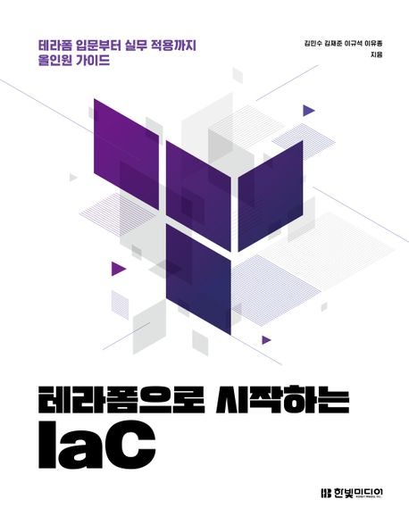

:::info  
This review was written after receiving the book as part of the Hanbit Media *I am a Reviewer* activity.  
:::

## Book Info

:::tip  
Click the book image to go to the Kyobobook site!  
:::

- **Title**: Terraform 101: Getting Started with Infrastructure as Code (IaC)  
- **Authors**: Kim Minsu, Kim Jaejun, Lee Gyuseok, Lee Yujong  
- **Publisher**: Hanbit Media  
- **Release Date**: May 24, 2023  

<!-- truncate -->

## Intro  

Admittedly, I’m just a student with limited knowledge of DevOps. I’ve dabbled in Kubernetes and Docker, but never deeply. So when I picked up this book, I was nervous—but also curious. I’d seen "Terraform" mentioned in CI/CD pipeline diagrams or heard it in passing, but didn’t truly understand it. I wanted this book to clarify what Terraform is and how it’s used.

## Book Review  

### A Beginner-Friendly Guide  

As mentioned earlier, I was intimidated before reading. My past attempts with Kubernetes and Docker felt overwhelming, and I feared Terraform might be the same. Plus, as a DevOps novice, I expected to encounter unfamiliar terms. But my anxiety faded as I read. This book is accessible—if you’re willing to put in the effort, even beginners can follow along.  

It starts with Terraform basics: how it works, its core concepts, and practical applications. The content is split into two parts:  
- **Part 1** covers Terraform fundamentals—providers, workflows, and basic usage.  
- **Part 2** dives into scaling Terraform for larger projects, sharing best practices for collaboration.  

I especially appreciated the focus on teamwork and organizational workflows in Part 2. If I ever implement Terraform professionally, I’ll revisit this section.  

## Recommended Audience  

This book is ideal for anyone curious about Terraform, regardless of prior DevOps experience. It’s particularly useful for infrastructure engineers, DevOps engineers, or anyone involved in designing and managing services. If you’re looking to learn IaC from scratch, this is a solid starting point.