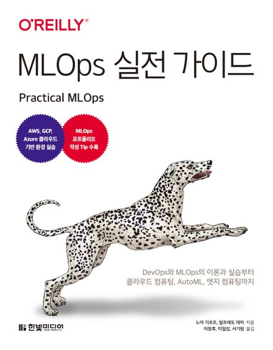

:::info  
This review was written as part of the Hanbit Media *I am a Reviewer* activity, where the book was provided for review.  
:::

## Book Info

:::tip  
Click the book image to visit the Kyobobook store!  
:::

- **Title**: MLOps 실전 가이드 (*Practical MLOps*)  
- **Authors**: Noah Gift, Alfredo Deza  
- **Translators**: Janghu Lee, Iilseop Lee, Kiwon Seo  
- **Publisher**: Hanbit Media  
- **Release Date**: May 24, 2023  

{/* truncate */}

## Intro

MLOps has been a hot topic since machine learning gained traction. These days, it's not enough to just build a good ML model—you also need a solid pipeline. MLOps, a blend of *Machine Learning* and *DevOps*, automates the process of developing and deploying ML models. Many might wonder how this is possible. I started studying this field and am now exploring MLOps and backend technologies to build better pipelines. This book seemed like a great resource, so I decided to read it.

## Book Review

### Is It Beginner-Friendly?

I wouldn’t say it’s super easy, but if you’re interested in MLOps and have at least some experience with it, this book is worth recommending. As the title suggests, it’s a practical guide—more focused on hands-on exercises than theory. However, the theoretical parts are well-explained, so if you’re familiar with command-line environments, Python, containers, etc., you’ll find it easier to follow. If you’re curious about MLOps, this is a must-read.

### Hands-On Guide

As mentioned earlier, this book is essentially a practical guide. It subtly tells you what you need to know if you want to learn MLOps. Since MLOps is a field that requires knowledge of many tools and concepts, the authors prioritize breadth over depth. After reading this book, you’ll know what areas to focus on next. A fun feature is the "Try It Out" and "Think About It" sections at the end of each chapter. The former challenges you with practical tasks, while the latter encourages theoretical reflection. Working through these exercises will deepen your understanding of MLOps. I found the explanations and translation to be clear and well-executed. It even made me want to dive deeper into MLOps if I ever get the chance.

### If It Had Been Translated in 2021...

One minor drawback is the use of **Flask**. While it’s still widely used, the industry seems to be shifting toward **FastAPI**. If given the chance, converting the Flask code to FastAPI would be an interesting exercise.  

Since technology evolves so quickly, this is a common issue. The original book was published in 2021, so if the Korean translation had come out the same year, it might have been even more popular.  

Some code examples from 2021 might not work in 2023, so the translators likely faced challenges updating and fixing them. That must have been a lot of work!

## Target Audience

I recommend this book to anyone working in or interested in MLOps. It’s also great for those who want hands-on experience. Prior knowledge of containers, command-line tools, backend systems, and cloud platforms will make reading this book much smoother.