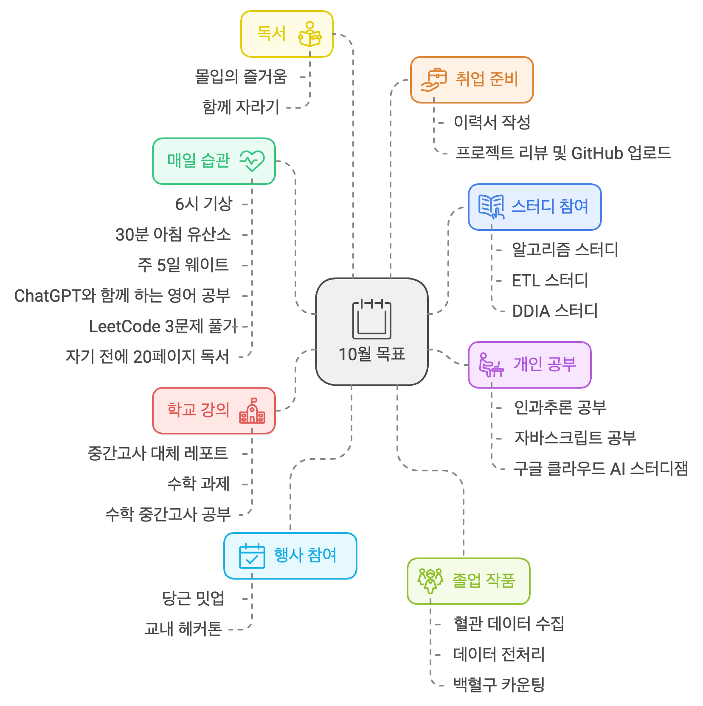

## 글또 10th Season

### Application

This time, I got the chance to join the 글또 community. Every season, I wanted to participate, but sometimes I missed out because I was busy or forgot to check. Other times, reflecting on myself while writing the application felt burdensome. This time too, writing the application wasn’t easy, but it was a great experience to look back on what I’ve done and how I’ve lived. And above all, since this is the last season of 글또, I really wanted to be part of it.

### Goals for 글또

I’m busy preparing for employment, but since this is my first and last chance to join 글또, I want to participate as much as possible.

- Join various small group channels
- Have coffee chats, study sessions, or writing sessions with different people
- Build healthy habits

September was an extremely tough month. Stressed from job preparation, my usual routines collapsed. I ordered delivery food three times a week and often drank alone. By chance, I got into 글또, and realizing I couldn’t go on like this, I resolved to join various small group channels in October to rebuild healthy habits.

One of my goals is to regain the pride and fulfillment I once felt by waking up at 6 AM again. It used to be so easy, but now it feels impossible. Surprisingly, the habit I thought I’d manage smoothly this week has already failed. Still, I won’t give up and will keep trying. Though I’m stressed from taking on too much too quickly, I’m grateful and happy every day.

I still feel insecure about coffee chats because I think I lack expertise. I worry if I’ll have meaningful conversations in one-on-one or group settings. Most members are professionals, and my knowledge and experience might fall short, making conversations awkward.

But I feel this worry repeats every time I meet new people. So, I’ll use 글또 to overcome it and communicate more actively. I’ll let go of the pressure to be professional and join with the mindset that it’s okay not to be perfect. After all, I’m still a student, not a professional, so there won’t be high expectations. I’ll relax and enjoy this time.

Maybe even my small knowledge or experiences could help someone. I want to listen, learn, and share my stories so we can grow together.

### What I’ll Write About

I run a separate blog and wiki. For the wiki, I wanted to document CS knowledge and insights. For the blog, I wanted to share my thoughts and experiences, not just technical posts. I also wanted to write longer, easy-to-read articles.

These are the topics I’ve thought about. I’ll probably write about these. I’d love to write something cool about ML, but I’m not sure what topic to pick yet. Maybe a good idea will come up during the activities.

## October Goals

Finally, I’ll briefly share my October goals! I always plan and set goals, but my reality never matches my expectations. Planning is tough but fun.

- Build daily habits
  - Wake up at 6 AM
  - 30-minute fasting cardio (walking or running) in the early morning
  - 5-day weekly weight training (chest, back, shoulders, legs, arms)
  - English study with ChatGPT
  - Solve at least 3 LeetCode problems
  - Read at least 20 pages before bedtime, 1 hour before sleep
- Join study groups
  - Algorithm study ([Coursera Stanford Algorithms](https://www.coursera.org/specializations/algorithms))
  - ETL study ([Learning Spark](https://product.kyobobook.co.kr/detail/S000061353994))
  - DDIA study ([Designing Data-Intensive Applications](https://product.kyobobook.co.kr/detail/S000001766328))
- Personal study
  - Causal inference
    - [Practical Causal Inference with Python](https://product.kyobobook.co.kr/detail/S000212577153)
    - [Causal Inference and Discovery with Python](https://product.kyobobook.co.kr/detail/S000213021532)
  - JavaScript
    - [Core JavaScript](https://product.kyobobook.co.kr/detail/S000001766397)
  - [Google Cloud AI Study Jam](https://sites.google.com/view/2024-study-jams/ai?fbclid=IwY2xjawFGYPlleHRuA2FlbQIxMAABHfcnts6c4jK3Hu0Z54OCOf1N3TLFGWM7Kcs5r43nvVpXteynWljH_6o4oA_aem_wSwPx49oIGWNDlWfJcizow)
- School courses
  - Midterm report for a liberal arts class
  - Math assignments
  - Studying for a math midterm (I’m taking a math class in my final semester—what am I thinking?)
- Graduation project
  - Collecting blood vessel data
  - Data preprocessing (CLAHE, LDC (Lightweight Dense CNN for Edge Detection))
  - Filming with a DVS (Dynamic Vision Sensor) camera
  - White blood cell counting using YOLOv8
  - Continuous experiments
- Reading
  - *Flow: The Psychology of Optimal Experience* (reading it for the third time)
  - *Growing Together* (next book to read)
- Job preparation
  - Resume writing
  - Reviewing past school projects and organizing them on GitHub
- Events
  - Daangn Meetup
  - Hackathon (scheduled soon within the school)

Looking at this list, it feels overwhelming. I wrote down what I’m currently doing and what’s planned, but there might be more variables. Who knows how it’ll turn out? Personally, I wish I had more time to read books.

I’m not sure how I’m managing all this. I guess it’s just from trying to live diligently. Among the study groups, *Learning Spark* and *Designing Data-Intensive Applications* are really tough, even after reading them multiple times. I’ll need to revisit them. As for causal inference, I’m both excited and worried about how difficult it’ll be.

  
I visualized this using [napkin.ai](https://www.napkin.ai/), recommended by 성윤님. The UI is beautiful, and I’ll use it often. Thank you for sharing the tool!

## Final Words

Writing such a long post is definitely challenging. But I hope my skills will improve with practice. How will I have changed in six months? I’m excited to see the new me through 글또. How many connections will I have made? What will I be writing? How will I be living? I’ll work harder and look forward to that time. I can do it.

Lastly, 글또, please take good care of me!