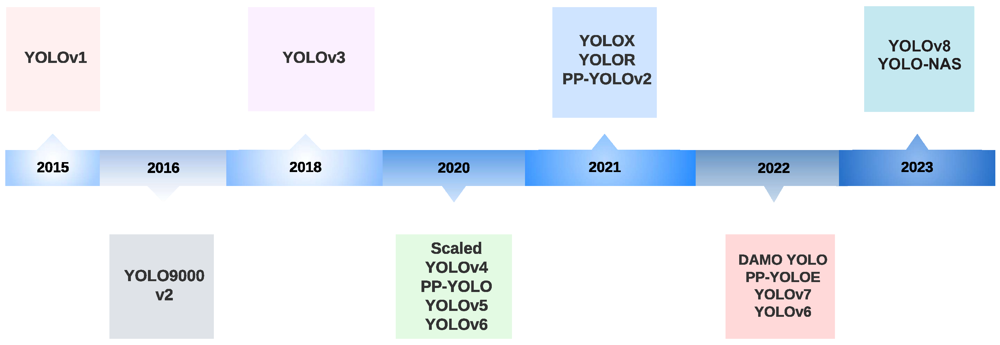
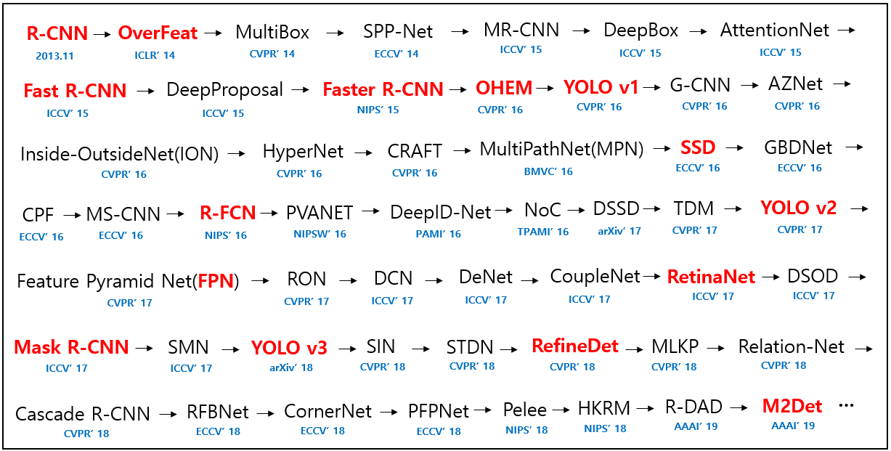

<!-- truncate -->

## You Only Look Once

YOLO is commonly known to people as "You Only Live Once." However, in Computer Vision, it's called **You Only Look Once**. YOLO is a model renowned for its speed and outstanding performance in the Object Detection field, supporting real-time object detection. As of now, YOLO has reached version 11, and this article will cover YOLO models from v1 to the present.

The overall timeline of YOLO is shown above. While the image only displays up to v8, YOLOv9 was released in February 2024, followed by YOLOv10 in May, and the latest version, YOLOv11, was unveiled on October 30th.

Joseph Redmon, the original developer of YOLO, halted his research after YOLOv3 due to ethical concerns. Subsequently, YOLOv4 was developed by other authors, YOLOv5 by Ultralytics, v6 by Meituan, v7 by some of the original v4 authors, and from v8 onward, Ultralytics has continued the releases.

## Object Detection

Object Detection is a field of computer vision that identifies the presence, location, and type of specific objects in images or videos. To elaborate, it recognizes multiple objects of varying sizes and positions, marking their locations with bounding boxes and identifying their categories.

Since this article doesn’t delve deeply into Object Detection itself, refer to the papers below if interested.

The image above was sourced from [deep_learning_object_detection](https://github.com/hoya012/deep_learning_object_detection). I recall this repository circulating in [TensorFlow Korea (now AGI-KR)](https://www.facebook.com/groups/agikr/) during the peak of vision research years ago. Though I feared the source might be lost, I was relieved to find it. The red-highlighted papers are those the repository creator deemed essential, while others are also important but recommended for further reading if time permits. Note that the larger text indicates the paper or model name, and the smaller text denotes the conference and publication year.

## YOLOv1

### Architecture

YOLOv1 consists of 24 convolutional layers and 2 fully connected layers. All layers except the final one use the leaky ReLU activation function, while the last layer uses a linear activation function. Inspired by GoogLeNet and Network in Network (NIN), it employs 1×1 convolutions to reduce the number of feature maps and optimize parameters. A lightweight model called Fast YOLO is also introduced, composed of 9 convolutional layers.

### How It Works

**YOLOv1 Operation Principle**

YOLOv1 unifies the object detection process to simultaneously detect all bounding boxes. It divides the input image into an $S \times S$ grid, where each grid cell predicts $B$ bounding boxes and a confidence score for $C$ classes. Each bounding box prediction consists of 5 values: $P_c, b_x, b_y, b_h, b_w$.

- $P_c$: Confidence score indicating the likelihood that the bounding box contains an object.
- $b_x, b_y$: Center coordinates of the bounding box relative to the grid cell.
- $b_h, b_w$: Height and width of the bounding box relative to the entire image.

The output of YOLO is a tensor of size $S \times S \times (B \times 5 + C)$, and duplicate detections are removed via Non-Maximum Suppression (NMS).

### Training Method

YOLOv1 was pre-trained on the ImageNet dataset at a resolution of 224×224 for the initial 20 layers, then fine-tuned on the PASCAL VOC 2007 and VOC 2012 datasets at 448×448 resolution. Data augmentation included random scaling and translation within 20% of the input image size, as well as exposure and saturation adjustments in the HSV color space.

## Reference

- [A Comprehensive Review of YOLO Architectures in Computer Vision: From YOLOv1 to YOLOv8 and YOLO-NAS](https://www.mdpi.com/2504-4990/5/4/83)
- [YOLOv1: You Only Look Once: Unified, Real-Time Object Detection](https://arxiv.org/abs/1506.02640)