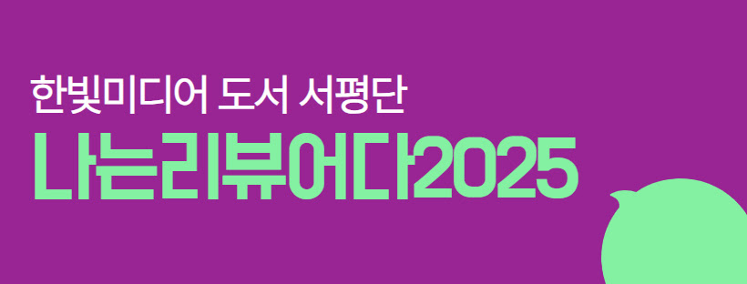
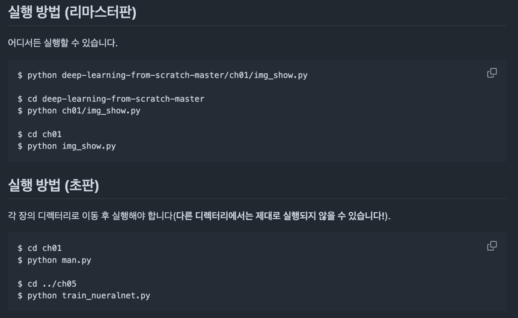

:::info  
This post is a book review written as part of the Hanbit Media "I am a Reviewer" activity, for which the book was provided.  
:::

## Book Info

:::tip  
Click the book image to visit the Kyobobook store!  
:::

- **Title**: Deep Learning from Scratch 1 (Remastered Edition)  
- **Author**: Saito Goki  
- **Translator**: Gaepyeon Lee (개앞맵시)  
- **Publisher**: Hanbit Media  
- **Release Date**: January 24, 2025  

{/* truncate */}

## Intro

Once again, I’m grateful to participate in Hanbit Media’s "I am a Reviewer" program in 2025. It’s truly a privilege to read books, write reviews, and access Hanbit Media’s publications more easily than others. This time, I read *Deep Learning from Scratch 1 (Remastered Edition)*. Originally published in January 2017, this book has played a significant role in deep learning education in Korea. It’s a book that has genuinely helped many people take their first steps into deep learning. The remastered edition makes it even more reader-friendly.

## Book Review

For my previous review of the original edition, you can visit [this link](http://localhost:3000/blog/deep-learning-from-scratch). In this review, I’ll focus on the changes and improvements in the remastered version rather than summarizing the content. If you’re curious about other updates, I recommend reading [[Rebirth Story] Deep Learning from Scratch 1 (Remastered Edition)](https://www.hanbit.co.kr/channel/category/category_view.html?cms_code=CMS2416204088&cate_cd=).

### Full-Color Design

The most noticeable change is the switch from black-and-white to full-color pages. While the original’s monochrome aesthetic had its charm—evoking the feel of classic papers—the new color scheme makes the content more engaging and visually accessible. It’s refreshing to see publishers prioritizing reader experience, even if production costs rise.

### Code Improvements

In the first edition, managing working directories was crucial, but the remastered version simplifies this process.  

  

Previously, code was only available as Python files, but now it’s also provided in Jupyter Notebook format for Google Colab. This is a fantastic improvement—readers can experiment with code directly in the browser without setting up a local environment.  

Additionally, the code has been updated to address warnings from libraries like `matplotlib` and `numpy`, ensuring compatibility with modern setups.

### Expanded Series Overview

The book now includes an introduction to other titles in the series. If you’re hooked after reading this one, the subsequent books offer deeper dives. I’m particularly excited about the upcoming *Deep Learning from Scratch 6*, which will focus on LLMs.  

Chapter 8, the final chapter, includes more detailed "NOTE" sections compared to the original. These notes guide readers to other books in the series for advanced topics—a feature I appreciate. A good book should always point you toward the next step, and this one does that well.

## Recommended Audience

This book is ideal for anyone looking to start their deep learning journey. After reading it, you’ll have a solid foundation in the fundamentals. I also recommend exploring the other books in the series afterward. Whenever friends, colleagues, or peers ask me how to begin with deep learning, I always point them to this book first. It’s an excellent starting point and truly worth the read.