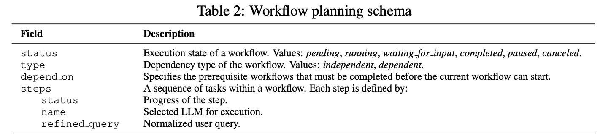
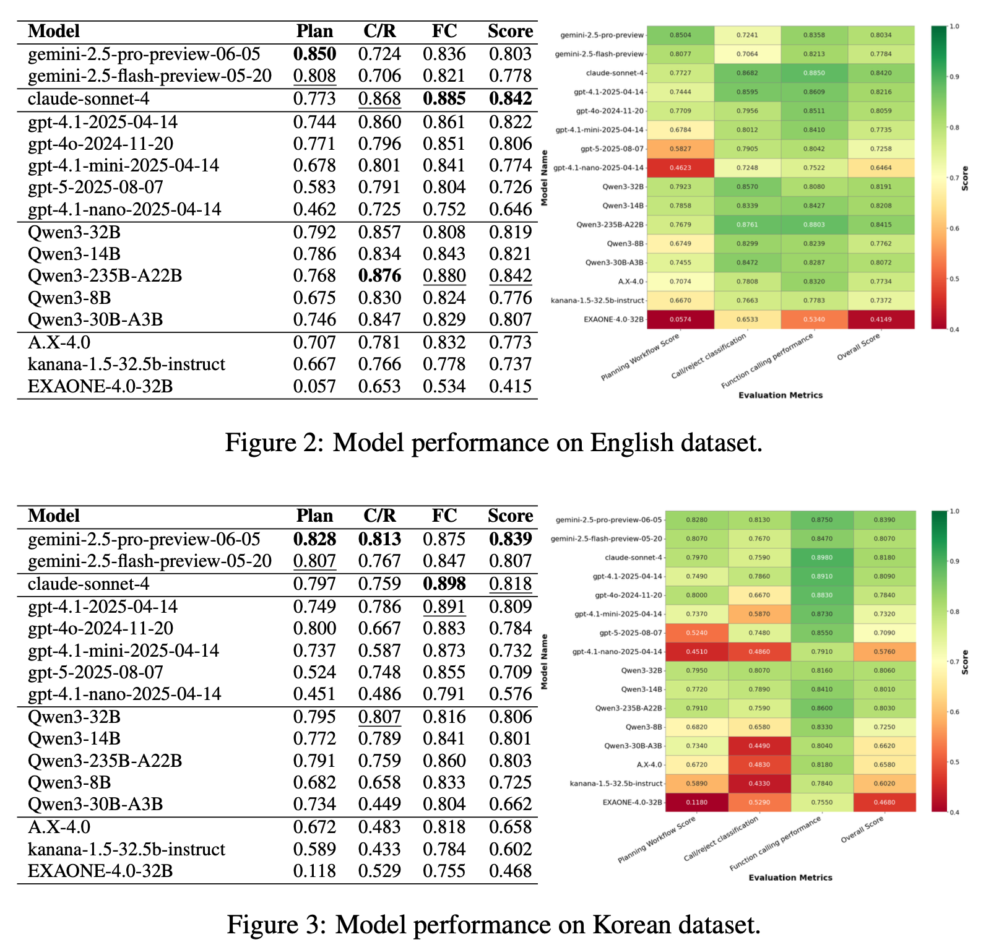

> ICLR 2026. [Paper](https://openreview.net/forum?id=Oljnxmf4pc&noteId=NyL52JeO4j) [GitHub](https://github.com/kakao/OrchestrationBench)

## Intro

Recently, services like moltbot (now openclaw) and oh-my-opencode have gained traction, so I thought this paper would be interesting to read and review. This paper was published by Kakao. If you want an easier explanation than my review, check [Kakao's announcement ("Kakao's self-developed LLM orchestration benchmark paper accepted to ICLR 2026... released as open source on GitHub")](https://www.kakaocorp.com/page/detail/11919).

## Quick Summary

1. It introduces a bilingual (Korean and English) benchmark for evaluating LLM orchestration in realistic multi-domain environments.
2. It separates evaluation into workflow planning and tool execution, and uses structured metrics such as Graph Edit Distance (GED).
3. The benchmark contains a manually created dataset across 17 domains and nearly 100 tools, including constraint validation and dynamic revision.
4. Experiments show relatively consistent tool execution but substantial variation in planning, highlighting the need for structured evaluation.
5. The benchmark is designed to be extensible to new domains, tools, and deployment contexts.

{/* truncate */}

## Introduction

Most existing benchmarks are either simplified or isolated by domain, so they are insufficient for evaluating the orchestration capability required for service-ready LLMs. To bridge this gap, the paper introduces OrchestrationBench, a bilingual benchmark for realistic service environments. It defines a comprehensive evaluation protocol centered on workflow planning and constraint-aware tool execution. Workflow planning is formalized as workflow construction. Each workflow is represented as a Directed Acyclic Graph (DAG). Constraint-aware tool execution goes beyond the syntactic correctness of tool calling.


## Related Work

The paper groups prior work into four areas.

**Tool Execution Benchmarks**  
BFCL, API-Bank, T-Eval, and ToolBench evaluate whether agents can decompose tasks and invoke the right tools or APIs.

**Single-agent Task Performance Benchmarks**  
TaskBench, τ-bench, GAIA, WebArena, and OSWorld evaluate whether a single agent can complete tasks in specific environments. These benchmarks are valuable because they measure agentic task execution across multiple domains. OrchestrationBench differs by focusing less on individual agent performance and more on LLM-to-LLM collaboration, where a main model orchestrates and invokes specialized LLMs.

**Tool Safety Benchmarks**  
ToolEmu, R-Judge, and SafeToolBench evaluate refusal behavior for risky requests. More specifically, ToolEmu targets single-agent settings, while R-Judge and SafeToolBench focus on multi-turn agents. ToolEmu emphasizes safety alignment of individual tool calls in emulated environments rather than complex multi-step planning. In contrast, OrchestrationBench tests whether the main LLM can reject infeasible requests by correctly understanding the functional descriptions and constraints of available sub-LLMs, evaluating functional feasibility rather than safety alignment itself.

**Agentic Planning Benchmarks**  
These benchmarks evaluate planning and coordination at different abstraction levels. Examples include PlanBench, MultiAgentBench, and REALM-Bench. While they test planning or tool-calling abilities of agents, OrchestrationBench presents a hierarchical LLM-to-LLM orchestration task where the main LLM dynamically coordinates specialized sub-LLMs from natural-language capability descriptions. It also provides diagnostic evaluation by separating workflow planning from constraint-aware execution, which is particularly relevant for production chatbot deployment.


OrchestrationBench is presented as the only benchmark that satisfies all of these dimensions.

## The OrchestrationBench Framework

### 1. The Complexity of Evaluating LLMs in Real-World Environments

Evaluating LLMs in real service environments is more complex than simple QA. Consider the following user request:

> "Book a flight to Seoul, find a hotel near COEX, and share the itinerary with my team."

Handling this request requires:

1. **multi-step planning**: sharing the itinerary is only possible after reservations are completed
2. **dynamic adaptation**: handling revisions such as "change it to a morning flight"
3. **constraint validation**: detecting system constraints (for example, only on-the-hour or 30-minute slots) and proposing alternatives

These scenarios highlight entangled challenges in planning, adaptation, and constraint-aware execution that static benchmarks often fail to capture.

### 2. OrchestrationBench Architecture

OrchestrationBench introduces a comprehensive evaluation framework with bilingual datasets in English and Korean.

#### 2.1 Advanced Planning and Coordination

As shown below, orchestration is formalized as a structured workflow schema that defines each task's execution status, dependency relations, and step-level planning. This structure allows evaluation of whether models can manage sequential and parallel execution, handle inter-workflow dependencies, and adapt to user interactions during execution.

**Workflow Schema**



**Example**: "I have a business trip to Seoul tomorrow. Book my flight, find a hotel near COEX, and share my itinerary with my team."

```yaml
workflow_1:
  status: pending
  type: independent
  steps:
    - status: pending
      name: travel_agent
      refined_query: "Book a flight for tomorrow's business trip to Seoul"

workflow_2:
  status: pending
  type: independent
  steps:
    - status: pending
      name: travel_agent
      refined_query: "Book a hotel near COEX"

workflow_3:
  status: pending
  type: dependent
  depend_on: ["workflow_1", "workflow_2"]
  steps:
    - status: pending
      name: calendar_agent
      refined_query: "Share the completed itinerary with my team"
```

`depend_on` specifies which workflows must finish before the current workflow starts. Since `workflow_3` depends on `workflow_1` and `workflow_2`, it can run only after both are completed.

In real environments, user queries often evolve dynamically rather than following a fixed plan. OrchestrationBench evaluates whether models can adjust flexibly by creating new workflows when additional tools are needed, and splitting workflows when explicit confirmation or branching into sub-tasks is required. For example, when a user revises an existing request or adds conditions mid-conversation, the model should update or extend workflows while maintaining consistency with prior steps. Clear criteria define when workflows should be split or merged. Independent requests (for example, requesting both flight planning and hotel recommendations) or tasks requiring intermediate confirmation (for example, approval before booking) are handled as separate workflows. By contrast, tasks that are coherent and contribute to a single goal are kept within one workflow.

In short, this framework evaluates not only planning, but also a model's ability to adjust, pause, and resume workflows in interactive scenarios.

#### 2.2. Comprehensive Tool Use

Tool execution evaluation goes beyond simple tool-call accuracy and covers the full service-level interaction flow.
It evaluates not only whether the model invokes tools correctly, but also when tool use is needed, when direct responses are sufficient without tools, and whether the model can recognize insufficient or ambiguous user input and proactively ask for clarification. This behavior is represented by the `AWAIT_FOR_USER_INPUT` signal.

Beyond syntactic correctness, real services must strictly enforce domain-specific business rules. Before actually invoking a tool, the model performs pre-execution validation, and emits `TOOL_CONSTRAINT_VIOLATION` when required constraints are not satisfied.

- Maintaining logical consistency
  - Checking whether the user request is logically coherent and non-contradictory
  - e.g., a return date earlier than a departure date in flight booking
- Enforcing resource constraints
  - Checking whether the request respects resource limits provided by a service or tool
  - e.g., ordering beyond available inventory, or purchases exceeding budget limits

After passing validation on user requests and extracted information, the LLM should execute the external tool with correctly formatted parameters.

Model performance is measured through call/reject classification metrics. `AWAIT_FOR_USER_INPUT` and `TOOL_CONSTRAINT_VIOLATION` are reject cases, while successful execution is assessed with function-calling metrics.

#### 2.3. Multi-Domain Tool Environments

The benchmark defines 17 representative service domains that stay independent from specific services while remaining extensible to real applications. Each domain is built around realistic but generalized scenarios so that a model's orchestration and instruction execution capability can be evaluated.


There are 97 tools in English and 99 in Korean. Korean includes additional culture-specific tools such as address romanization and fortune-related information. Unlike prior benchmarks that use simplified tool abstractions, OrchestrationBench integrates domain-specific constraints and realistic behavior to provide fine-grained coverage of diverse tasks and better simulate real service environments.

Collectively, these domains represent three common user workflow types. This categorization emphasizes that the benchmark primarily reflects everyday consumer services while remaining extensible to utility and productivity contexts.

1. inquiry and information tasks (e.g., weather checks, place search, reading news)
2. action and transaction tasks (e.g., booking flights, purchasing items)
3. planning and coordination tasks (e.g., scheduling meetings, sending messages, arranging delivery)

### 3. Dataset Construction

The dataset is designed to capture the complexity and realism of real-world service orchestration. To ensure authenticity and quality, all conversation sessions, workflows, and tool calls are manually created by trained annotators following detailed construction guidelines, rather than being artificially generated. This ensures that dialogue flow, tool usage, and constraint handling faithfully reflect realistic user-service interactions rather than model-generated synthetic patterns.

The table below shows the overall construction pipeline, including domain selection, virtual tool design, and manual review/validation. Every scenario is cross-validated by at least three annotators to ensure consistency and accuracy. To enable controlled and interpretable evaluation, ambiguous or multi-solution cases are excluded, and data is built from tasks with clear, well-defined dependencies. As a result, the benchmark achieves high reliability while remaining independent of any single model or proprietary API.


**Scenario Type Examples**


### 4. Dataset Scale and Distribution


This dataset includes both English and Korean subsets with similar scale. Both cover 17 representative service domains and intentionally show asymmetric tool distributions. Broad domains such as Places or Entertainment include many tools, while narrower domains like Weather or News remain compact to reflect realistic usage frequency.

At the workflow level, most sessions include 2-3 workflows across 2-3 domains, while some expand to up to 7 steps or span four or more domains. This shows that a single session typically requires multiple planning rounds, with some including up to seven planning steps. The frequent inclusion of two or more domains reflects realistic multi-domain scenarios where users switch across heterogeneous services. In terms of tool invocation, sequential and parallel call structures dominate over isolated single calls, indicating the complexity of orchestration needed to complete real tasks.

Taken together, these distributions show that OrchestrationBench covers a broad range of real orchestration patterns and enables fine-grained evaluation of planning, tool invocation, and adaptive reasoning capabilities. This highlights that the benchmark goes beyond isolated QA or simple tool calling, enabling realistic orchestration assessment in constraint-aware service environments.

## Evaluation

Current end-to-end benchmarks such as AgentBench, GAIA, SWE-bench, and τ-bench provide flexibility but often obscure failure points in complex multi-step tasks. To address this limitation, the paper uses step-wise evaluation that separates and tests each component independently. The evaluation distinguishes two major stages: Planning and Tool Execution. To capture subtle behaviors of sub-LLMs, tool execution is further decomposed into two sequential criteria: call/reject classification accuracy and function-calling performance.

**Models**  
All reasoning models are configured with low reasoning effort settings.
- OpenAI GPT Models (gpt-4.1, gpt-4o, gpt-5)
- Anthropic Claude Models (claude-sonnet-4)
- Google Gemini Models (gemini-2.5-pro-preview, gemini-2.5-flash-preview)
- Alibaba Qwen Models (Qwen3 series)
- Korean Open-Source Models (SKT A.X-4.0, Kakao kanana-1.5, LG AI Research EXAONE-4.0)

**Evaluation Protocol**
- Each target LLM receives the full dialogue history up to the evaluation point.
- Parallelly executed LLMs operate on separated histories to prevent information leakage.
- Sequentially executed LLMs access cumulative dialogue history including prior model outputs.
- Workflow generation by the main LLM is triggered only by user input.
- Sub-LLMs process refined queries forwarded by the main LLM and additional clarifications provided by users.

### 1. Evaluation Metrics

The evaluation is split into two parts. This separation is important because a model can plan well but fail in execution, and conversely, good call-level accuracy does not guarantee robust end-to-end workflow behavior.

**Planning Assessment**
To evaluate workflow generation quality, the paper uses Graph Edit Distance (GED). GED quantifies structural differences by counting the minimum edit operations required to transform one graph into another, following the method in Advancing Agentic Systems. In this paper, 1-GED is used so that higher values indicate better performance. The workflow representation includes workflow structure, step assignment (sub-LLM selection), and execution status. The framework performs hierarchical workflow scoring: structural score measures workflow topology correctness, and component score evaluates step-level assignments. Error weighting gives higher weight to selection errors (0.8) than status errors (0.2), reflecting the intuition that selecting the wrong tool is generally more harmful to task success than misjudging execution status. These weights are not empirically derived.

**Tool Execution Assessment**
To evaluate tool execution comprehensively, two core components are analyzed: (1) the model's ability to make correct call/reject decisions, and (2) the quality of actual function execution. Call/reject classification accuracy measures the ratio of correct decisions over all cases, including both proper rejections and successful function-call attempts. Function-calling performance evaluates function-call correctness only among cases that correctly proceed to the function-call stage, using three detailed metrics: tool selection F1, key F1, and argument F1.

Function-calling parameter validation uses a three-stage approach:
1. Exact match comparison
2. Type/pattern validation based on tool descriptions
3. Semantic validation for remaining cases

To reduce model bias, the paper uses an ensemble of three LLM judges - GPT-4.1, Claude Sonnet 4, and Gemini 2.5 Flash - with temperature 0.3, aggregating scores by arithmetic mean.

The LLM judge classifies true/false positives and negatives, and these decisions are integrated into F1 calculations. To further ensure reliability, inter-rater agreement between annotators and the LLM judge is measured, yielding a Cohen's Kappa of 0.63, which indicates substantial agreement. To maintain compatibility with function-calling training (JSON output format), call rejections and information requests are implemented in XML output format.

### 2. Evaluation Results



Best performance is shown in bold and second-best performance is underlined. Claude was evaluated via AWS Bedrock using `anthropic.claude-sonnet-4-20250514-v1:0`. Workflow score is computed as 1-GED, where higher is better.

**Key Findings**

**Open-Source Model Viability**

Open-source dense models such as Qwen3-235B-A22B achieved performance close to proprietary models. Dense architectures also consistently outperformed Mixture-of-Experts (MoE) variants on planning tasks.

**Model-Specific Specializations**

Gemini showed the best planning performance (English 0.850) but relatively weaker function calling. Claude-sonnet-4 showed the best function-calling performance (English 0.885). GPT-4.1 showed balanced performance. In particular, workflow generation showed relatively large gaps between top-tier and lower-performing models in both English and Korean, highlighting planning as the most discriminative capability among evaluated tasks.

**Planning-Execution Gap**

The correlation between Planning and Call/Reject is relatively low (English 0.58, Korean 0.45). This indicates a weaker link between planning and decision outcomes. In other words, models can generate good workflows but still make inaccurate execution decisions.

**Language-Dependent Performance**

Claude's English Call/Reject decision score is 0.868 but drops to 0.759 in Korean. Gemini, by contrast, is stronger in Korean. This suggests language-specific training effects and reinforces the importance of bilingual evaluation.

These results show that despite strong individual capabilities, the planning-execution gap can limit real-world agentic performance, emphasizing the need for task-specific and language-aware model selection.


## Conclusion and Future Works

OrchestrationBench is the first bilingual (English/Korean) benchmark for evaluating LLM orchestration capabilities in realistic multi-domain service environments. By separating orchestration into workflow planning and tool execution, it provides detailed insights into model performance across different aspects of agentic reasoning.

There are two main conclusions:
- Workflow planning shows much larger model gaps than function calling, so careful model selection is critical for orchestration tasks.
- While models execute function calls relatively well, they struggle with call/reject classification, i.e., deciding whether function calling is appropriate under real-world tool constraints.

Limitations are as follows:
- The 17 domains may not fully capture all orchestration scenarios or generalize to other languages.
- The use of virtual tools does not reflect the full complexity of real API integration.
- Turn-by-turn evaluation assumes successful execution at each step, which can overestimate overall performance metrics.

Future directions include:
- Real multi-domain tool integration through frameworks such as MCP
- Training methods to reduce the planning-execution gap
- Support for more sophisticated multi-agent collaboration patterns
