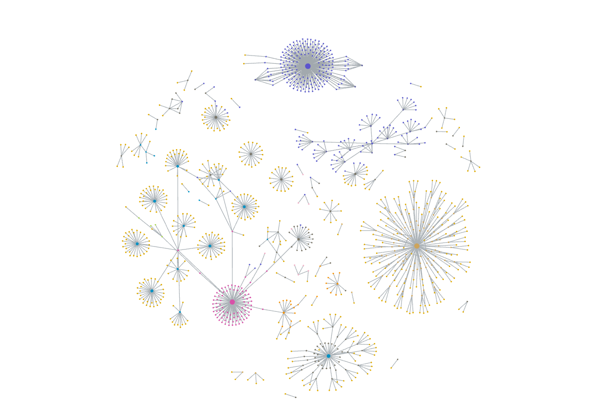

기록의 시작은 다이어리였다. 수능이 이제 막 끝나고, 20살을 맞이 하고 있을 때 나는 내 인생의 가치를 찾고 싶었고, 기록을 하고 싶었다. 우연히 페이스북을 통해 '열정에 기름붓기'를 알게 됐고, 그 페이지의 매력에 빠져 다이어리를 구매하고 나 또한 열정에 기름을 붓기 시작했다. 나에게 인사이트도 많이 주고, 기록의 재미도 느끼게 해줬던 추억의 다이어리다. 디자인도, 구성도 정말 예뻤고 아기자기한 스티커까지 있던 게 재밌었다.

그러다 노션을 알게 됐고, 노션에 기록을 시작했다. 아날로그에서 디지털로 넘어가면서 좋았던 건 더 많은 정보를 쉽고 빠르게 기록할 수 있다는 점이었다. 그러나 그건 독이 됐었다. 지금은 '노션'이라는 회사가 많이 발전해서 크게 느리지 않지만, 그 당시에는 페이지가 많으면 다른 페이지로 넘어갈 때 속도가 너무 느렸었다. 그래서 다시 다이어리로 돌아왔었다. 이번에는 모든 것을 기록하려고 하지 않고 그냥 일기만 적기 위한 다이어리.

그러다 옵시디언을 알게 되어 디지털로 넘어갔다. 옵시디언은 노션보다 더 빠르고, 커스텀도 자신의 마음대로, 그리고 무엇보다도 내가 쓴 글이 파일로 컴퓨터에 남는다는 것이 좋았다. 즉, 내가 소유하고 있을 수 있다는 게 좋았던 것이다. 그래서 옵시디언에 정착했다. 다시 디지털로 돌아가 많은 것을 기록할 수 있었다. 그렇다고 해서 아날로그를 버린 것은 아니다. 나 또한, 누구보다 아날로그를 좋아했던, 그리고 좋아하는 사람이니까. 가끔 아날로그가 그리울 때는 다이어리에 글을 써본다. 그리고 그걸 찍어 옵시디언에 올린다. 이런 과정이 조금 귀찮지만 손으로 직접 쓰는 것 또한 매력이 있기에 버릴 수 없다. 

이번 연도에는 감사하게도 많은 분들께 다이어리를 받아 일부는 부모님 또는 다른 지인분들께 나눠드렸다. 그분들께 다시 한번 감사하다는 말을 전하고 싶다. 받은 만큼 더 많이 돌려드리자.

글을 쓰며 오랜만에 온갖 공부 기록과 감정들이 묻어 있는 옵시디언 노트들을 다시 읽어 봤다. 저 점들이 노트다. 많은 것 같지만, 1년하고 조금 더 넘는 시간을 생각하면 몇 개 되지 않는다. 앞으로 좀 더 열심히 기록해야지. 다시 봤을 때 조금이라도 특별했던 그날들이 펼쳐지도록. 기억하고 싶다.
