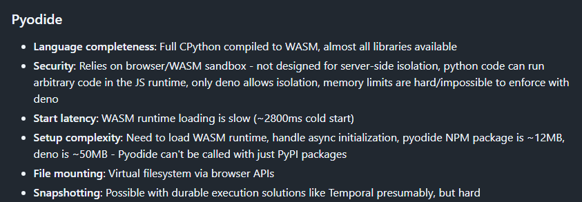
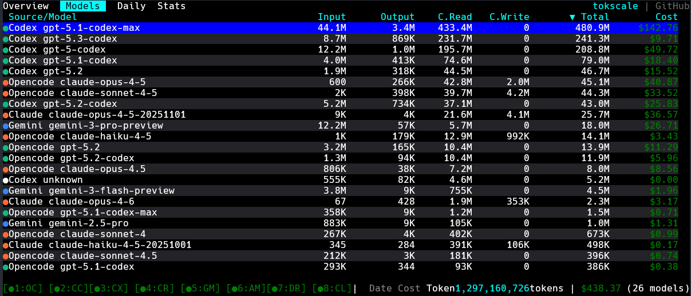
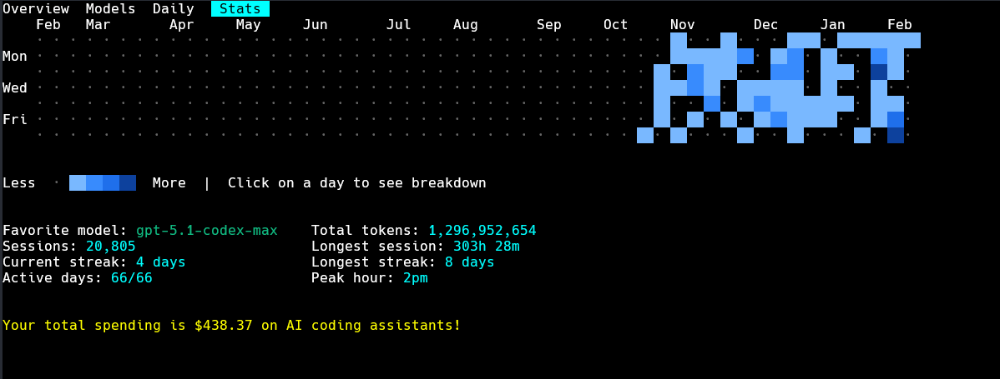

- [bun](https://github.com/oven-sh/bun)
    - [Bun is joining Anthropic](https://bun.com/blog/bun-joins-anthropic)

요즘 bun이 왜 이렇게 많이 보이나 했는데 생각해보니까 Anthropic에 들어갔었지.

- [monty](https://github.com/pydantic/monty): A minimal, secure Python interpreter written in Rust for use by AI

- [tokscale](https://github.com/junhoyeo/tokscale)

