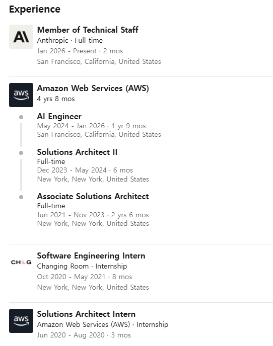

- [VeOmni](https://github.com/ByteDance-Seed/VeOmni): VeOmni: Scaling Any Modality Model Training with Model-Centric Distributed Recipe Zoo
    - [VeOmni: Scaling Any Modality Model Training with Model-Centric Distributed Recipe Zoo](https://arxiv.org/pdf/2508.02317)

책도 마저 읽고 리뷰 써야 하고 면접도 봐야 하고 프로젝트도 해야 하고 토큰도 써야 하고 바쁘다 바빠. 코세라 강의도 들어야 하는데 몸이 두 개였으면 좋겠다.

- [rust-bindgen](https://github.com/rust-lang/rust-bindgen): Automatically generates Rust FFI bindings to C (and some C++) libraries.
- [json](https://github.com/serde-rs/json): Strongly typed JSON library for Rust
- [serde](https://github.com/serde-rs/serde): Serialization framework for Rust
- [pyo3](https://github.com/PyO3/pyo3): Rust bindings for the Python interpreter
- [maturin](https://github.com/PyO3/maturin): Build and publish crates with pyo3, cffi and uniffi bindings as well as rust binaries as python packages
- [criterion.rs](https://github.com/bheisler/criterion.rs): Statistics-driven benchmarking library for Rust
- [neon](https://github.com/neon-bindings/neon): Rust bindings for writing safe and fast native Node.js modules.
- [yew](https://github.com/yewstack/yew): Rust / Wasm framework for creating reliable and efficient web applications

재밌는 커리어 또 발견.

- [VibeVoice](https://github.com/microsoft/VibeVoice): Open-Source Frontier Voice AI
