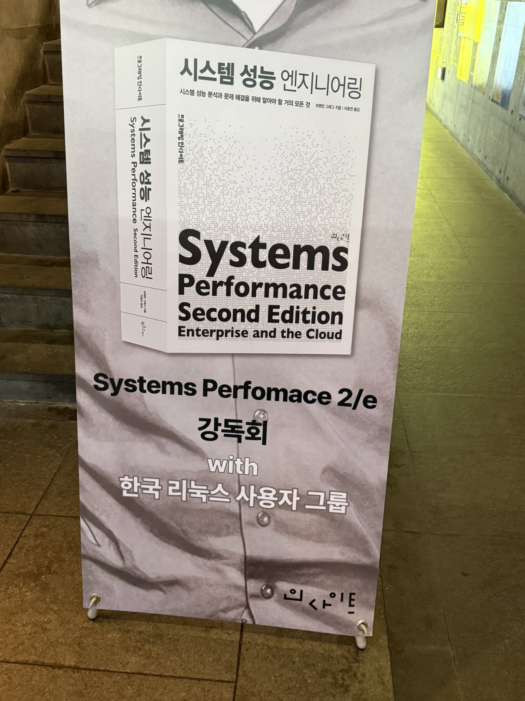

- [The Philosophy: AI Native Hiring](https://techblog.musinsa.com/the-philosophy-ai-native-hiring-c002c2775b3a)

이번에 무신사의 에이전트를 활용해서 진행한 채용 글인데 재밌게 읽었다.

- [GPU를 이용한 신경망 구현](https://www.kci.go.kr/kciportal/ci/sereArticleSearch/ciSereArtiView.kci?sereArticleSearchBean.artiId=ART001182379)

세계 최초로 신경망 구현에 GPU를 사용한 논문은 한국의 숭실대에서 무려 2004년에 나왔다고 한다. 

위의 책 강독회를 다녀왔는데 공부를 더 열심히 해야겠다는 생각이 든다. 
진
마지막 클라우드 -> ai 성능 엔지니어링 kpi는 무엇일까? -> 비용
observability와 모니터링의 차이는? -> 나중에 따로 정리하기
옵저빌리티의 로그 등의 비정형 데이터가 실시간으로 들어오는데 이걸 어떻게 자동화 하냐 -> 아직은 이 단계가 오지는 않았다. 
openai는 월 90만장 hbm
state, status의 차이?
use 방법론
클라우드에서의 스케일아웃 비용은 어떻게 계산하는가 -> 미국은 좀 심각하게 본다
캐핑에 대한 아키텍처링을 만드는 데 시간을 많이 쓴다
메모리 할당 실패를 어떻게 잡아내는가? 
커널이 아웃오브메모리 일어나는 경우? -> openai에서는 자주 발생 
클라우드에서 스왑을 쓰지 않는다 -> EBS -> 비용