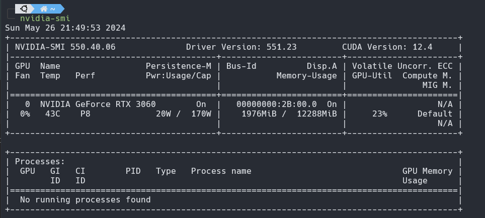
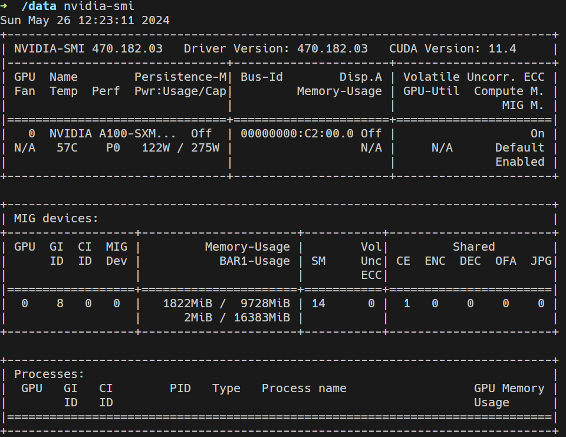

## 데스크탑과 서버의 nvidia-smi 비교

```bash
nvidia-smi
```

머신러닝, 딥러닝을 공부하면서 모두가 한 번쯤 치게 되는 그 명령어이다. 보통은 CUDA version을 확인하기 위해 많이 사용하고, 현재 사용 중인 GPU 메모리를 확인하기 위해서도 사용한다. 



근데 내가 쓰고 있는 데스크탑에서 이 명령어를 쳤을 때와 학교에서 대여해 준 서버에서 쳤을 때의 차이점이 있었다. 위의 이미지를 보면 데스크탑에서는 그냥 GPU 메모리를 확인하는 용도로만 사용했는데, 서버에서는 GPU와 Processes 외에도 MIG devices 부분이 나타났다. 



이 부분이 뭔지 궁금해서 찾아봤는데, MIG(Multi-Instance GPU)는 NVIDIA의 A100 GPU에서 도입된 기술로, 하나의 GPU를 여러 개의 작은 인스턴스로 분할하여 다양한 작업 부하를 동시에 처리할 수 있게 해주는 기능이다. MIG는 클라우드 서비스 제공업체나 데이터 센터에서 여러 사용자에게 GPU 자원을 효율적으로 배분하고, 높은 GPU 활용도를 달성하기 위해 설계되었다고 한다. 

GPU의 메모리를 분할해 뒀다는 사실이 너무 신기했다. 당연히 이런 기술이 하나쯤은 있을 것이라 생각했지만, 우리 학교가 이런 기술을 사용하고 있을 거라는 건 생각도 못 했다. 학교를 너무 과소평가했나. 솔직히 GPU를 처음 대여받을 때 학교에 A100이 있다는 사실에도 엄청 놀랐었다. A100의 메모리를 모두 쓰고 있을 줄 알았는데 MIG를 사용하고 있었다니 다시 생각해 보면 조금 어이가 없으면서도 당연한 것이라 할 말이 없다.

## 장점

어쨌든 이렇게 사용하면 장점이 뭘까? 당연히 첫 번째는 자원 분할이다. 하나의 A100을 여러 사용자가 사용할 수 있게 되니까 GPU를 더 효율적으로 사용할 수 있다. 두 번째는 분할 되면 당연히 안정성이 높아진다. 다른 인스턴스와 독립적으로 동작하니 한 인스턴스에서 발생한 문제는 다른 인스턴스에 영향을 미치지 않는다. 뭐 이 밖에도 다양한 장점들이 있을 것이다.

## 단점

내가 못 쓴다. 약 10GB밖에 못 쓴다니 조금 속은 기분이다. 난 40GB인지 80GB인지 다 쓸 수 있을 줄 알았다. 그래도 서버가 하나 더 생겼다는 것에 만족해야지. 졸업 전까지 더 많은 리소스를 사용할 수 있으니 그래도 좋다. 

이걸 보니 내가 직접 이 기술로 메모리를 나눠 보고 싶다는 생각밖에 들지 않는다. 나중에 회사 가면 언젠가 하지 않을까.

## 🌐 References

- [NVIDIA Multi-Instance GPU User Guide](https://docs.nvidia.com/datacenter/tesla/mig-user-guide/index.html)