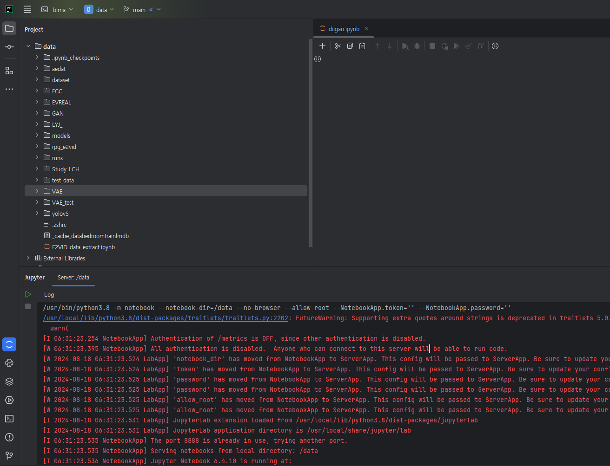
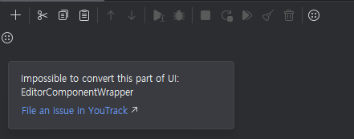
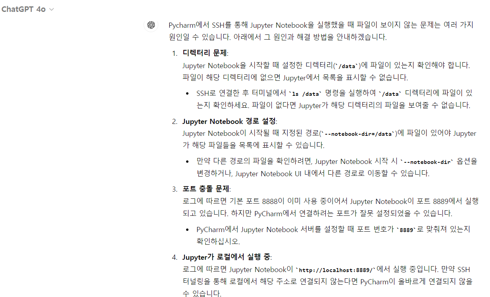

## 🤔 문제

### Pycharm gateway jupyter notebook 문제

예전에 Pycharm에서 서버에 SSH 연결하는 방법을 알게 됐다. 근데 그 당시에도 Jupyter Notebook을 사용하려고 했는데, 그때도 안 됐었다. 그래서 그냥 포기하고 Jupyter Lab을 사용하고 있었는데, 우연히 우리와 함께 졸업작품을 진행중인 조교님께서 Pycharm을 이용한다고 하셔서 혹시나 되나 싶어 다시 시도해봤다. 그러나 여전히 아래와 같은 상황이다.

처음에는 이 문제를 해결해보려고 했다. 저기 Pycharm에 Jupyter 부분에 올라온 log를 읽은 후 password 문제라고 생각이 되어서 Jupyter Notebook 서버에 password를 넣어도 보고 없애기도 해봤다. 그러나 달라지는 건 없었다. 이렇게 넘어가기는 너무 싫었다. 내 궁금증을 무조건 해결하고 싶은 생각에 다시 구글링을 해봤고 문제가 무엇인지 찾았다.

### Remote Development

문제는 매우 간단했다. 그냥 Jetbrains에서 이 부분을 아직 지원하지 않는다는 것이다. [이 링크](https://youtrack.jetbrains.com/issue/PY-71195/Remote-Development-Jupyter-Notebook-not-rendered)를 보면 알 수 있다.

저기 동그라미에 점이 4개 찍힌 아이콘을 마우스로 갖다 대보면 저런 문구가 나온다. 문구 아래에 있는 링크를 누르면 YouTrack에서 issue를 작성할 수 있는 곳이 나온다. Jetbrains에서 YouTrack이라는 서비스를 만들었으니 혹시 이런 IDE 개발도 여기서 관리하지 않을까 싶어 이 키워드를 연결지어 검색했다.

그러니 내가 원하던 정보를 찾을 수 있었다. 이 링크가 위에서 언급한 링크이다.

처음에는 나도 구글링 할 생각은 안 하고 ChatGPT(GPT 4o)에게 물어봤다. 에러 로그를 던져주고 왜 Pycharm에서 Jupyter Notebook의 UI가 보이지 않는지 물어봤었다. 그러나 기업에서 업데이트가 안 된 부분이었기에 ChatGPT가 해결할 수 없었다.

구글 검색이 GPT 이후로 악성 링크가 매우 많아졌지만 아직 구글링을 버릴 수는 없다고 느낀다. 그리고 너무 GPT에만 의존하지 말자. 얘가 대부분의 문제는 해결해줄 수 있겠지만 해결해줄 수 없는 문제도 있다. 

## 🚩 해결

해결 방법은 아직 없다. 얼른 Jetbrains가 Remote 환경에서 Jupyter Notebook을 지원해주길 바란다. 그 전에는 vscode를 사용하거나 Jupyter Lab을 사용하자.

## 🌐References

- [Remote Development: Jupyter Notebook not rendered](https://youtrack.jetbrains.com/issue/PY-71195/Remote-Development-Jupyter-Notebook-not-rendered)